# Benchmark figure pack

These figures explain the electrical questions and results in the core
benchmark suite. They are newly drawn from the implemented circuit
connections, independent equations, and the completed ngspice result. They do
not reproduce journal artwork.

The vector SVG files are the publication masters and the 300 dpi PNG files are
for ordinary document insertion. `output/pdf/benchmark-figure-pack.pdf`
contains the same eleven figures in one fixed-page file. The reusable layout
and rendering rules are documented in
[`docs/figure-system.md`](../../docs/figure-system.md).

## Figure map

### 1. RF analysis boundary and matching topologies

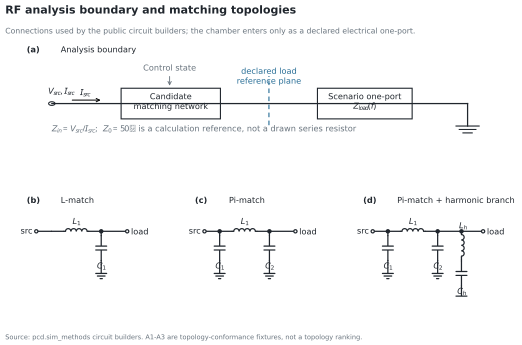

The upper panel separates the fixed Candidate network from the Scenario
one-port at its declared reference plane. The lower panels reproduce the exact
connections of `l_match`, `pi_match`, and `pi_match_harmonic`. The 50 ohm value
is the reflection calculation reference; it is not represented as a physical
series resistor.

### 2. Effective electrical load models

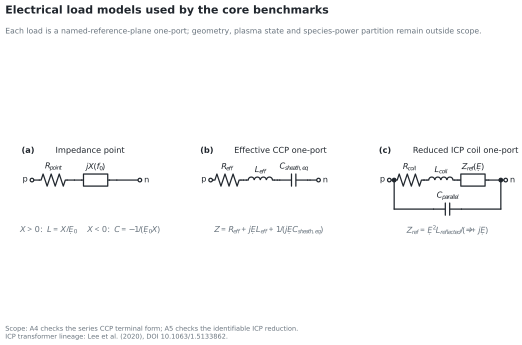

The impedance point is exact at one anchor frequency. The CCP model is the
implemented effective series R-L-C terminal form. The ICP panel uses the
terminal-identifiable reduced impedance plus optional shunt capacitance. The
internal SPICE transformer realization is intentionally not presented as a
unique physical secondary plasma circuit.

### 3. Reference-plane circuit representations

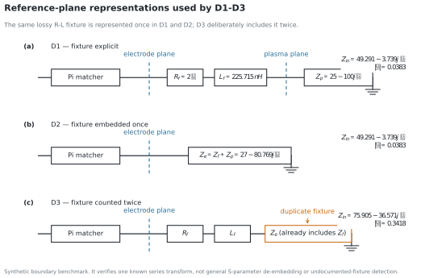

D1 and D2 describe the same lossy fixture once, explicitly or embedded in the
upstream one-port. D3 is the deliberate fixture-double-counting negative
control.

### 4. Control authority

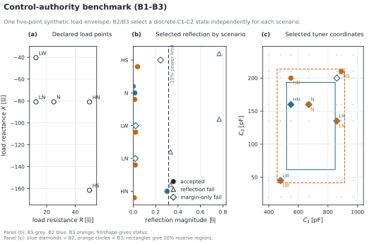

The five load points are independent synthetic scenarios. B2 reaches all five
electrically, but three selected states fail only the 20% control-reserve
criterion. B3 retains the required reserve for all five points. The small grey
points in the control panel are the actual discrete C1-C2 settings, not a
continuous interpolation.

The normalized reserve is

```text
m = 2 min over each control axis(
      distance from selected value to nearest range boundary / full range
    )
```

### 5. Effective ICP frequency conformance

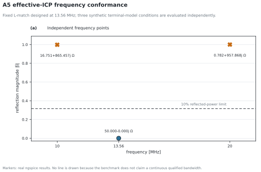

The fixed L-match was constructed for 13.56 MHz. The 10, 13.56, and 20 MHz
points are not connected because A5 does not claim a continuous qualified
bandwidth.

### 6. High-drive component and source stress

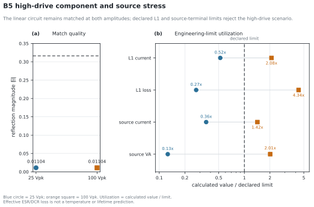

Both drive amplitudes remain well matched. The high-drive case is rejected by
the independently declared L1 current/loss and source current/apparent-power
limits. Effective ESR/DCR loss is not a thermal or lifetime prediction.

### 7. Deterministic component-value corners

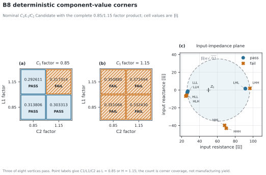

The two matrices display all eight C1/L1/C2 factor combinations. `3/8` means
three accepted vertices in an equal-weight deterministic set; it is neither a
37.5% yield estimate nor proof of the continuous tolerance-box interior.

### 8. Reference-plane result equivalence

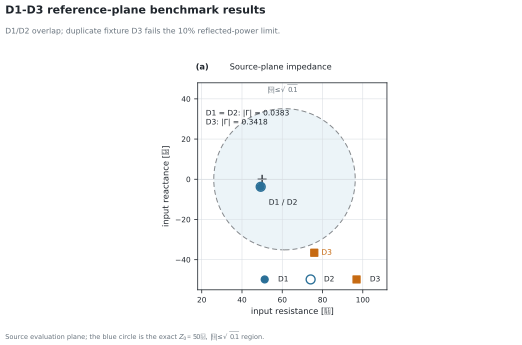

D1 and D2 overlap within numerical tolerance. D3 moves outside the exact
50-ohm, 10%-reflected-power acceptance circle.

### 9. B5 source and output fundamental

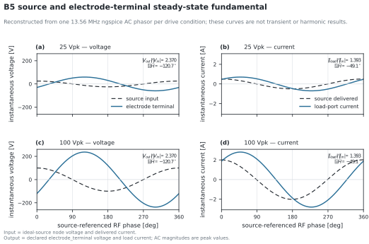

The four panels compare ideal-source input with the declared
`electrode_terminal` output at 25 and 100 Vpk. They are reconstructed from the
archived 13.56 MHz AC peak phasors, not transient samples. The relative gain
and phase are meaningful; ignition, settling, harmonics, and waveform
distortion are outside this case.

### 10. B5 terminal scaling and power flow

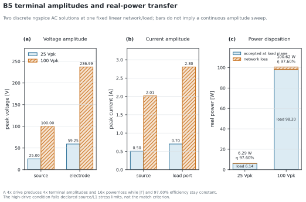

Discrete bars connect the input setting to source/electrode voltage, source/load
current, and accepted/lost real power. The 4x drive produces 4x phasor
amplitudes and 16x power in this fixed linear network. High drive fails the
declared stress limits even though match and transfer efficiency do not change.

### 11. Benchmark reading guide

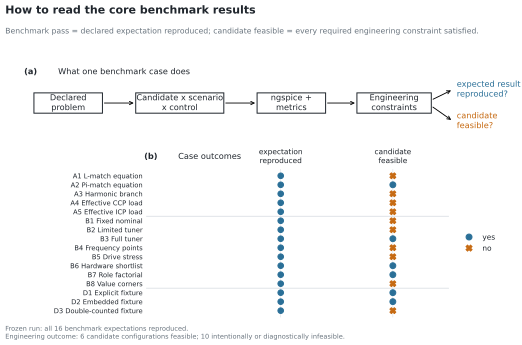

This page separates two often-confused outputs: whether the implementation
reproduced the case's declared expected result, and whether the evaluated
Candidate is engineering-feasible. All 16 frozen expectations pass; only six
of the evaluated configurations are intended to satisfy every constraint.

## Sources and conventions

- J. J. Lee et al., “A simple model of solenoidal inductively coupled plasma
  sources considering finite size,” *AIP Advances* 10, 035008 (2020),
  <https://doi.org/10.1063/1.5133862>. Used only for the transformer-model
  lineage of the reduced ICP terminal equation.
- N. Lee, O. Kwon, and C.-W. Chung, “Correlation of RF impedance with Ar
  plasma parameters in semiconductor etch equipment using inductively coupled
  plasma,” *AIP Advances* 11, 025027 (2021),
  <https://doi.org/10.1063/6.0000883>. Supports explicit separation of VI-probe,
  fixture, and corrected terminal reference planes; its ESC bias circuit is
  not treated as an ICP source-coil model.
- M. A. Sobolewski, “Current and Voltage Measurements in the Gaseous
  Electronics Conference RF Reference Cell,” *J. Res. NIST* 100, 341–351
  (1995), <https://doi.org/10.6028/jres.100.026>. Supports distinguishing probe
  and powered-electrode reference planes and redundant marker/line encoding.
- P. J. Hargis et al., “The Gaseous Electronics Conference radio-frequency
  reference cell,” *Rev. Sci. Instrum.* 65, 140–154 (1994),
  <https://doi.org/10.1063/1.1144770>. Defines the 13.56 MHz electrical
  measurement convention used by the separate literature benchmark.
- P. Colpo, R. Ernst, and F. Rossi, “Determination of the equivalent circuit of
  inductively coupled plasma sources,” *J. Appl. Phys.* 85, 1366–1371 (1999),
  <https://doi.org/10.1063/1.369268>. Used as precedent for treating fixture
  parasitics and complex impedance explicitly; its apparatus-specific circuit
  is not substituted for the PCD ICP model.

The visual grammar follows conventional technical-paper practice: left-to-right
RF paths, standard circuit symbols, named dashed reference planes, white
backgrounds, direct units, restrained blue/orange emphasis, and shape or hatch
redundancy so status is not encoded by colour alone. No journal figure was
traced or embedded.

The circuit renderer is Schemdraw 0.23 behind the project-owned
`pcd.figures.CircuitDiagram` layer. Fixed symbol length, named anchors, equal
x/y scale, common viewports, IEEE symbols, and a fixed export canvas prevent a
branch height or panel aspect ratio from resizing one component. CircuiTikZ is
retained as a possible LaTeX-native export target rather than a mandatory
runtime dependency.

## Reproduce

Run the core benchmark first, then generate the figure pack:

```powershell
uv run python bench/run_suite.py --run-root runs/benchmark_suite
uv run python bench/figures/generate.py --run-root runs/benchmark_suite
```

`generated/figure_data.json` records the benchmark-result, candidate and B5 AC
artifact hashes plus renderer versions and page geometry. The result figures
contain only observed ngspice points, exact phasor reconstructions, and declared
acceptance boundaries; no spline, fitted trend, or probabilistic interpretation
is added.
