# Benchmark figure packs

## Dynamic-impedance etch CCP with dual RF and DC superposition

This seven-page study extends the earlier minimal CCP example without turning
PCD into a plasma-chemistry solver. The explicit circuit contains a 60 MHz
upper source, 2 MHz wafer-bias source, pulsed negative DC bias tee, matching
and feed parasitics, chamber/ESC stray capacitance, wall leakage, two lossy
sheaths, and a bulk `R-L` path. The prescribed `R_p(t)`, `L_p(t)`,
`C_s,u(t)`, and `C_s,w(t)` use charge/flux constitutive laws.

1. [Apparatus and detailed equivalent circuit](etch_ccp_dcs/01-apparatus-and-equivalent-circuit.svg)
   keep the chamber and circuit in the same top-to-bottom order and name every
   input, dynamic element, objective, and held-out measurement plane.
2. [Inputs and dynamic elements](etch_ccp_dcs/02-inputs-and-dynamic-elements.svg)
   show the three electrical excitations, common plasma-state envelope, and
   all four prescribed element profiles.
3. [Forward conformance](etch_ccp_dcs/03-forward-conformance.svg) compares an
   independent charge/flux MNA integration with ngspice for wafer voltage,
   reflected voltage, bulk current, sheath charge, and inductor flux.
4. [Dynamic branch impedance](etch_ccp_dcs/04-dynamic-branch-impedance.svg)
   shows the frozen-time main-plasma-branch impedance and 50-ohm Smith charts
   at 2 MHz and 60 MHz.
5. [GP-UCB waveform validity](etch_ccp_dcs/05-gp-ucb-waveform-validation.svg)
   shows the fitted wafer waveform, the unused upper-reflection output, and
   both residuals for the median fitted seed rather than a cherry-picked best run.
6. [GP-UCB identification](etch_ccp_dcs/06-gp-ucb-identification.svg)
   shows three-seed convergence, parameter recovery, and reconstructed dynamic
   R/L/sheath-C profiles without adding optimizer-comparison panels.
7. [Literature basis and scope](etch_ccp_dcs/07-literature-basis-and-scope.svg)
   separates published apparatus/model evidence from benchmark-specific
   assumptions and reports transparent order-of-magnitude checks.

[`etch_ccp_dcs/figure_data.json`](etch_ccp_dcs/figure_data.json) records every
source hash, forward error, exact-grid candidate, GP-UCB selected value,
three-seed loss trace, cache behavior, and held-out error without
duplicating every raw trial row. The
full literature boundary, equations, results, and reproduction commands are in
[`docs/etch-ccp-dcs-dynamic-impedance-study-ja.md`](../../docs/etch-ccp-dcs-dynamic-impedance-study-ja.md).
The combined publication artifact is
[`output/pdf/etch-ccp-dcs-dynamic-impedance-study.pdf`](../../output/pdf/etch-ccp-dcs-dynamic-impedance-study.pdf).
Its page-by-page Japanese reading guide is
[`output/pdf/etch-ccp-dcs-dynamic-impedance-study-guide-ja.md`](../../output/pdf/etch-ccp-dcs-dynamic-impedance-study-guide-ja.md).

## Dual-frequency CCP with rectangular lower bias

The four-page CCP study turns a literature-grounded apparatus class into one
forward problem and two bounded inverse problems without claiming a
plasma-state solve. It uses a 40 MHz upper excitation, an 800 kHz rectangular
lower bias, fixed effective sheath capacitors, and a positive `R_p(t)`.

1. [Equipment and vertical equivalent circuit](dual_frequency_ccp/01-apparatus-and-equivalent-circuit.svg)
   maps the chamber top-to-bottom order, component names, wafer node, and
   upper 50-ohm reflection reference plane directly to the ngspice circuit.
2. [Forward observable conformance](dual_frequency_ccp/02-forward-observable-conformance.svg)
   shows both source waveforms, prescribed `R_p(t)`, wafer/chuck voltage, and
   upper reflected voltage against an independent RK4 calculation.
3. [Inverse identification from wafer voltage](dual_frequency_ccp/03-inverse-from-wafer-voltage.svg)
   uses only the wafer waveform to rank all 81 `R_p(t)` candidates and retains
   upper reflection as a held-out waveform.
4. [Inverse identification from upper reflection](dual_frequency_ccp/04-inverse-from-upper-reflection.svg)
   reverses those roles and independently recovers the same four resistance
   values from upper reflection alone.

[`dual_frequency_ccp/figure_data.json`](dual_frequency_ccp/figure_data.json)
records input and run hashes, direct numerical errors, all 162 candidate
evaluations, held-out errors, and the excluded physical claims. The figure
generator is read-only. The
problem statement, literature boundary, results, and reproduction commands are
in [`docs/dual-frequency-ccp-pulsed-bias-study-ja.md`](../../docs/dual-frequency-ccp-pulsed-bias-study-ja.md),
and the combined artifact is
[`output/pdf/dual-frequency-ccp-pulsed-bias-study.pdf`](../../output/pdf/dual-frequency-ccp-pulsed-bias-study.pdf).
The page-by-page Japanese guide is
[`output/pdf/dual-frequency-ccp-pulsed-bias-study-guide-ja.md`](../../output/pdf/dual-frequency-ccp-pulsed-bias-study-guide-ja.md).

## Direct calculation evidence

The four-page calculation-evidence pack answers the shortest third-party
questions directly: can an authored netlist be solved, can a prescribed
time-varying element be used correctly, do the effective CCP/ICP terminal
circuits reproduce their equations, and does component optimization recover a
known target waveform?  The generator reads completed artifacts only; it does
not run ngspice or optimization while drawing.

1. [Netlist to ngspice waveform](evidence/01-netlist-to-ngspice-waveform.svg):
   authored `.cir` fragment, calculation path, circuit, input waveform, and
   analytic-versus-ngspice output.
2. [Time-varying element conformance](evidence/02-time-varying-element-conformance.svg):
   prescribed resistance, output voltage, and element current against the
   independent divider equation.
3. [Effective plasma-load conformance](evidence/03-effective-plasma-load-conformance.svg):
   CCP and reduced ICP terminal circuits connected through each case's fixed
   L-match, with analytic and ngspice whole-network input
   resistance/reactance at the three declared frequencies.  This is
   equivalent-circuit propagation conformance, not plasma-state validation.
4. [Target-waveform optimization](evidence/04-target-waveform-optimization.svg):
   target versus selected waveform, exhaustive loss history, and the complete
   3 x 3 component-value grid.

The vector SVG files are publication masters, the PNG files are 300 dpi, and
[`output/pdf/calculation-evidence-pack.pdf`](../../output/pdf/calculation-evidence-pack.pdf)
contains the four fixed-size pages.  [`evidence/figure_data.json`](evidence/figure_data.json)
records every source path and SHA-256 hash plus the independently calculated
comparison errors.
The page-by-page Japanese guide is
[`output/pdf/calculation-evidence-pack-guide-ja.md`](../../output/pdf/calculation-evidence-pack-guide-ja.md).

One compact reproduction uses the core conformance result plus three focused
public-CLI runs:

```powershell
$root = "runs/calculation_evidence"
uv run --frozen python bench/run_suite.py --run-root "$root/core"
uv run --frozen pcd sim-run examples/advanced/time_varying_resistor.yaml `
  --run-root "$root/varying"
uv run --frozen pcd sim-run bench/figures/cases/external_netlist_rc.yaml `
  --run-root "$root/netlist"
uv run --frozen pcd sim-netlist bench/figures/cases/external_netlist_rc.yaml `
  --out "$root/netlist/external_netlist_resolved.cir"
uv run --frozen pcd run bench/figures/cases/target_waveform_conformance.yaml `
  --output "$root/optimization"
uv run --frozen python bench/figures/generate_calculation_evidence.py `
  --benchmark-result "$root/core/benchmark_result.json" `
  --varying-root "$root/varying" `
  --netlist-root "$root/netlist" `
  --optimization-root "$root/optimization"
```

## Core RF benchmark figure pack

These figures explain the electrical questions and results in the core
benchmark suite. They are newly drawn from the implemented circuit
connections, independent equations, and the completed ngspice result. They do
not reproduce journal artwork.

The vector SVG files are the publication masters and the 300 dpi PNG files are
for ordinary document insertion. `output/pdf/benchmark-figure-pack.pdf`
contains the same eleven figures in one fixed-page file. The reusable layout
and rendering rules are documented in
[`docs/figure-system.md`](../../docs/figure-system.md).

## Figure map

### 1. RF analysis boundary and matching topologies

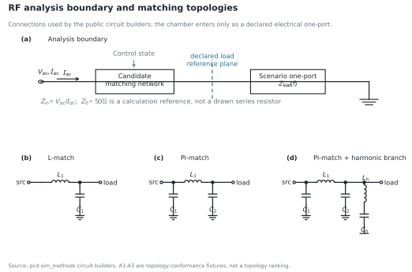

The upper panel separates the fixed Candidate network from the Scenario
one-port at its declared reference plane. The lower panels reproduce the exact
connections of `l_match`, `pi_match`, and `pi_match_harmonic`. The 50 ohm value
is the reflection calculation reference; it is not represented as a physical
series resistor.

### 2. Effective electrical load models

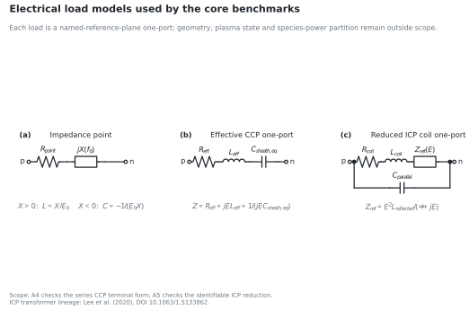

The impedance point is exact at one anchor frequency. The CCP model is the
implemented effective series R-L-C terminal form. The ICP panel uses the
terminal-identifiable reduced impedance plus optional shunt capacitance. The
internal SPICE transformer realization is intentionally not presented as a
unique physical secondary plasma circuit.

### 3. Reference-plane circuit representations

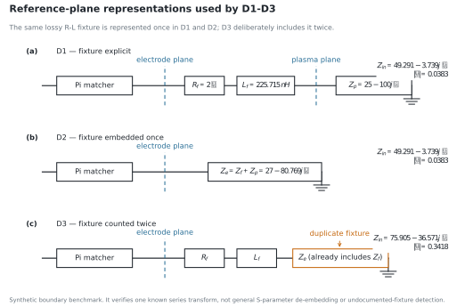

D1 and D2 describe the same lossy fixture once, explicitly or embedded in the
upstream one-port. D3 is the deliberate fixture-double-counting negative
control.

### 4. Control authority

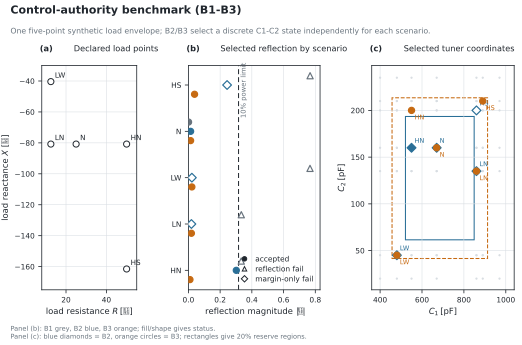

The five load points are independent synthetic scenarios. B2 reaches all five
electrically, but three selected states fail only the 20% control-reserve
criterion. B3 retains the required reserve for all five points. The small grey
points in the control panel are the actual discrete C1-C2 settings, not a
continuous interpolation.

The normalized reserve is

```text
m = 2 min over each control axis(
      distance from selected value to nearest range boundary / full range
    )
```

### 5. Effective ICP frequency conformance

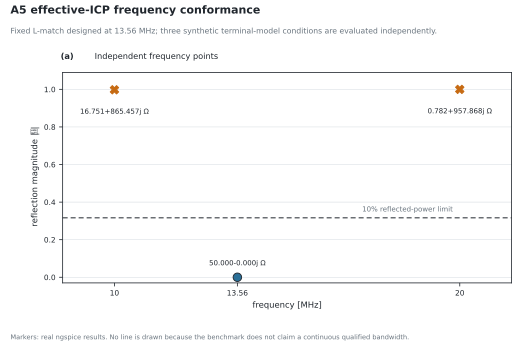

The fixed L-match was constructed for 13.56 MHz. The 10, 13.56, and 20 MHz
points are not connected because A5 does not claim a continuous qualified
bandwidth.

### 6. High-drive component and source stress

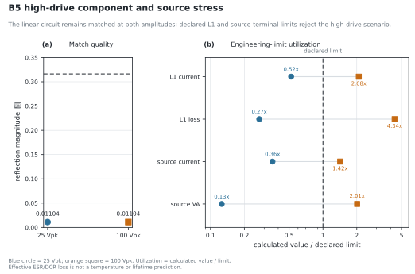

Both drive amplitudes remain well matched. The high-drive case is rejected by
the independently declared L1 current/loss and source current/apparent-power
limits. Effective ESR/DCR loss is not a thermal or lifetime prediction.

### 7. Deterministic component-value corners

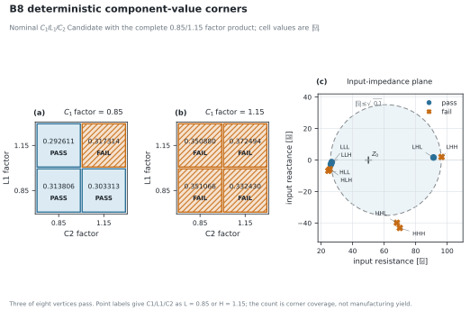

The two matrices display all eight C1/L1/C2 factor combinations. `3/8` means
three accepted vertices in an equal-weight deterministic set; it is neither a
37.5% yield estimate nor proof of the continuous tolerance-box interior.

### 8. Reference-plane result equivalence

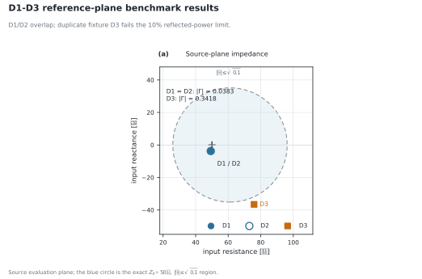

D1 and D2 overlap within numerical tolerance. D3 moves outside the exact
50-ohm, 10%-reflected-power acceptance circle.

### 9. B5 source and output fundamental

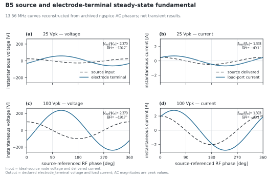

The four panels compare ideal-source input with the declared
`electrode_terminal` output at 25 and 100 Vpk. They are reconstructed from the
archived 13.56 MHz AC peak phasors, not transient samples. The relative gain
and phase are meaningful; ignition, settling, harmonics, and waveform
distortion are outside this case.

### 10. B5 terminal scaling and power flow

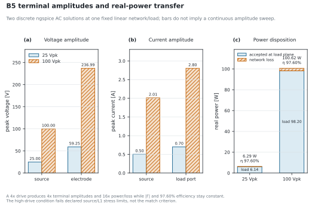

Discrete bars connect the input setting to source/electrode voltage, source/load
current, and accepted/lost real power. The 4x drive produces 4x phasor
amplitudes and 16x power in this fixed linear network. High drive fails the
declared stress limits even though match and transfer efficiency do not change.

### 11. Benchmark reading guide

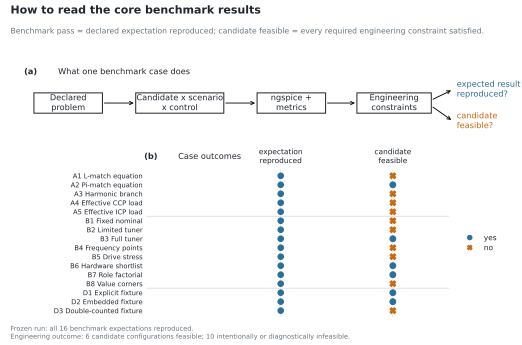

This page separates two often-confused outputs: whether the implementation
reproduced the case's declared expected result, and whether the evaluated
Candidate is engineering-feasible. All 16 frozen expectations pass; only six
of the evaluated configurations are intended to satisfy every constraint.

## Sources and conventions

- J. J. Lee et al., “A simple model of solenoidal inductively coupled plasma
  sources considering finite size,” *AIP Advances* 10, 035008 (2020),
  <https://doi.org/10.1063/1.5133862>. Used only for the transformer-model
  lineage of the reduced ICP terminal equation.
- N. Lee, O. Kwon, and C.-W. Chung, “Correlation of RF impedance with Ar
  plasma parameters in semiconductor etch equipment using inductively coupled
  plasma,” *AIP Advances* 11, 025027 (2021),
  <https://doi.org/10.1063/6.0000883>. Supports explicit separation of VI-probe,
  fixture, and corrected terminal reference planes; its ESC bias circuit is
  not treated as an ICP source-coil model.
- M. A. Sobolewski, “Current and Voltage Measurements in the Gaseous
  Electronics Conference RF Reference Cell,” *J. Res. NIST* 100, 341–351
  (1995), <https://doi.org/10.6028/jres.100.026>. Supports distinguishing probe
  and powered-electrode reference planes and redundant marker/line encoding.
- P. J. Hargis et al., “The Gaseous Electronics Conference radio-frequency
  reference cell,” *Rev. Sci. Instrum.* 65, 140–154 (1994),
  <https://doi.org/10.1063/1.1144770>. Defines the 13.56 MHz electrical
  measurement convention used by the separate literature benchmark.
- P. Colpo, R. Ernst, and F. Rossi, “Determination of the equivalent circuit of
  inductively coupled plasma sources,” *J. Appl. Phys.* 85, 1366–1371 (1999),
  <https://doi.org/10.1063/1.369268>. Used as precedent for treating fixture
  parasitics and complex impedance explicitly; its apparatus-specific circuit
  is not substituted for the PCD ICP model.

The visual grammar follows conventional technical-paper practice: left-to-right
RF paths, standard circuit symbols, named dashed reference planes, white
backgrounds, direct units, restrained blue/orange emphasis, and shape or hatch
redundancy so status is not encoded by colour alone. No journal figure was
traced or embedded.

The circuit renderer is Schemdraw 0.23 behind the project-owned
`pcd.figures.CircuitDiagram` layer. Fixed symbol length, named anchors, equal
x/y scale, common viewports, IEEE symbols, and a fixed export canvas prevent a
branch height or panel aspect ratio from resizing one component. CircuiTikZ is
retained as a possible LaTeX-native export target rather than a mandatory
runtime dependency.

## Reproduce

Run the core benchmark first, then generate the figure pack:

```powershell
uv run python bench/run_suite.py --run-root runs/benchmark_suite
uv run python bench/figures/generate.py --run-root runs/benchmark_suite
```

`generated/figure_data.json` records the benchmark-result, candidate and B5 AC
artifact hashes plus renderer versions and page geometry. The result figures
contain only observed ngspice points, exact phasor reconstructions, and declared
acceptance boundaries; no spline, fitted trend, or probabilistic interpretation
is added.

The page-by-page Japanese guide for the eleven-page pack is
[`output/pdf/benchmark-figure-pack-guide-ja.md`](../../output/pdf/benchmark-figure-pack-guide-ja.md).
