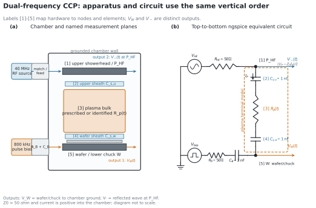
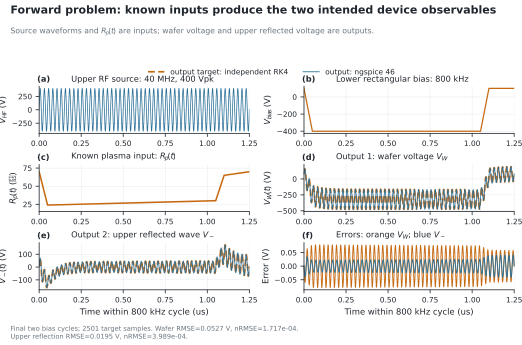
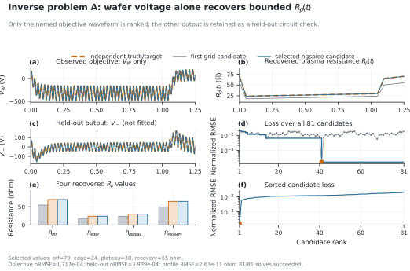
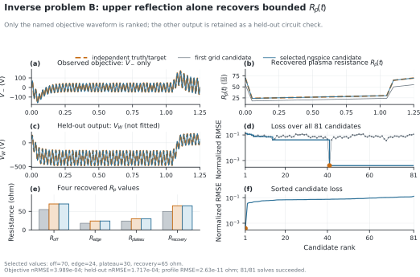

# 2周波CCP・下部矩形バイアス回路の順問題と逆問題

## 1. この検証で答える問い

このベンチマークは、上部40 MHz励振、下部800 kHz矩形バイアスを持つCCP装置を、上下シース容量と
時間変化するプラズマ実効抵抗で縮約した電気回路として扱う。問題は次の三つに分離した。

1. **順問題**: 入力波形と既知の `R_p(t)` から、ウェハ電極電圧 `V_W(t)` と上部反射電圧波 `V_-(t)` を
   正しく計算できるか。
2. **逆問題A**: `V_W(t)` だけが観測される場合、限定した `R_p(t)` の4節点値を回収できるか。
3. **逆問題B**: `V_-(t)` だけが観測される場合、同じ4節点値を回収できるか。

順問題の独立基準は固定刻みRK4で計算し、逆問題は複雑なsurrogateを使わず、事前に宣言した81候補を
ngspiceで完全列挙する。逆問題では目的に使わなかったもう一方の出力も保存し、held-out回路波形として確認する。

## 2. 装置、回路、観測点の対応



装置と回路は、上から下へ同じ順序で表す。

| 対応番号 | 装置部位 | 回路表現・ノード |
|---:|---|---|
| 1 | 上部シャワーヘッド、上部RF給電面 | `P_HF = top_electrode` |
| 2 | 上部シース | `C_s,u = 1 nF` |
| 3 | プラズマbulk | 正値の時間変化抵抗 `R_p(t)` |
| 4 | ウェハ側シース | `C_s,w = 1 nF` |
| 5 | ウェハ／下部chuck | `W = bottom_electrode` |

二つの出力を次のように区別する。

- `V_W(t)`: 下部電極／ウェハchuckから接地チャンバーまでの電圧。この縮約回路の電極電圧であり、
  ウェハ表面の局所的なシース電位分布ではない。
- `V_-(t)`: 上部50 ohm参照面における反射**電圧波**。上部port電流をチャンバーへ流入する向きに取ると、
  `V_- = (V_P - Z_0 I_P) / 2`, `Z_0 = 50 ohm` とする。

後者の進行波分解はNISTの端子電圧・電流と入射／反射波の定義に従う
([NBS Monograph 137, Eq. 2.33](https://nvlpubs.nist.gov/nistpubs/Legacy/MONO/nbsmonograph137.pdf))。
ただし本モデルの `V_-` は指定した上部参照面の回路量であり、実機directional couplerの校正値ではない。

## 3. 入力と独立基準計算

| 入力・固定値 | 値 |
|---|---:|
| 上部RF source | 40 MHz, 400 Vpeak |
| 下部bias source | 800 kHz, `+100/-400 V`, negative interval 80% |
| rise/fall | 50 ns |
| `R_HF`, `R_B` | 各50 ohm |
| `C_B` | 2 nF |
| `C_s,u`, `C_s,w` | 各1 nF |
| ngspice最大刻み | 250 ps |
| 独立RK4刻み | 62.5 ps |

loop電荷を `q`、上部から下部へ流れる電流を `I=dq/dt` とすると、独立基準は次式である。

```text
1/C_eq = 1/C_s,u + 1/C_s,w + 1/C_B

dq/dt = [V_HF(t) - V_bias(t) - q/C_eq]
        / [R_HF + R_B + R_p(t)]

V_P(t) = V_HF(t) - R_HF I(t)
V_W(t) = V_bias(t) + R_B I(t) + q(t)/C_B
V_-(t) = [V_P(t) - Z_0 I(t)]/2
```

40 MHz／800 kHz矩形bias、2 nF blocking capacitor、80%負電圧区間、50 ns edgeは
[Rauf et al.](https://doi.org/10.1116/6.0001732)を主な装置条件とした。上部HF・下部LF構成とblocking
capacitorの電気的役割は[Song and Kushner](https://doi.org/10.1116/1.4863948)を根拠とする。

## 4. 順問題: 既知 `R_p(t)` から装置出力を計算する



最終2 bias周期の2,501独立基準点で、次の一致を得た。

| 出力 | RMSE | normalized RMSE | 最大絶対差 |
|---|---:|---:|---:|
| ウェハ電極電圧 `V_W(t)` | 0.05274 V | `1.7167e-4` | 0.07912 V |
| 上部反射電圧波 `V_-(t)` | 0.01948 V | `3.9890e-4` | 0.04135 V |

ngspice内の反射波monitorと、保存した `V_P`、`I_P` から再計算した式との差は最大
`1.74e-10 V` だった。したがって、入力source、既知 `R_p(t)`、二つの目的出力の接続と符号は独立式と整合する。

## 5. 逆問題: 一つの観測波形から `R_p(t)` を同定する

### 5.1 同定対象を限定する理由

単一の電圧波形から任意の `R(t)`、時間変化するシース容量、配線寄生、source impedanceを同時に求める問題は
一般に一意ではない。そこで今回はシース容量、`R_HF`、`R_B`、`C_B`、節点時刻を固定し、1.25 us周期の
piecewise-linear `R_p(t)` の4値だけを未知量とした。

| 未知量 | 時刻 | 候補 | 基準値 |
|---|---:|---:|---:|
| `R_off` | 0 usおよび1.25 us | 55, 70, 85 ohm | 70 ohm |
| `R_edge` | 0.05 us | 18, 24, 30 ohm | 24 ohm |
| `R_plateau` | 1.05 us | 24, 30, 36 ohm | 30 ohm |
| `R_recovery` | 1.10 us | 50, 65, 80 ohm | 65 ohm |

候補総数は `3^4 = 81` である。有限候補をすべて計算するため、optimizerの収束性や初期値依存は問題に入らない。

### 5.2 逆問題A: ウェハ電圧だけを使用



| 評価 | 結果 |
|---|---:|
| ngspice成功 | 81/81、cache hit 0 |
| 選択値 | `70 / 24 / 30 / 65 ohm` |
| 目的 `V_W` nRMSE | `1.7167e-4` |
| 初期候補loss | `2.0506e-2` |
| 2位候補loss | `5.8113e-3` |
| held-out `V_-` nRMSE | `3.9890e-4` |

ウェハ電圧だけを順位付けへ使用して基準4値を回収し、適合に使わなかった上部反射波も独立基準と一致した。

### 5.3 逆問題B: 上部反射電圧だけを使用



| 評価 | 結果 |
|---|---:|
| ngspice成功 | 81/81、cache hit 0 |
| 選択値 | `70 / 24 / 30 / 65 ohm` |
| 目的 `V_-` nRMSE | `3.9890e-4` |
| 初期候補loss | `1.2853e-1` |
| 2位候補loss | `3.5806e-2` |
| held-out `V_W` nRMSE | `1.7167e-4` |

上部反射波だけでも同じ4値を回収した。これは**宣言した4節点モデルと有限候補内での識別成功**であり、
自由なプラズマ状態や任意の時間関数を一つの波形から復元できるという主張ではない。

## 6. 実機へ適用するときの境界

時間分解V/Iによるパルスplasma impedance診断は[Lee et al.](https://doi.org/10.1063/1.4928121)で示されている。
一方、[Press et al.](https://doi.org/10.1116/1.5132753)が示すように、実機のtime-resolved impedanceや反射量には
probe較正、伝搬遅延、周波数依存、寄生impedanceのde-embeddingが必要である。

実データへ移るときは次の順序を守る。

1. `P_HF` と `W` の実測参照面を固定する。
2. 同期した `V_P(t)`、`I_P(t)` または `V_W(t)` を取得し、cable、feedthrough、matcherをde-embedする。
3. 今回の4節点 `R_p(t)` familyをtraining pulseで同定する。
4. 同定に使わない別pulse条件と、可能ならもう一方の観測波形でhold-out検証する。
5. 残差が構造的に残る場合だけ、動的sheath lawまたは外部plasma solverとの連成を別責務で追加する。

## 7. 再現方法

```powershell
uv run --frozen python bench/figures/generate_dual_frequency_ccp_target.py
uv run --frozen python -m pcd solver-diagnose --json

uv run --frozen python -m pcd sim-run `
  bench/figures/cases/dual_frequency_ccp_forward.yaml `
  --run-root runs/dual_frequency_ccp_forward_v2_20261001 --json

uv run --frozen python -m pcd run `
  bench/figures/cases/dual_frequency_ccp_inverse_wafer.yaml `
  --output runs/dual_frequency_ccp_inverse_wafer_v2_20261001 --json

uv run --frozen python -m pcd run `
  bench/figures/cases/dual_frequency_ccp_inverse_reflection.yaml `
  --output runs/dual_frequency_ccp_inverse_reflection_v2_20261001 --json

uv run --frozen python bench/figures/generate_dual_frequency_ccp_evidence.py
```

入力hash、solver version、順問題誤差、全162候補、選択値、held-out誤差は
[`figure_data.json`](../bench/figures/dual_frequency_ccp/figure_data.json)に保存している。図生成処理は保存済み結果を
読むだけで、ngspiceやoptimizerを再実行しない。
