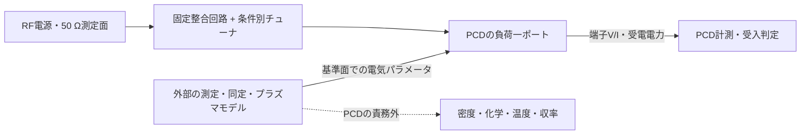
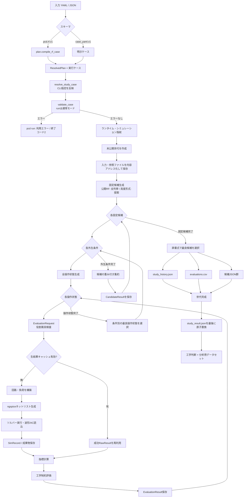
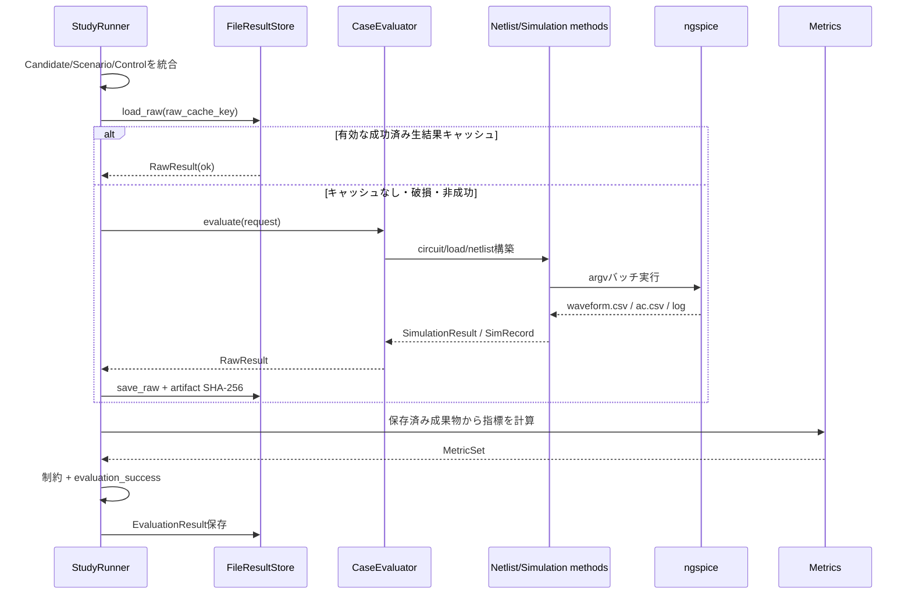
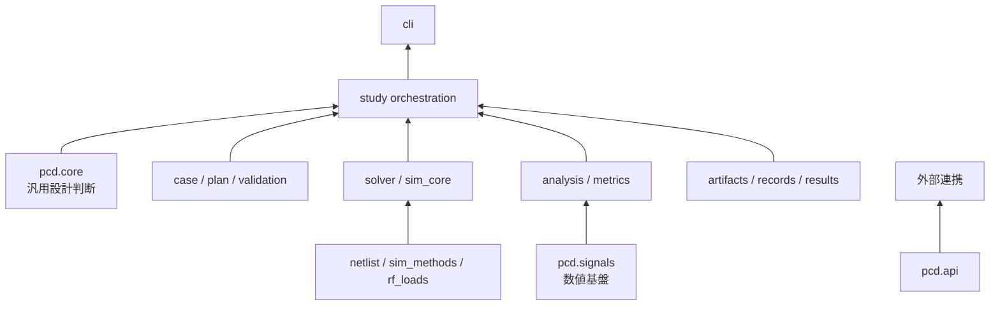

# PCD RF回路設計スタディ・プラットフォーム 技術仕様書

## 1. 文書管理

| 項目 | 内容 |
|---|---|
| 文書名 | PCD RF回路設計スタディ・プラットフォーム 技術仕様書 |
| 対象ソフトウェア | `circuit-design-platform` / PCD |
| 対象バージョン | `0.16.0` |
| 対象コミット | `3d9d48664f83ff68218e6f6e4c5e794b308f6966` |
| 仕様基準日 | 2026-09-15 |
| 文書版 | 1.1 |
| 対象言語 | Python 3.10以上 |
| 主たる外部ソルバー | ngspice CLI |
| 対象入力スキーマ | 公開RFスキーマ `pcd.rf.v1`、高度な明示スキーマ `case_yaml.v1` |
| 想定読者 | RF・プラズマ装置・回路設計エンジニア、数値解析担当者、データサイエンティスト、ソフトウェア保守担当者 |
| 文書の位置づけ | 上記コードスナップショットの実装仕様。後続版へ適用する場合は、コード、テスト、変更履歴との差分を確認する |

### 1.1 規範性と読み方

本書で「する」「しなければならない」と記載する箇所は、対象コミットにおけるソフトウェア契約を表す。実装動作について情報が矛盾する場合は、原則として次の順に確認する。

1. 実行された `case.yaml`、`sim_manifest.json`、`study_result.json` とそのハッシュ
2. 対象コミットの実装コード
3. 自動テストおよび凍結ベンチマーク期待値
4. 本書およびリポジトリ内の設計資料

物理モデルの適用可否はこの優先順位とは別である。基準面、校正、デエンベディング、同定残差、適用周波数・運転範囲は、承認済みの測定記録またはモデル検証記録で判断する。ソフトウェアが計算を完了しても、入力モデルの物理的妥当性までは保証されない。

本書では実装根拠を `[Ixx]`、外部資料・学術文献を `[Exx]` として参照する。参照一覧は第20章に示す。

### 1.2 読者別の確認箇所

| 読者 | 主な確認事項 | 関連章 |
|---|---|---|
| 物理・回路エンジニア | 基準面、負荷モデルの成立条件、peak/RMS・電流方向、電力収支、定常判定、適用限界 | 3、4、6、11～15、19章 |
| データサイエンティスト | 一行の観測単位、データセット同一性、失敗行、重複、分割単位、目的変数リーク、代理モデルの検証 | 7、15～17、19章 |
| ソフトウェア保守担当者 | モジュール責務、処理順序、拡張境界、キャッシュ、世代管理、終了コード | 5、8～10、17～20章 |
| 設計審査者 | 受入条件、証拠完全性、モデル適用範囲、ベンチマークの意味、残存リスク | 2～5、18～21章 |

### 1.3 目次

| 区分 | 章 |
|---|---|
| 目的・境界 | [2. 要約](#2-要約)、[3. 背景](#3-背景)、[4. システム境界と前提](#4-システム境界と前提)、[5. 要求仕様](#5-要求仕様) |
| 入力・モデル | [6. 入力仕様](#6-入力仕様)、[7. ドメインモデル](#7-ドメインモデル) |
| 構造・実行 | [8. アーキテクチャ](#8-アーキテクチャ)、[9. 処理責務単位](#9-処理責務単位)、[10. 詳細処理フロー](#10-詳細処理フロー) |
| 理論・数値 | [11. 回路理論](#11-回路理論)、[12. RF負荷モデル](#12-rf負荷モデル)、[13. RF計測式](#13-rf計測式)、[14. 過渡数値計算](#14-過渡数値計算)、[15. 制約・集約・順位付け](#15-制約集約順位付け) |
| データ・運用 | [16. 機械学習・データ分析連携](#16-機械学習データ分析連携)、[17. 成果物・キャッシュ仕様](#17-成果物キャッシュ仕様)、[18. 状態・終了コード・運用](#18-状態終了コード運用) |
| 品質・根拠 | [19. 検証・品質保証・制約](#19-検証品質保証制約)、[20. トレーサビリティ](#20-トレーサビリティ)、[21. 設計審査時の確認事項](#21-設計審査時の確認事項) |

---

## 2. 要約

PCDは、RF給電系の固定整合回路を複数の負荷条件に対して評価する設計スタディ・エンジンである。判定対象は、各外生条件に対して装置が許容する調整状態を選んだとき、反射、端子電流・電圧、損失および調整余裕の規定値を満たせるか、である。

固定設計候補を \(c\in\mathcal C\)、外生条件を \(s\in\mathcal S\)、条件ごとの操作可能状態を \(u\in\mathcal U(c,s)\)、制約を \(g_k(c,s,u)\leq 0\) とすると、全条件合格の必要条件は次式で表せる。

$$
\forall s\in\mathcal S,\quad
\exists u\in\mathcal U(c,s):
\mathrm{status}(c,s,u)=\mathrm{ok}
\land
\bigwedge_k g_k(c,s,u)\le0
$$

この問題を正しく扱うため、入力を次の三役に分ける。名称は実装中の型名と対応させる。

| 日本語名 | 実装名 | 内容 | 代表例 |
|---|---|---|---|
| 固定設計候補 | `Candidate` | 製作・選定後は条件ごとに変更しない値 | 固定L/C、部品候補、トポロジ |
| 外生条件 | `Scenario` | 設計側から操作できない運転条件・ばらつき | 負荷R+jX、周波数、駆動振幅、部品公差コーナー |
| 操作状態 | `ControlState` | 外生条件ごとに再設定できる値 | 可変C1/C2の離散設定 |

公開RFスキーマでは、固定候補と操作状態の有限集合を全列挙する。したがって、宣言した離散範囲内の到達不能判定は、探索点の取りこぼしに依存しない。連続空間を乱数探索する高度な形式では、この保証は成立しない。

出力を読む際は、次の四つを区別する。

| 判定 | 確認できること | 確認できないこと |
|---|---|---|
| 電気計算完了 | ngspice実行と結果読込みが完了した | 工学的制約に合格した |
| 工学的受入合格 | ケースに記載した全制約を満たした | 未記載の定格、熱寿命、工程性能を満たした |
| ベンチマーク合格 | 凍結した数値・分類・不変条件を再現した | 任意装置への一般化が成立した |
| 物理モデル適用可 | 入力モデルが対象基準面・条件範囲で検証済みである | PCD単体では判定しない |

PCDはプラズマ状態方程式、反応化学、密度、温度、シース形状または自己整合的な回路―プラズマ連成を解かない。チャンバまたはコイルは、指定基準面で妥当性を確認した電気的一ポートとして入力する。

### 2.1 用語

| 用語 | 本書での定義 |
|---|---|
| RF | Radio Frequency。本書では対象回路の交流基本波およびその高調波 |
| CCP | Capacitively Coupled Plasma。本仕様では端子から見た有効直列R-L-C負荷 |
| ICP | Inductively Coupled Plasma。本仕様ではコイル損失と反射負荷を含む有効トランス負荷 |
| ESR / DCR | コンデンサの等価直列抵抗 / インダクタの直流抵抗を、対象動作点の直列損失として与えた値 |
| フェーザ | 正弦定常波の複素振幅。AC解析値はpeak規約を用いる |
| 基準面 | 負荷インピーダンス、電圧、電流および電力を定義する電気的位置 |
| 凍結期待値 | 独立計算またはレビュー済み根拠から固定した回帰試験値 |
| 生結果キャッシュ | 目的関数、制約および識別子から独立して再利用する、成功済みの電気計算結果 |

---

## 3. 背景

### 3.1 解くべき工学課題

RFプラズマ装置の端子インピーダンスは、圧力、投入電力、周波数、ガス・工程条件、装置個体差および配線寄生成分により変化する。一方、整合回路の固定部品は運転条件ごとに交換できない。したがって設計対象は名目負荷一点で反射を最小にする回路ではなく、一組の固定ハードウェアで対象負荷範囲を覆い、各条件で利用可能な調整器だけを動かして制約を満たす回路である。

> 固定ハードウェア候補 \(c\) を選び、各外部条件 \(s\) に対して許された調整状態 \(u\) のいずれかを選んだとき、全条件で反射・電流・電圧・損失・調整余裕の制約を満たせるか。

単一条件の最適化だけでは、次の問題を見落としやすい。

| 不適切な仮定・処理 | 生じる設計リスク |
|---|---|
| 名目負荷だけで整合 | 負荷変動時に反射電力制約を超える |
| チューナを連続値として近似 | 実機の離散設定では同じ整合点へ到達できない |
| チューナ端の整合点を余裕ありと判定 | 経時変化・個体差・計測誤差を吸収できない |
| 反射係数だけを評価 | 部品電圧・電流、実効損失、電源端子制約を超過する |
| 基準面を曖昧化 | ケーブル・治具・フィードスルーを二重計上または欠落 |
| 非等間隔の過渡標本を算術平均 | 実時間平均電力と実効値を誤る |
| ソルバー失敗を制約違反と同列に順位づけ | 証拠がない候補を、計算済み候補より優先する |

PCDは、設計・外生条件・操作量の役割分離、離散状態の全列挙、基準面と単位の明記、電圧・電流の符号規約、失敗を含む成果物保存によって、これらの誤判定を抑制する。[I01][I02]

### 3.2 設計業務上の有用性

| 利用目的 | PCDが提供するもの | 意思決定への寄与 |
|---|---|---|
| 固定整合回路の選定 | 固定候補ごとの全外生条件評価 | 一つの部品構成で対象負荷範囲を覆えるか判断できる |
| 調整器の権限確認 | 条件ごとの全操作状態評価 | 整合点の有無と調整余裕を分けて確認できる |
| 周波数点の再生 | 測定行ごとの独立一周波数AC解析 | 未測定点を補間せず、同一固定回路を周波数横断で比較できる |
| CCP/ICP等価負荷評価 | 受動一ポートの端子式 | 上流回路の整合、共振移動、パラメータ感度を評価できる |
| 部品電気ストレス評価 | 端子V/I、peak/RMS、実効直列損失 | 反射が小さくても定格に近い設計を識別できる |
| 電力収支確認 | 電源電力、負荷受電、回路損失、損失閉合残差 | 電流計の位置や損失モデルの不足を検出しやすい |
| 再現・監査 | 入力、解決済み計画、ネットリスト、ソルバー同一性、ハッシュ | 設計判断を後日再計算し、差異原因を追跡できる |
| 回帰・文献照合 | 独立複素数計算、実ngspice、文献由来ケース | 実装回帰と物理的解釈の境界を別々に確認できる |
| データ分析連携 | 一論理評価一行の `evaluations.csv` | 特徴量、結果、失敗、由来を同一粒度で管理できる |

### 3.3 適用範囲外

PCDの計算結果だけを根拠に、次の事項を判定してはならない。

- プラズマ密度、電子温度、化学種別電力、反応収率、シース厚さの予測
- 自己整合プラズマ―回路連成、着火、モード遷移、非線形高調波負荷
- 部品温度、熱寿命、絶縁寿命、部品メーカー定格への適合
- チューナの移動時間、量子化遅延、制御安定性
- 未宣言の連続設計空間に対する大域最適性
- ICPポートとCCPポートの電力を単純加算した多ポート結合評価
- 基準面文字列だけによる治具二重計上の自動検出
- 測定不確かさの統計的伝播、信頼区間または故障確率
- `evaluations.csv` から学習したモデルの装置外挿性能

---

## 4. システム境界と前提

### 4.1 実行環境

| 項目 | 仕様 |
|---|---|
| Python | 3.10以上 |
| パッケージ管理 | `uv.lock` を用いた `uv run --frozen` が再現実行の推奨経路 |
| 数値・表処理 | NumPy、pandas |
| 入力 | YAML/JSON、シナリオ・目標波形用CSV、任意の外部SPICEネットリスト |
| 回路ソルバー | 既定 `ngspice_cli`。Windowsでは `ngspice_con.exe` を優先 |
| 可視化 | Matplotlib、Schemdraw 0.23系列 |
| 実行成果物 | 既定で `runs/`。レビュー済み成果物は `output/` |
| タイムアウト | 既定300 s/ソルバー実行 |

ランタイム依存条件は `pyproject.toml`、完全な解決版は `uv.lock` を規範とする。[I08][I09]

### 4.2 物理モデル境界



PCDの計算境界は、電源・整合回路側から見た指定基準面までである。負荷パラメータの由来、デエンベディング、適用周波数範囲は入力側の責任であり、PCDは受動性等の基本条件を検査するが、装置固有モデルの科学的妥当性を自動認定しない。[I04][E07][E09]

### 4.3 解析上の前提

| 項目 | 公開RFスキーマでの前提 | 設計上の扱い |
|---|---|---|
| 回路表現 | 集中定数のR/L/Cおよび実効直列損失 | 配線長が無視できない場合は、適切な外部ネットリストまたは別途検証した分布定数モデルを用いる |
| 負荷 | 指定基準面の受動一ポート | 多ポート結合、負性抵抗、履歴依存状態は公開負荷モデルの対象外 |
| AC解析 | 正弦定常・線形フェーザ解析 | 反射係数は振幅非依存。非線形性や状態遷移を論じる場合は別の過渡・実験証拠が必要 |
| インピーダンス点 | 指定周波数でのみ \(R+jX\) を厳密再現 | 生成されたL/Cを広帯域等価回路として使用しない |
| CCP/ICP等価回路 | 外部同定で妥当性を確認した周波数・運転範囲内 | 適合範囲外への外挿は入力モデル側の責任 |
| 定常過渡量 | 最終整数周期が規定残差以下 | 未整定時は `not_settled` とし、電力・ストレス判定に使用しない |
| 基準インピーダンス | 公開RFでは50 Ω | 高度な形式では明示値を用い、測定系の基準と一致させる |

### 4.4 不確かさとばらつきの扱い

PCDのロバスト評価は、入力された離散的な外生条件集合に対する決定論的評価である。測定誤差分布や部品公差分布を内部で推定する機能はない。

| 入力の意味 | 推奨表現 | 注意事項 |
|---|---|---|
| 測定繰返し | 異なる安定した外生条件IDを付けて各行を保持 | 平均化で実測ばらつきを消さない |
| 部品公差 | 高度なケースの明示外生条件または設計候補として列挙 | 固定設計値と製造ばらつきの役割を混在させない |
| 工程条件 | 条件IDと電気パラメータを同一測定記録で管理 | 工程変数そのものを未検証の回路パラメータへ変換しない |
| 外生条件の重み | 重要度または確率質量として入力者が定義 | 正規化前の正の値として扱う。校正されていなければ発生確率とは解釈しない |
| 数値許容差 | ソルバー・補間・整定判定の計算規則 | 測定不確かさや物理モデル誤差の代用にしない |

確率的な合格率、信頼区間または感度分散が必要な場合は、外部で不確かさモデルを定義し、その標本または設計点を外生条件として入力する。結果を統計推定へ用いるときは、標本生成法と重みの意味をデータセットの付帯情報に残す。

### 4.5 証拠レベル

| レベル | 証拠 | 主張できる範囲 |
|---:|---|---|
| 0 | スキーマ、単位、有限値、受動性の入力検査 | 入力が実行可能な形式である |
| 1 | 独立した複素数式・単体試験 | 実装式と期待式が一致する |
| 2 | 実ngspiceとの回帰試験 | ネットリスト生成から解析までが凍結値を再現する |
| 3 | 校正済み測定または文献データとの適合確認 | 指定基準面・範囲内で端子モデルが証拠と整合する |
| 4 | 対象装置での設計・工程適格性確認 | 装置固有の採用判断。PCDの責務外 |

下位レベルの合格を上位レベルの代替として扱わない。特に、電気計算の成功とプラズマ・工程適格性は独立した判定である。

---

## 5. 要求仕様

### 5.1 機能要求

| ID | 要求 | 実装上の受入条件 |
|---|---|---|
| FR-01 | 公開RF入力を一意な実行ケースにコンパイルする | 既定値・推論・実行設定を `resolved_plan.yaml` に残す |
| FR-02 | 固定設計、外生条件、操作状態を分離する | 同名パラメータが `Candidate`、`Scenario`、`ControlState` の複数役割へ所属することを拒否 |
| FR-03 | 公開RFの有限候補・調整状態を完全列挙する | 安全上限を超える場合は間引かずエラー |
| FR-04 | 宣言された回路・負荷を決定的SPICEデッキへ変換する | 同一入力・実装で同一ネットリスト文字列を生成 |
| FR-05 | ngspiceをバッチ実行し、成功・失敗の双方を記録する | 失敗時もマニフェスト、ログ、空波形を保持 |
| FR-06 | AC整合指標を計算する | 入力Z、反射係数、dB値、VSWRを出力 |
| FR-07 | 過渡RFポート量を計算する | 定常周期性確認後にV/I/RMS/電力/高調波を出力 |
| FR-08 | 部品・電源ストレスを評価する | 宣言された上限を汎用メトリック制約へ変換 |
| FR-09 | 条件ごとに最良操作状態を選ぶ | 計算成功、制約、目的、余裕の優先順位を守る |
| FR-10 | 固定設計候補をロバストに順位づけする | 証拠完全性、可行率、違反、目的、余裕の辞書式順位 |
| FR-11 | 再利用可能なキャッシュを提供する | 物理入力・実装・ソルバー指紋が一致し、成果物ハッシュが一致する成功結果だけを再利用 |
| FR-12 | 完全なスタディ世代を原子的に公開する | 世代内成果物完成後にルート `study_result.json` を置換 |
| FR-13 | 分析・機械学習用の平坦表を生成する | 固定設計候補×外生条件×操作状態の一論理評価を一行にする |
| FR-14 | 外部ネットリストを実行意味を保って取り込む | `.include` / `.lib` をインライン化し、解析・出力指令はPCD側が所有 |
| FR-15 | 拡張機構を提供する | 公開 `pcd.api` から回路、負荷、ソルバー、メトリック、最適化器を登録可能 |
| FR-16 | 回路・応答を可視化する | 説明用トポロジ図、波形、Smith図、反射周波数図を生成 |
| FR-17 | 測定インピーダンス行の意味を保持する | 各行を独立した外生条件として扱い、行間補間・範囲外外挿を行わない |
| FR-18 | 物理モデルの境界情報を保持する | 全負荷で基準面を必須とし、由来情報の欠落を検証時に警告する |

### 5.2 非機能要求

| ID | 要求 | 実装 |
|---|---|---|
| NFR-01 | 再現性 | ケース、参照ファイル、プラグイン、PCD実装、ソルバーバイナリをSHA-256で識別 |
| NFR-02 | 監査可能性 | 公開RFでは原著・解決済み・実行用の三層入力と各評価成果物を保存 |
| NFR-03 | 決定性 | 公開RF候補は固定順序の直積列挙、`seed=0` |
| NFR-04 | 失敗分離 | 一評価の例外を `RawResult(status=failed)` としてデータ化 |
| NFR-05 | 数値健全性 | 非有限値の拒否、符号規約、非等間隔積分、周期整定判定 |
| NFR-06 | データ完全性 | JSONはNaN禁止、キャッシュ成果物を再ハッシュ |
| NFR-07 | Windows互換性 | コンソールngspice優先、無表示プロセス、予約名・パス長対策 |
| NFR-08 | 保守可能性 | `core` と `signals` をアプリケーション依存から分離し、import-linterで検査 |
| NFR-09 | 安全な保守 | 世代削除は既定でdry-run（確認のみ）とし、現行世代とキャッシュを保護 |
| NFR-10 | 解釈境界 | 電気計算完了、工学的受入合格、ベンチマーク合格、物理モデル妥当性を別概念として報告 |
| NFR-11 | データ由来 | データセットID、ケーススキーマ、実装・ソルバー指紋を評価表へ付与 |
| NFR-12 | 単位・振幅規約 | SI単位をフィールド名で示し、AC peak、RMSおよび電流方向を計算式と成果物で一貫させる |

---

## 6. 入力仕様

### 6.1 公開スキーマ `pcd.rf.v1`

最小入力は以下の構造を持つ。

```yaml
schema: pcd.rf.v1
case_id: production_window
frequency_Hz: 13560000

network:
  type: pi_match
  fixed:
    L1: 6.43e-7
  tuning:
    C1: [4.8e-10, 6.7e-10, 8.9e-10]
    C2: [4.5e-11, 1.6e-10, 2.1e-10]

load:
  type: impedance_table
  file: load_points.csv
  reference_plane: electrode_terminal
  evidence:
    origin: measured_vna
    deembedding: fixture_v3

acceptance:
  reflected_power_fraction_max: 0.10
  control_margin_min: 0.20
```

#### トップレベル

| フィールド | 必須 | 型 | 意味・制約 |
|---|---:|---|---|
| `schema` | 必須 | 文字列 | `pcd.rf.v1` |
| `case_id` | 必須 | 非空文字列 | スタディID。成果物内には完全値、内部パスには安全化値を用いる |
| `description` | 任意 | 文字列 | 説明 |
| `frequency_Hz` | 条件付 | 正の有限数 | 表または全 `conditions` が周波数を供給する場合は省略 |
| `drive_peak_V` | 条件付 | 正の有限数 | 絶対ストレス制約時に必須。未指定の反射専用解析では1 V peakを推論 |
| `network` | 必須 | マッピング | 回路、固定値、候補、調整、損失 |
| `load` | 必須 | マッピング | 負荷モデル、基準面、根拠情報 |
| `conditions` | 任意 | 非空リスト | 小規模なインライン外生条件 |
| `acceptance` | 必須 | マッピング | 反射制約と任意のストレス・余裕制約 |
| `execution` | 任意 | マッピング | ソルバーと列挙安全上限 |

未知フィールドはコンパイル時に拒否される。詳細は[I03]を参照。

#### 単位と値の規約

公開RFスキーマの数値は、フィールド名の接尾辞に従うSI単位で与える。工学接頭辞を含む文字列ではなく、YAML/JSONの有限数を使用する。

| 接尾辞・名称 | 単位・規約 | 例 |
|---|---|---|
| `_Hz` | Hz | `13560000` |
| `_rad_s` | rad/s | `4.0e6` |
| `_ohm` | Ω | `25.0` |
| `_H` | H | `0.4e-6` |
| `_F` | F | `120e-12` |
| `_V` / `_A` | フィールド名にpeakまたはRMSを明記 | `drive_peak_V: 100` |
| `_W` / `_VA` | 実電力 / 見掛け電力 | `loss_W_max: 0.5` |
| `weight` | 無次元の正数 | `1.0` |

`drive_peak_V` は理想電圧源のpeak振幅であり、実機RFジェネレータの進行波電力を直接表す値ではない。反射のみを評価する1 V設定は線形AC比を得るための規格化であり、絶対ストレス評価には用いない。

### 6.2 整合回路

| `network.type` | 必須部品参照 | 回路接続 |
|---|---|---|
| `l_match` | L1, C1 | L1直列、出力C1並列 |
| `pi_match` | C1, L1, C2 | 入力C1並列、L1直列、出力C2並列 |
| `pi_match_harmonic` | C1, L1, C2, Lh, Ch | pi回路に、出力から接地へのLh–Ch直列分枝を追加 |

各部品参照は、次のうち厳密に一つへ所属しなければならない。

| ブロック | 内部役割 | 値の仕様 |
|---|---|---|
| `network.fixed` | 固定設計の一値 | 正の有限数 |
| `network.search` | 固定設計候補の列挙軸 | 非空・正・一意の `values`。任意 `default` はその集合内 |
| `network.tuning` | 操作状態の列挙軸 | 非空・正・一意の明示値集合 |

`network.loss_ohm` は、部品ごとの実効ESR/DCRを非負有限値で与える。これはその動作点における電気的等価値であり、周波数依存モデル、温度モデル、寿命モデルではない。[I05]

### 6.3 負荷モデル

| 公開型 | 入力 | 内部型 | 適用条件 | 禁止される解釈 |
|---|---|---|---|---|
| `impedance_point` | 単一のR+jX | `impedance_point` | 指定アンカー周波数のみ | 広帯域等価回路 |
| `impedance_table` | CSVの独立R+jX行 | 行ごとの `impedance_point` | 各行の周波数・共通基準面 | 行間を補間した連続モデル |
| `ccp_lumped` | R_eff、L_eff、C_sheath_eq | `ccp_lumped` | 外部で適合確認した範囲 | シース状態や粒子種別電力の推定 |
| `icp_transformer` | コイルR/L、反射L、二次減衰率、任意並列C | `icp_transformer` | 端子応答として識別できる範囲 | 密度、衝突周波数、誘導・容量結合電力の分離 |

全負荷で `reference_plane` は必須である。`evidence` は通常実行では任意だが、内部の `characterization` に変換され、欠落時は警告となる。strict検証では警告も不合格になる。モデルの自由度は観測情報量を超えないものを選ぶ。単一周波数の複素インピーダンスしかない場合は、原則として `impedance_point` を用いる。

#### インピーダンステーブル

必須列は `scenario_id,resistance_ohm,reactance_ohm`、任意列は `weight,frequency_Hz,drive_peak_V` である。

| 規則 | 内容 |
|---|---|
| 外生条件ID | 非空・一意 |
| 抵抗 | 0以上の有限数 |
| リアクタンス | 有限数 |
| 周波数・駆動 | 存在する場合は全行で正の有限数 |
| 重み | 空欄なら1、指定時は正 |
| 追加列 | 元CSVには残るが、ソルバーパラメータや評価表列へ自動変換しない |
| `conditions` との併用 | 禁止。暗黙の直積を避ける |

物理データとして再利用する場合は、実行必須列に加えて次の情報を測定記録または `evidence` に保持する。キー名は組織のデータ管理規約に合わせてよい。

| 情報 | 必要性 | 目的 |
|---|---|---|
| 基準面の名称と位置 | 必須 | ケーブル、治具、フィードスルー等の計上範囲を固定する |
| 測定・推定周波数 | 必須 | R+jXの成立点を一意にする |
| 校正方式・校正日時 | 推奨 | 測定系の状態と再解析可能性を残す |
| デエンベディング手順・版 | 推奨 | 基準面移動と除去回路を追跡する |
| 装置・チャンバ・レシピ識別子 | 推奨 | 装置単位のデータ分割と外挿判定に使う |
| 測定繰返しID | 推奨 | 再現性と測定分散を評価する |
| R/Xの不確かさまたは品質フラグ | 推奨 | 外れ値処理と重み設計の根拠にする |
| 元データセット版・ハッシュ | 推奨 | 学習・設計結果を元データへ結び付ける |

追加列は入力CSVと `input_manifest.json` により保存・識別できるが、`evaluations.csv` へ自動複製されない。分析時には元入力または世代内ケースと明示的に結合する。

### 6.4 受入基準

反射制約は、以下のどちらか一方だけを必須とする。

- `reflected_power_fraction_max: p_max`
- `reflection_magnitude_max: gamma_max`

前者は内部で \(\lvert\Gamma\rvert \le \sqrt{p_{\max}}\) に変換される。

追加可能な制約は次のとおりである。

| 対象 | 公開フィールド | 内部メトリック |
|---|---|---|
| 部品 | `current_rms_A_max` | `component_<ref>_current_rms_A` |
| 部品 | `current_peak_A_max` | `component_<ref>_current_peak_A` |
| 部品 | `voltage_rms_V_max` | `component_<ref>_voltage_rms_V` |
| 部品 | `voltage_peak_V_max` | `component_<ref>_voltage_peak_V` |
| 部品 | `loss_W_max` | `component_<ref>_loss_W` |
| 電源端子 | `current_rms_A_max` | `source_current_rms_A` |
| 電源端子 | `apparent_power_VA_max` | `source_apparent_power_VA` |
| 調整余裕 | `control_margin_min` | `min_control_margin` |
| 損失閉合 | `loss_balance_fraction_max` | `component_loss_balance_fraction_of_source` |

絶対V/I/電力制約には `drive_peak_V` または全条件・全表行の駆動振幅が必要である。部品損失上限には該当部品の `loss_ohm`、損失閉合上限には一つ以上の `loss_ohm` が必要である。

受入上限はPCDが自動算定する定格ではない。部品メーカー定格、周囲温度、周波数ディレーティング、製造公差、安全率および計測不確かさを考慮した設計値を、入力責任者が設定する。`source_limits` は理想電圧源端子の計算値に対する制約であり、実RFジェネレータ内部の進行波・反射波定格とは区別する。

### 6.5 高度な `case_yaml.v1`

高度な形式は、次の場合に用いる。

- 独自回路、複数ソース、過渡解析
- 外部SPICEネットリスト
- 連続・整数・対数設計変数
- プラグインによる回路、負荷、ソルバー、メトリック、最適化器
- 波形目標 `waveform_l2`

| グループ | 主な内容 | 責務 |
|---|---|---|
| `schema`, `case_id` | スキーマとケース識別子 | 形式選択、成果物識別 |
| `variables` | default、choices、bounds、型、scale | 固定設計探索空間 |
| `source` / `sources` | 電源種別、端子、振幅、周波数 | 励振条件 |
| `circuit` | builder、素子、外部ネットリスト | 上流回路構成 |
| `load` | builder、端子、モデルパラメータ、基準面 | 負荷一ポート |
| `measurement` | 電圧節点、電流計、基準Z、周期判定 | 観測点と数値規約 |
| `solver` | ソルバー、AC/過渡条件、タイムアウト | 数値実行条件 |
| `target` | 目的メトリック、制約、基本周波数 | 設計判断規則 |
| `study` | 外生条件、操作状態、集約方法 | ロバスト評価構造 |
| `optimizer`, `run` | 探索器、`seed`、試行数 | 固定候補の生成計画 |
| `plugins` | 拡張Pythonファイル | 回路・負荷・評価機能の追加 |

公開RF形式と異なり、連続変数を乱数探索できる。この経路は探索的であり、宣言範囲の完全列挙や大域最適性を保証しない。高度な形式を運用に用いる場合は、探索停止条件、`seed`、試行数および未探索領域の扱いを設計審査記録に残す。

### 6.6 外部ネットリスト契約

| 項目 | 仕様 |
|---|---|
| `netlist_mode: deck` | 第1行をSPICEタイトルとして破棄 |
| `netlist_mode: fragment` | 第1行から回路文として保持。既定 |
| `source_policy: replace_named` | PCDが生成する構造化ソースと**同名**のトップレベル独立源だけを除去 |
| `source_policy: preserve` | インポート元ソースをすべて保持 |
| `.include` / `.lib` | 再帰解決し、読める依存内容を可搬スナップショットへインライン化 |
| ケース所有指令 | `.control` ブロック、`.ac` / `.tran` / `.op` / `.dc` / `.noise` / `.end` 等は取り込まずPCDが生成 |
| 保持対象 | `.param`、`.model`、`.options`、条件式、サブ回路、回路素子 |

共有ノードだけを理由に電源競合と推定しない。0 V電圧源は電流計として正当なためである。外部ネットリストは実行コードに準じる入力であり、未信頼ファイルをそのまま運用環境へ持ち込まない。[I17]

---

## 7. ドメインモデル

### 7.1 値オブジェクト

| 型 | 主キー・属性 | 不変条件 | 出力 |
|---|---|---|---|
| `Candidate` | `candidate_id`, `values` | IDは非空。入れ子値を不変化し、非有限数を禁止 | 固定設計候補 |
| `Scenario` | `scenario_id`, `values`, `weight` | スタディ内でID一意。`weight` は正の有限数 | 外生条件 |
| `ControlState` | `values` | 値を不変化し、非有限数を禁止 | 操作状態 |
| `Objective` | `metric`, `direction`, `aggregation`, `cvar_alpha` | `direction` は `minimize` / `maximize`、集約は `mean` / `worst` / `cvar`、\(0<\alpha\le1\)。既定\(\alpha=0.1\) | 候補集約値 |
| `EvaluationRequest` | `Candidate`×`Scenario`×`ControlState` | 同名入力の役割衝突を拒否 | 評価器への入力 |
| `RawResult` | `status`, `observations`, `artifacts`, `diagnostics` | `status` は `ok` / `failed` / `not_settled` / `invalid` | 計測前の生評価 |
| `MetricSet` | 数値・説明値 | 浮動小数の非有限値を禁止 | 制約・目的計算の入力 |
| `ConstraintResult` | `satisfied`, `violation`, `value`, `limit` | `violation` は非負有限 | 個別制約判定 |
| `EvaluationResult` | `request`、`raw`、`metrics`、`constraints` | `duration` は非負有限 | 一つの論理電気評価 |
| `ScenarioResult` | `trials`, `selected`, `control_margin` | `selected` は `trials` の一要素 | 条件別の全試行と選択点 |
| `CandidateResult` | `scenarios`、`aggregates`、`feasible_fraction`、`success_fraction` | 比率は0～1、違反は非負 | 固定候補の集約結果 |

マッピング、リスト、集合は内部で不変な構造へコピーする。プラグインには、さらに分離した `Case` とパラメータのコピーを渡す。プラグインが入力を変更しても、別評価や指紋計算へ波及しないようにするためである。[I10]

### 7.2 評価数

一般形の評価数は次式である。

$$
N_{\mathrm{eval}}
=
\sum_{c \in \mathcal{C}}
\sum_{s \in \mathcal{S}}
\left|\mathcal{U}(c,s)\right|
$$

公開RF入力では各操作軸が全外生条件で共通であるため、

$$
N_C=\prod_i |H_i|,\qquad
N_U=\prod_j |T_j|,\qquad
N_{\mathrm{eval}}=N_C N_S N_U
$$

ここで \(H_i\) は固定部品候補軸、\(T_j\) は操作軸である。既定の安全上限は固定候補250状態、操作状態250状態である。ただし、これは総評価数や外生条件数の上限ではない。実行前に上式から評価数、所要時間および保存容量を見積もる。

### 7.3 結果の階層と観測単位

| 階層 | 多重度 | 保持内容 | 主な用途 |
|---|---:|---|---|
| スタディ | 1 | 全候補、最良候補、実行・データセット同一性 | 設計判断と監査入口 |
| 固定設計候補 | \(N_C\) | 全外生条件の選択結果と集約指標 | 固定BOM候補の比較 |
| 外生条件 | \(N_C N_S\) | 全操作試行と選択操作状態 | 条件別到達性の確認 |
| 電気評価 | \(N_{\mathrm{eval}}\) | 生結果、指標、制約、成果物、失敗情報 | 数値監査、分析、機械学習 |

候補JSONには階層構造を保持し、`evaluations.csv` には全電気評価を平坦化する。外生条件内で選択されなかった操作状態も削除しない。選択結果だけを残すと、操作面の形状、失敗領域および選択バイアスを再評価できなくなるためである。

---

## 8. アーキテクチャ

### 8.1 全体処理フローチャート



上図は `pcd run` の主経路である。独立した事前検証 `pcd validate-case` はソルバーを起動せず、不合格時に終了コード1を返す。`--strict` 指定時は警告も不合格とする。

### 8.2 一評価のシーケンス



### 8.3 依存方向



`pcd.core` は回路・ソルバー・検索実装・CLIへ依存してはならず、`pcd.signals` はアプリケーション層へ依存してはならない。CLIはライブラリから参照されないリーフである。これらは `.importlinter` で機械検査される。[I02]

---

## 9. 処理責務単位

### 9.1 入力・計画・インターフェース

| モジュール | 主責務 | 主入力 → 主出力 | 責務外 |
|---|---|---|---|
| `pcd.case` | YAML/JSON読込み、スキーマ振分け、パス解決、変数抽出 | ファイル → `Case` | 数値解析、ソルバー実行 |
| `pcd.plan` | `pcd.rf.v1` の唯一の短縮記法コンパイラ | 作成時マッピング → `ResolvedPlan` + `case_yaml.v1` | 実行、プラグイン |
| `pcd.validation` | 電源、変数、回路、ソルバー、負荷、計測、目的、スタディの検査 | `Case` → `ValidationReport` | シミュレーション |
| `pcd.study_config` | 明示ケースを `Candidate` / `Scenario` / `ControlState` / `Objective` へ変換 | `Case` → `StudySpec`、操作方針 | ソルバー実行 |
| `pcd.cli` | コマンド解析、表示、終了コード | argv → ハンドラ | ライブラリ本体の判断ロジック |
| `pcd.api` | 外部利用者向けの安定したimport面 | 公開型・デコレータ | 非公開補助関数の互換保証 |
| `pcd.__main__` | `python -m pcd` エントリポイント | argv → `cli.main` | 業務処理 |
| `pcd.__init__` | バージョンとパッケージ説明 | — | 実行 |

### 9.2 汎用設計判断コア

| モジュール | 主責務 | 重要な契約 |
|---|---|---|
| `pcd.core.models` | 不変値オブジェクト | 有限値、正の重み、役割衝突、状態値 |
| `pcd.core.protocols` | Evaluator/Metric/Constraint/Control/StoreのProtocol | 実装の交換可能性 |
| `pcd.core.spaces` | 離散値生成、直積 | 操作空間を間引かず、上限超過時は拒否 |
| `pcd.core.pipeline` | 共通評価パイプライン | 失敗のデータ化、操作状態選択、候補集約 |
| `pcd.core.aggregation` | mean/worst/CVaR、被覆率、辞書式順位、調整余裕 | 証拠完全性を最優先 |
| `pcd.search` | 固定候補生成 | gridは有限choicesを一度ずつ生成し、randomは高度形式に限定 |
| `pcd.search_registry` | 最適化器名の登録・解決 | 組込み実装を先登録し、同名競合は先登録を優先 |

### 9.3 回路・ソルバー・計測

| モジュール | 主責務 | 主な成果 |
|---|---|---|
| `pcd.rf_loads` | 一ポート負荷の解析式と定義域検証 | R+jX、CCP、ICPの複素インピーダンス |
| `pcd.component_models` | 観測用0 V電圧源、実効直列損失、決定的なプローブ名 | `ComponentObservation` |
| `pcd.sim_methods` | 組込み回路・負荷・ソルバーアダプタ | `Circuit`、負荷サブ回路、`SimulationResult` |
| `pcd.spice` | パラメータ解決、SPICE値表現、基本周波数 | 決定的文字列 |
| `pcd.netlist` | Circuit IRと電源・負荷・制御ブロックの統合 | 完全なngspiceネットリスト |
| `pcd.solver` | ソルバー発見・同一性・子プロセス実行・wrdata解析 | `SimulationResult` |
| `pcd.sim_core` | 一実行の準備、実行、失敗記録、マニフェスト | `SimRecord` |
| `pcd.analysis` | プローブ計画、AC/過渡の電気量計算 | インピーダンス、電力、ストレス、高調波 |
| `pcd.metrics` | 名前付き指標、制約変換 | `MetricSet`、`MetricLimitConstraint` |
| `pcd.signals.series` | 非有限値除去、時刻整列、重複平均、台形重み | 正規化済み数値系列 |
| `pcd.signals.power` | 時間重み付き平均・実電力 | スカラー値 |
| `pcd.signals.phasor` | 指定高調波周波数での重み付き最小二乗 | 高調波フェーザ |
| `pcd.signals.windows` | 最終整数周期窓と整定残差 | `PeriodicWindow` |

### 9.4 オーケストレーション・永続化

| モジュール | 主責務 | 重要な整合性 |
|---|---|---|
| `pcd.study` | 指紋、runner構築、候補ループ、データセット、最終公開 | `study_result.v1` |
| `pcd.artifacts` | SHA-256、原子書込み、入力一式、パス安全化 | 内容アドレス成果物 |
| `pcd.records` | 保存済み実行の安定読込み・成果物パス解決 | マニフェスト記載位置を優先 |
| `pcd.results.store` | 生結果・評価キャッシュ、世代、候補保存 | 完全キー照合、成果物の再ハッシュ |
| `pcd.results.report` | 最良候補の判断面、候補要約 | 判断状態を明示 |
| `pcd.results.maintenance` | 古い世代のdry-runまたは削除 | 現行世代、最新の指定件数、キャッシュを保護 |

### 9.5 ネットリスト取込・可視化

| モジュール | 主責務 | 注意 |
|---|---|---|
| `pcd.netlist_import` | 実行意味を保つ `.include` / `.lib` 展開、ケース所有指令の除外 | 描画用パーサとは別境界 |
| `pcd.netlist_parse` | R/C/L/V/I/D、T/O、K、サブ回路を描画グラフ化 | 未対応文を実行意味として扱わない |
| `pcd.netlist_viz` | 主信号路・分枝・結合をSchemdrawで描画 | 説明図でありソルバー受理の証拠ではない |
| `pcd.response_plot` | 波形、Smith図、反射周波数図 | 数値は `analysis` から取得 |
| `pcd.figures.circuit` | 固定長記号、アンカー、等アスペクト | 比較図の幾何一貫性 |
| `pcd.figures.publication` | 色、書体、ページ、文字収まり | 7.25×4.8 inch固定キャンバス |

図の描画規約と出版用レイアウトは[I06]に定義する。

### 9.6 拡張レジストリ

| レジストリ | 種別 | 組込み実装 | プラグイン契約 |
|---|---|---|---|
| `simulation` | `circuit` | `from_yaml`, `l_match`, `pi_match`, `pi_match_harmonic`, `from_netlist` | `Circuit` を返す |
| `simulation` | `load` | `none`, `resistor`, `impedance_point`, `ccp_lumped`, `icp_transformer`, `from_yaml` | 負荷サブ回路文字列を返す |
| `simulation` | `solver` | `ngspice_cli` | `SimulationResult` を返す |
| `metric` | `metric` | `waveform_l2`, `impedance_match`, `rf_load` | 非空マッピングを返す |
| `search` | `optimizer` | `grid`, `random` | `BaseOptimizer` 派生、`ask` / `tell` |

同名競合では先に登録された組込み実装を保持し、警告と競合記録を残す。プラグインファイルはプロセス内で一度だけ実行し、読込み後に内容ハッシュが変化した場合は再利用を拒否する。プラグインは任意のPythonコードとして実行されるため、レビュー済みコードだけを指定する。

---

## 10. 詳細処理フロー

### 10.1 読込と公開入力コンパイル

1. `load_case` は拡張子によりYAML/JSONを読み、ルートマッピングと `schema` を検査する。
2. `pcd.rf.v1` なら `compile_rf_case` を一度だけ呼ぶ。
3. `network` の全参照を `fixed` / `search` / `tuning` へ分類し、重複、欠落、未使用参照を拒否する。
4. 負荷表または `conditions` から、周波数、駆動および外生条件列のマッピングを解決する。
5. 反射電力比を反射振幅上限へ変換し、部品、電源、余裕、損失閉合を指標上限・下限へ変換する。
6. 絶対駆動がある場合は全整合部品を自動観測対象にする。
7. 電源、標準ノード、負荷ポート、50 Ω基準、AC一点解析、目的関数を明示した `case_yaml.v1` を生成する。
8. 推論内容、試行数、最適化器、`seed`、ソルバーを `ResolvedPlan` に残す。

後段の検証、シミュレーション、キャッシュ、指標計算、報告は、同じ解決済みケースを使用する。公開短縮記法を各処理が個別に解釈してはならない。[I13]

### 10.2 検証

検証順は `source` → `variables` → `plugins` → `circuit` → `solver` → `load` → `measurement` → `target` → `study` である。`pcd run` は通常検証を使用し、`pcd validate-case --strict` は警告も不合格とする。

| レベル | 通常 | `--strict` |
|---|---|---|
| `error` | 不合格 | 不合格 |
| `warning` | 実行可 | 不合格 |

主要な検証カテゴリは次のとおり。

| カテゴリ | 例 |
|---|---|
| 変数 | choices非空、bounds順序、整数範囲、対数軸の正値、有限値 |
| ソルバー | 登録済み名称、ACのlin/dec/oct、一点AC設定の競合、正の範囲、タイムアウト |
| 負荷 | 必須パラメータ、非負抵抗、正のL/C、ICPの \(L_\mathrm{ref}\le L_\mathrm{coil}\)、基準面 |
| 計測 | 正の基準Z、負荷なしでの自動電流計禁止、プローブ名衝突、十分なRF周期 |
| 目的 | impedance_matchにはAC、rf_loadにはtranと負荷電流を要求 |
| スタディ | 外生条件・操作状態の構築、全操作状態の直積が上限以内 |
| プラグイン | パス、存在、読込み成功 |

### 10.3 実効実行設定

`run_case_study` はCLI指定を適用したケースを先に作り、その後で検証、ハッシュ計算、保存を行う。したがって `resolved_plan.yaml` は、実際に使用したソルバー、最適化器、試行数および `seed` を表す。

公開RFでは固定候補数を `network.search` から導出する。`--optimizer`、`--trials`、`--seed` による変更は認めず、指定された場合はエラーとする。

### 10.4 世代開始と入力スナップショット

1. ランタイム指紋とシミュレーション指紋を生成する。
2. `generations/g_<uuid16>/` を未公開世代として作成する。
3. CSV、目標波形、外部ネットリストと依存ファイルをSHA-256で内容アドレス化する。
4. ケース内の参照を世代内の保存先へ書き換える。
5. `input_case.yaml`、`resolved_plan.yaml`、`case.yaml`、`input_manifest.json` を保存する。
6. 外部ネットリストの場合は展開済み `imported_netlist.cir` を保存する。

### 10.5 固定候補の生成

#### 公開RF

`GridOptimizer` は全choices軸の直積を宣言順で一度ずつ生成する。すべての設計変数は、有限choices、またはboundsを持たないdefaultでなければならない。

#### 高度な探索

`RandomOptimizer` はNumPyの `default_rng(seed)` を使う。

| 変数型 | サンプリング |
|---|---|
| choices | 選択肢から離散一様 |
| bool | 0/1から一様 |
| int bounds | 閉区間の整数一様 |
| float linear | 指定区間の連続一様 |
| float log | \(\log_{10}\) 空間で一様 |

`bounds` を省略したint/floatは実装上 `[0, 1]` を使う。対数軸ではこの既定下限0が許されないため、正のboundsを明示しなければ固定候補生成時に拒否される。

`ask` の戻り値に対して、未宣言軸、default欠落、型、choices、bounds、有限値、対数軸の正値を一か所で再検証する。

### 10.6 固定設計候補×外生条件×操作状態の評価

1. 操作方針が外生条件別の固定値と全操作状態の直積を生成する。
2. 固定設計候補、外生条件および操作状態の値を統合し、同名衝突を検査する。
3. 生結果キャッシュを照会する。
4. キャッシュがなければ `simulate_case` を呼ぶ。
5. シミュレーション成果物から指標を計算する。
6. 指標上限・下限と `evaluation_success` を評価する。
7. 必要な場合は調整余裕制約を追加する。
8. その外生条件で最良の操作状態を辞書式に選択する。
9. 全外生条件の選択点を重み付き集約する。
10. 固定設計候補の結果を保存し、最適化器へ評価結果を返す。

評価単位の例外はスタディ全体を中断させず、`RawResult` の `failed` または `not_settled` として保存する。目的指標が欠落または非有限の場合も計測失敗とする。失敗した生結果はキャッシュ再利用しない。

| 失敗段階 | `RawResult` | 主な診断 |
|---|---|---|
| 回路構築・ソルバー・結果読込み | `failed` | `stage=evaluate`、例外型、ソルバーログ |
| 周期整定未達 | `not_settled` | `stage=measure`、周期数、信号別残差 |
| 指標計算・目的値検査 | `failed` | `stage=measure`、欠落または非有限指標 |

共通評価パイプラインとスタディの反復制御は[I11][I14]を規範とする。

### 10.7 回路・ネットリスト・ソルバー実行

1. `design` / `scenario` / `control` と既定値を統合して実行パラメータを作る。
2. 名前付きの回路構築関数と負荷構築関数を、プラグインを含めて解決する。
3. 観測部品には0 V直列電圧源、実効損失には明示抵抗を挿入する。
4. `measurement.load_current: auto` なら負荷直前に `Vload_meter 0 V` を挿入する。
5. 電源、回路、負荷サブ回路、`.save`、`.control`、AC/過渡解析および `wrdata` を統合する。
6. 浮動小数リテラルを有効12桁で直列化し、`set numdgt=15` により高Q負荷の小さい同相電流を保存する。
7. シェルを介さない引数配列で `ngspice -b -o solver.log netlist.cir` を実行する。[E01][E13]
8. 戻りコード、必要ファイル、解析結果を検査し、正規化CSVへ変換する。
9. マニフェスト、ログ、ネットリスト、波形、AC応答を保存する。

ngspiceは電圧源正端子へ**流入する**電流を返すため、ネットワークへ供給される電流は符号反転する。

### 10.8 操作状態と固定候補の選択

操作状態の選択では、ソルバー・計測成功を最優先し、その後に可行性、制約違反、目的値、調整余裕を比較する。調整余裕制約がある場合は、電気的には到達できるが余裕だけが不足する状態を `control_margin_only` として区別する。

固定候補の選択では、各外生条件の選択点における計算証拠と全条件可行性を最上位とし、次に成功率、可行率、違反、目的値、調整余裕を比較する。計算失敗を「小さい制約違反」として扱わない。非選択操作状態を含む全探索の証拠完全性は、別項目 `search_completeness` で表す。

### 10.9 最終公開

全固定候補の評価後、`study_history.json`、`evaluations.csv`、候補JSONの生成を確認し、ルート `study_result.json` を最後に原子置換する。途中で中断した場合は、前回の完全世代を引き続き正とする。

---

## 11. 回路理論

| 記号 | 単位 | 意味 |
|---|---|---|
| \(f, f_0\) | Hz | 周波数、基本周波数 |
| \(\omega=2\pi f\) | rad/s | 角周波数 |
| \(j\) | — | 虚数単位、\(j^2=-1\) |
| \(Z, Z_0\) | Ω | インピーダンス、反射の基準インピーダンス |
| \(V_p, I_p\) | V peak, A peak | peakフェーザ |
| \(V_{\mathrm{rms}}, I_{\mathrm{rms}}\) | V RMS, A RMS | 実効値 |
| \(\Gamma\) | — | 電圧波反射係数 |
| \(P\) | W | 時間平均実電力 |
| \(w_s\) | — | 外生条件の正の重み |

フェーザの時間規約は \(x(t)=\Re\{X e^{j\omega t}\}\) とする。したがって、正弦波 \(A\sin\omega t\) のフェーザは \(-jA\)、余弦波 \(A\cos\omega t\) のフェーザは \(A\) である。第11章のトポロジ式は集中定数・線形定常状態を前提とする。

### 11.1 基本インピーダンス

角周波数を \(\omega=2\pi f\) とすると、

$$
Z_R=R,\qquad
Z_L=j\omega L,\qquad
Z_C=\frac{1}{j\omega C}
$$

複数枝の並列合成は、

$$
Z_1\parallel Z_2\parallel\cdots
=
\left(\sum_k\frac{1}{Z_k}\right)^{-1}
$$

である。

### 11.2 実装トポロジの入力インピーダンス

負荷を \(Z_L\) とする。

#### L-match

$$
Z_{\mathrm{in,L}}
=j\omega L_1+
\left(
Z_L\parallel\frac{1}{j\omega C_1}
\right)
$$

#### Pi-match

$$
Z_{\mathrm{out}}
=
Z_L\parallel\frac{1}{j\omega C_2}
$$

$$
Z_{\mathrm{in,\pi}}
=
\frac{1}{j\omega C_1}
\parallel
\left(j\omega L_1+Z_{\mathrm{out}}\right)
$$

#### Pi-match harmonic

高調波分枝を

$$
Z_h=j\omega L_h+\frac{1}{j\omega C_h}
$$

とすると、

$$
Z_{\mathrm{out,h}}
=
Z_L\parallel\frac{1}{j\omega C_2}\parallel Z_h
$$

$$
Z_{\mathrm{in,\pi h}}
=
\frac{1}{j\omega C_1}
\parallel
\left(j\omega L_1+Z_{\mathrm{out,h}}\right)
$$

高調波分枝は \(\omega^2 L_h C_h=1\) 付近で低インピーダンスとなる。基本波で整合していても高調波分枝電流や部品電圧が大きくなり得るため、反射係数だけで採否を決めない。

回帰試験では、これらの独立複素数演算を凍結期待値と照合する。[I07]

### 11.3 実効直列損失

部品に実効直列抵抗 \(R_s\) がある場合、

$$
Z_{L,\mathrm{lossy}}=R_s+j\omega L,\qquad
Z_{C,\mathrm{lossy}}=R_s+\frac{1}{j\omega C}
$$

PCDは実際のSPICE回路へ独立抵抗として挿入し、計測電流から損失を求める。第11.2節の理想式へ損失を反映する場合は、各 \(Z_L\)、\(Z_C\) を上式の有損失インピーダンスへ置き換える。入力した \(R_s\) は対象周波数・温度に対する実効値であり、温度上昇や周波数依存性は内部計算しない。

---

## 12. RF負荷モデル

### 12.1 独立インピーダンス点

アンカー周波数 \(f_m\) で、

$$
Z(f_m)=R+jX,\qquad R\ge0
$$

SPICE実現は次のとおり。

| 条件 | 直列実現 |
|---|---|
| \(X>0\) | \(R+ j\omega L,\quad L=X/(2\pi f_m)\) |
| \(X<0\) | \(R+1/(j\omega C),\quad C=-1/(2\pi f_m X)\) |
| \(X=0\) | Rのみ |

この実現は \(f_m\) でのみ厳密である。実行基本周波数と `model_frequency_Hz` は、相対許容差 \(10^{-12}\)、絶対許容差 \(10^{-9}\) Hzで一致しなければならない。

### 12.2 有効CCP直列R-L-C

$$
Z_{\mathrm{CCP}}(\omega)
=
R_{\mathrm{eff}}
+j\omega L_{\mathrm{eff}}
+\frac{1}{j\omega C_{\mathrm{sheath,eq}}}
$$

よって、

$$
\Re Z_{\mathrm{CCP}}=R_{\mathrm{eff}},\qquad
\Im Z_{\mathrm{CCP}}
=
\omega L_{\mathrm{eff}}
-\frac{1}{\omega C_{\mathrm{sheath,eq}}}
$$

領域条件は \(f>0\)、\(L_{\mathrm{eff}}>0\)、\(C_{\mathrm{sheath,eq}}>0\)、\(R_{\mathrm{eff}}\ge0\) である。\(R_{\mathrm{eff}}\) は基準面下流の総実電力経路であり、電子・イオン・シース等へ分解しない。[I04]

直列共振周波数とリアクタンス感度は、

$$
f_r=\frac{1}{2\pi\sqrt{L_{\mathrm{eff}}C_{\mathrm{sheath,eq}}}},\qquad
\frac{\partial\Im Z}{\partial L_{\mathrm{eff}}}=\omega,\qquad
\frac{\partial\Im Z}{\partial C_{\mathrm{sheath,eq}}}
=\frac{1}{\omega C_{\mathrm{sheath,eq}}^2}
$$

となる。同じ端子リアクタンスを作るL/Cの組合せは一意とは限らず、共振近傍では小さなパラメータ差が符号を含むリアクタンス変化として現れる。単一点の一致ではなく、複数周波数または独立条件で残差を確認する。

### 12.3 有効ICPトランス

コイル端子の直列部を、

$$
Z_s(\omega)
=
R_c+j\omega L_c
+\frac{\omega^2 L_r}{\gamma+j\omega}
$$

とする。ここで \(L_r\) は反射インダクタンス `reflected_inductance_H`、\(\gamma\) は二次側減衰率 `secondary_damping_rate_rad_s` である。

反射項を実部・虚部へ分けると、

$$
\frac{\omega^2 L_r}{\gamma+j\omega}
=
\frac{\omega^2 L_r\gamma}{\gamma^2+\omega^2}
-j\frac{\omega^3 L_r}{\gamma^2+\omega^2}
$$

任意の端子並列容量 \(C_p\) がある場合、

$$
Z_{\mathrm{ICP}}(\omega)
=
\left(
\frac{1}{Z_s(\omega)}+j\omega C_p
\right)^{-1}
$$

入力領域は、

$$
f>0,\quad L_c>0,\quad\gamma>0,\quad
R_c\ge0,\quad0\le L_r\le L_c,\quad C_p\ge0
$$

である。

反射項の低周波・高周波極限は次のとおりである。

$$
\omega\ll\gamma:\quad
\Delta Z\approx\frac{\omega^2L_r}{\gamma}
-j\frac{\omega^3L_r}{\gamma^2}
$$

$$
\omega\gg\gamma:\quad
\Delta Z\approx\gamma L_r-j\omega L_r
$$

したがって高周波側の直列部は概ね

$$
Z_s\approx(R_c+\gamma L_r)+j\omega(L_c-L_r)
$$

となる。実装が課す \(0\le L_r\le L_c\) は、この極限で有効インダクタンスが負になる入力を排除する条件でもある。

SPICEの数値実現では、

$$
L_s=L_c,\qquad R_s=\gamma L_s,\qquad
k=\sqrt{\frac{L_r}{L_c}}
$$

を用いる。この二次側スケールは同じ端子応答を作る数値表現であり、物理的二次巻線パラメータの主張ではない。LeeらのICPトランス縮約式との対応は文献ベンチマークで独立検証される。[I20][E07]

### 12.4 識別可能性

一つの複素測定値が与える独立実数情報は実部・虚部の2個である。したがって、3個以上の自由パラメータを単一周波数点だけから一意同定することはできない。PCDはパラメータ同定を行わず、外部で同定・検証した電気パラメータを入力として受け取る。

外部で等価回路を同定する場合、観測値を \(Z_n^{\mathrm{obs}}\)、モデルを \(Z(\omega_n;\boldsymbol{\theta})\) とし、実部・虚部を積み重ねた残差を

$$
\boldsymbol r(\boldsymbol{\theta})
=
\begin{bmatrix}
\Re\!\left(Z(\omega_1;\boldsymbol{\theta})-Z_1^{\mathrm{obs}}\right)\\
\Im\!\left(Z(\omega_1;\boldsymbol{\theta})-Z_1^{\mathrm{obs}}\right)\\
\vdots\\
\Re\!\left(Z(\omega_N;\boldsymbol{\theta})-Z_N^{\mathrm{obs}}\right)\\
\Im\!\left(Z(\omega_N;\boldsymbol{\theta})-Z_N^{\mathrm{obs}}\right)
\end{bmatrix}
$$

とする。測定共分散を \(\Sigma\) として評価できる場合は \(W=\Sigma^{-1}\) とし、評価できない場合は各成分の妥当な尺度を別途定義する。重み付き目的関数は、

$$
J(\boldsymbol{\theta})
=
\boldsymbol r(\boldsymbol{\theta})^\mathsf{T}
W
\boldsymbol r(\boldsymbol{\theta})
$$

である。パラメータ数を \(p\) とすると、局所識別可能性の必要条件は、解近傍の感度行列

$$
S
=
\frac{\partial\boldsymbol r}{\partial\boldsymbol{\theta}}
\in\mathbb{R}^{2N\times p},
\qquad
\operatorname{rank}(S)=p
$$

である。ランクが満たされても大きな条件数はパラメータ推定の不安定性を示すため、残差だけでなく感度、パラメータ相関および初期値依存性を確認する。この検査は局所的であり、大域的な解の一意性を保証しない。

| モデル | 主な自由度 | 最低限必要な識別情報 | 推奨する独立確認 |
|---|---|---|---|
| `impedance_point` | R、X | 一周波数の複素V/I | 同一基準面での繰返し測定 |
| `ccp_lumped` | R_eff、L_eff、C_sheath_eq | 複数周波数、または一部パラメータの独立拘束 | 適合範囲外に近い保持データでの残差 |
| `icp_transformer` | R_coil、L_coil、L_reflected、γ、任意C_parallel | コイル/ダミー、プラズマ消灯/点灯、周波数掃引等の組合せ | 未使用条件での複素Zおよび電力整合 |

等価負荷を設計入力として承認する際は、少なくとも次を記録する。

1. 基準面と校正・デエンベディング手順
2. 同定に使用した周波数・運転条件の範囲
3. 複素インピーダンス残差の定義と許容値
4. 同定に未使用の確認条件
5. 受動性とパラメータ境界の確認結果
6. データセット、コード、同定結果の版またはハッシュ

---

## 13. RF計測式

計測量は次の方向を正とする。この規約はACと過渡解析で共通である。

| 量 | 正方向・定義 |
|---|---|
| 電源電圧 | 電源正端子から負端子への電位差 |
| ngspice電源電流 \(I_{\mathrm{ng}}\) | 電圧源の正端子へ流入する方向 |
| 供給電流 \(I_d\) | 電源から整合回路へ流出する方向。\(I_d=-I_{\mathrm{ng}}\) |
| 負荷電流 | 整合回路から指定負荷基準面へ流入する方向 |
| 電源実電力 | 整合回路へ供給される向きを正 |
| 負荷実電力 | 負荷一ポートへ吸収される向きを正 |

電圧・電流の向きが異なる外部データを比較する場合は、PCDへ入力する前にこの規約へ変換する。符号の一致を確認せずに電力収支だけを比較してはならない。

### 13.1 入力インピーダンスと反射

ngspice電圧源電流を \(I_{\mathrm{ng}}\) とすると、ネットワークへの供給電流は、

$$
I_d=-I_{\mathrm{ng}}
$$

入力インピーダンスは、

$$
Z_{\mathrm{in}}=\frac{V}{I_d}
$$

基準インピーダンス \(Z_0\) に対する反射係数は、

$$
\Gamma
=
\frac{Z_{\mathrm{in}}-Z_0}{Z_{\mathrm{in}}+Z_0}
=
\frac{V-Z_0 I_d}{V+Z_0 I_d}
$$

実装は後者を使う。開放 \(I_d=0\) で \(\Gamma=1\) と有限になり、\(\infty/\infty\) によるNaNを避ける。

| 指標 | 式 | 実装名 |
|---|---|---|
| 反射振幅 | \(\lvert\Gamma\rvert\) | `reflection_magnitude` |
| 反射電力比 | \(\lvert\Gamma\rvert^2\) | 受入入力・ベンチマーク導出 |
| 反射dB | \(20\log_{10}\max(\lvert\Gamma\rvert,10^{-30})\) | `reflection_db`。良好な整合では負 |
| リターンロス | \(-20\log_{10}\lvert\Gamma\rvert\) | ベンチマーク表現。`reflection_db` の符号反転 |
| VSWR | \((1+\lvert\Gamma\rvert)/(1-\lvert\Gamma\rvert)\) | \(\lvert\Gamma\rvert<1\) の場合 |

\(\lvert\Gamma\rvert\ge1\) のVSWRは無限大として扱い、有限値へ丸めない。[E02][E03]

### 13.2 AC解析のpeakフェーザによる電力

PCDのAC電源振幅と各フェーザはpeak値である。

$$
V_{\mathrm{rms}}=\frac{|V_p|}{\sqrt2},\qquad
I_{\mathrm{rms}}=\frac{|I_p|}{\sqrt2}
$$

$$
P=\frac12\Re\{V_p I_p^*\}
$$

したがって、

$$
P_{\mathrm{source}}
=\frac12\Re\{V_s I_s^*\},\qquad
P_{\mathrm{load}}
=\frac12\Re\{V_l I_l^*\}
$$

$$
P_{\mathrm{network\,loss}}
=P_{\mathrm{source}}-P_{\mathrm{load}}
$$

$$
\eta=\frac{P_{\mathrm{load}}}{P_{\mathrm{source}}}
$$

電源見掛け電力は \(S=V_{\mathrm{rms}}I_{\mathrm{rms}}\) である。負荷電流には電源電流を代用せず、負荷直列の0 V計測源を用いる。入力並列枝の電流を負荷受電流へ誤算入しないためである。

公開RFスキーマの線形RLC回路では、同一周波数・同一パラメータのまま電源振幅を正の係数 \(k\) 倍すると、

$$
V\mapsto kV,\qquad
I\mapsto kI,\qquad
P\mapsto k^2P,\qquad
\Gamma\mapsto\Gamma
$$

となる。したがって1 V peakのAC解析は反射の規格化には使えるが、部品電圧・電流・損失の合否には実駆動振幅が必要である。このスケーリング則は、非線形素子または状態依存負荷を含む外部ネットリストには適用しない。

| 出力量 | 含む範囲 | 解釈上の注意 |
|---|---|---|
| `source_real_power_W` | 理想電源から整合回路側へ供給される実電力 | 実機ジェネレータ内部の進行波電力とは限らない |
| `load_real_power_W` | 指定負荷基準面へ流入する実電力 | 微視的なプラズマ加熱経路には分解しない |
| `network_loss_W` | 電源面と負荷面の間の実電力差 | 負荷モデル内部の損失は含めない |
| `transfer_efficiency` | \(P_{\mathrm{load}}/P_{\mathrm{source}}\) | 電源実電力がほぼ0の点は物理効率として解釈しない |

`ccp_lumped` の負荷電力は \(R_{\mathrm{eff}}\) が表す下流実電力の総和である。`icp_transformer` では、負荷一ポート内のコイル抵抗損失と反射実電力を含む。いずれも電子・イオン・シース加熱等への配分は行わない。

### 13.3 部品ストレスと損失

$$
V_{\mathrm{peak}}=|\hat V|,\qquad
I_{\mathrm{peak}}=|\hat I|
$$

$$
V_{\mathrm{rms}}=\frac{|\hat V|}{\sqrt2},\qquad
I_{\mathrm{rms}}=\frac{|\hat I|}{\sqrt2}
$$

$$
P_{\mathrm{loss},k}=I_{\mathrm{rms},k}^2 R_{s,k}
$$

モデル化部品損失と回路全体損失の閉合は、

$$
P_{\mathrm{modeled}}=\sum_k P_{\mathrm{loss},k}
$$

$$
r_{\mathrm{balance}}
=
\frac{\left|
P_{\mathrm{network\,loss}}-P_{\mathrm{modeled}}
\right|}
{\max(\lvert P_{\mathrm{source}}\rvert,10^{-30})}
$$

である。残差は、未観測の抵抗、治具損失、損失抵抗の入力漏れまたは数値誤差を示し得る。非ゼロであること自体は自動エラーとせず、`loss_balance_fraction_max` が指定された場合に限り受入判定へ用いる。[I15][I16]

部品損失は \(I_{\mathrm{rms}}^2R_s\) による電気的発熱源であり、部品温度ではない。温度上限や寿命へ変換するには、熱抵抗、冷却条件、温度依存抵抗、絶縁・材料モデルを別途与える必要がある。

---

## 14. 過渡数値計算

### 14.1 時系列の正規化

時刻と信号は以下の順で正規化する。

1. その演算へ同時入力された時刻・信号列のいずれかが非有限である行を除去
2. 時刻を安定ソート
3. 同一時刻の信号値を算術平均
4. 厳密増加時刻列を生成

欠落電流は0 AではなくNaNで表す。測定不能を物理ゼロへ変換しないためである。

### 14.2 非等間隔台形積分

時刻 \(t_0<\cdots<t_{n-1}\)、\(\Delta t_i=t_{i+1}-t_i\) に対し、標本重みは、

$$
w_0=\frac{\Delta t_0}{2},\qquad
w_{n-1}=\frac{\Delta t_{n-2}}{2}
$$

$$
w_i=\frac{\Delta t_{i-1}+\Delta t_i}{2}
\quad(1\le i\le n-2)
$$

時間平均は、

$$
\overline{x}
\approx
\frac{\int_{t_0}^{t_{n-1}}x(t)\,dt}
{t_{n-1}-t_0}
$$

を `numpy.trapezoid` で計算する。可変時間刻みにより標本が密な区間だけを過大評価するため、単純な標本平均は用いない。[E04]

$$
x_{\mathrm{rms}}=\sqrt{\overline{x^2}},\qquad
P_{\mathrm{source}}=\overline{-v_s i_{\mathrm{ng}}},\qquad
P_{\mathrm{load}}=\overline{v_l i_l}
$$

### 14.3 周期整定

基本周期 \(T=1/f_0\) とし、隣接する新旧一周期を共通の位相格子へ線形補間する。残差は、

$$
\epsilon
=
\frac{
\sqrt{\operatorname{mean}\left[(x_{\mathrm{new}}-x_{\mathrm{old}})^2\right]}
}{
\max\left(
\operatorname{RMS}(x_{\mathrm{new}}),
\operatorname{ptp}(x_{\mathrm{new}}),
10^{-15}
\right)
}
$$

である。

| 既定値 | 値 |
|---|---:|
| 計測周期数 \(M\) | 3 |
| 隣接周期比較数 \(K\) | 2 |
| 整定許容値 | \(10^{-3}\) |
| 高調波次数 | 3 |
| 一周期の位相標本数 | 256 |

整定条件は、

$$
N_{\mathrm{available}}\ge\max(M,K+1),\qquad
\max(\epsilon_1,\ldots,\epsilon_K)\le\mathrm{tolerance}
$$

である。指標計算に使う負荷V/I、電源V/I、部品V/Iのすべてが整定しなければ、評価は `not_settled` となる。起動時リンギングを定常電力や定常ストレスとして採用しない。

### 14.4 高調波フェーザ

最終周期窓内で、

$$
x(t)
\approx
a_0+\sum_{h\in H}
\left[
a_h\cos(h\omega_0\tau)
+b_h\sin(h\omega_0\tau)
\right]
$$

を近似する。設計行列を \(A\)、台形重み対角行列を \(W\)、標本を \(y\) とすると、

$$
\hat\theta
=
\arg\min_\theta
\left\|
W^{1/2}(A\theta-y)
\right\|_2^2
$$

を `numpy.linalg.lstsq` で解く。フェーザ規約は、

$$
X_h=a_h-jb_h
$$

であり、\(A\sin\omega t\mapsto-jA\)、\(A\cos\omega t\mapsto A\) となる。FFTの周波数ビンではなく指定周波数へ直接適合するため、非等間隔標本および非整数ビンに対応できる。設計行列のランクが不足する場合はフェーザを返さない。[E05]

基本波負荷インピーダンスは、

$$
Z_1=\frac{V_1}{I_1}
$$

である。

### 14.5 AC周波数補間

AC掃引から指定周波数を読む場合、次の順序を守る。

- 周波数が一致する行があれば、その行を使う。
- 掃引範囲外への外挿は禁止。
- 範囲内では、**ソルバーが生成した**フェーザの実部・虚部を線形補間する。
- ZやΓのような非線形派生量を先に補間しない。
- 測定負荷表のR/X行は補間しない。

二点 \(f_l,f_u\) 間では、

$$
q(f)=q_l+
\frac{f-f_l}{f_u-f_l}(q_u-q_l)
$$

を各フェーザ成分へ適用する。[E06]

### 14.6 波形L2目的

目標波形とシミュレーション波形を目標時刻へ補間し、

$$
\mathrm{RMSE}
=
\sqrt{
\frac1N\sum_{i=1}^{N}
(v_i-v_i^{\mathrm{target}})^2
}
$$

$$
\mathrm{normalized\_RMSE}
=
\frac{\mathrm{RMSE}}
{\sqrt{\frac1N\sum_i(v_i^{\mathrm{target}})^2}+10^{-12}}
$$

を `loss` とする。シミュレーション時間範囲が目標全域を覆わない場合は失敗とする。時間ずれ補正、位相最適化、振幅規格化は行わないため、目標波形とシミュレーション波形は同じ時間原点・単位・スケールで用意する。

### 14.7 数値結果の確認項目

| 確認項目 | 確認先 | 判断 |
|---|---|---|
| ソルバー収束・警告 | `solver.log`, `sim_manifest.json` | 収束警告を物理的な不成立と混同しない |
| 周期数・整定残差 | 指標、`RawResult.diagnostics` | 残差が許容値近傍なら停止時間を延ばして感度確認する |
| 時間刻み依存 | ソルバー設定と再実行差 | peak値、高調波、急峻波形は刻みを変えて収束確認する |
| AC点密度依存 | 掃引設定と補間差 | 高Q共振付近では粗い掃引の線形補間に依存しない |
| 損失閉合 | `component_loss_balance_*` | 残差原因を未観測損失、符号、基準面、数値誤差に分ける |

`numdgt=15`、整定許容値、補間規則は数値処理の再現条件であり、物理モデル誤差の上限ではない。設計余裕は、数値誤差、測定不確かさ、部品公差を別々に見積もったうえで設定する。

---

## 15. 制約・集約・順位付け

### 15.1 制約違反

上限制約 \(x\le L\) と下限制約 \(x\ge L\) の距離は、

$$
d_{\max}=\max(0,x-L),\qquad
d_{\min}=\max(0,L-x)
$$

正規化違反は、

$$
v=\frac{d}{\max(|L|,10^{-12})}
$$

である。指標が欠落または非有限なら `satisfied=false, violation=1` とする。すべての評価へ `evaluation_success` 制約を追加し、`RawResult` が `ok` でない場合の違反を1とする。

一評価の `total_violation` は各制約の正規化違反の和である。制約ごとの追加重みは持たない。したがって、異なる重要度を表す場合は受入上限そのものを工学的に設定し、`total_violation` を物理量や故障確率として解釈しない。特に \(L\approx 0\) の制約では分母下限 \(10^{-12}\) の影響を確認する。

### 15.2 調整余裕

数値操作軸 \(i\) について、選択値 \(u_i\)、宣言最小・最大 \(l_i,h_i\) から、

$$
m_i
=
\operatorname{clip}
\left(
\frac{
2\min(u_i-l_i,h_i-u_i)
}{h_i-l_i},
0,1
\right)
$$

とする。単一値軸は \(m_i=1\)、カテゴリ軸は除外する。総合余裕は、

$$
m=\min_i m_i
$$

である。したがって宣言した格子の端は0、中心は1となり、一軸の飽和を全体余裕不足として検出する。この値は宣言した設定範囲内の相対幾何余裕であり、実機の容量公差、分解能、移動時間または制御安定余裕ではない。

固定設計候補の `control_margin` は、各外生条件で選択された操作状態のうち、数値として計算できた余裕の最小値である。全外生条件で計算不能なら `null` となり、順位キー上は \(+\infty\) として最後の比較で不利になる。

### 15.3 外生条件の重み付き指標

外生条件の重みを \(w_s>0\)、選択評価を \(e_s\) とする。

$$
\mathrm{success\_fraction}
=
\frac{\sum_s w_s\,1[\mathrm{raw}_s=\mathrm{ok}]}
{\sum_s w_s}
$$

$$
\mathrm{feasible\_fraction}
=
\frac{\sum_s w_s\,1[e_s\ \mathrm{feasible}]}
{\sum_s w_s}
$$

$$
\mathrm{total\_violation}
=
\frac{\sum_s w_s v_s}{\sum_s w_s}
$$

重みは条件の重要度または確率質量として使用できるが、その意味は入力者が定義する。確率標本として設計していない外生条件集合では、`mean` は重み付き設計スコアであり、母集団期待値ではない。同様に `cvar` も、校正済み確率質量がなければ確率的リスク量とは呼ばない。

### 15.4 目的集約

| 集約方式 | `minimize` | `maximize` |
|---|---|---|
| `mean` | \(\sum w_s x_s/\sum w_s\) | 同左 |
| `worst` | \(\max_s x_s\) | \(\min_s x_s\) |
| `cvar` | 大きい側の最悪\(\alpha\)重み質量の平均 | 小さい側の最悪\(\alpha\)重み質量の平均 |

CVaRは有限の外生条件を目的値の悪い順に並べ、境界となる条件の重みを必要量だけ分割する。裾の重みは \(\alpha\sum_s w_s\) である。[E08]

目的値の集約対象は、選択評価のうち `raw.ok` かつ当該指標が有限な外生条件だけであり、その部分集合内で重みを再正規化する。欠落証拠を隠さないよう、後述の順位では成功率・可行率を目的集約値より先に比較する。

### 15.5 辞書式順位

#### 一操作状態の評価

調整余裕の合格下限を宣言しない場合の順位キーは、

$$
(
1[\mathrm{raw\ failure}],
1[\mathrm{infeasible}],
\mathrm{violation},
\mathrm{signed\ objectives},
-\mathrm{margin}
)
$$

である。調整余裕の合格下限を宣言した場合は、電気的に到達した点を余裕不足点から識別できるよう、

$$
(1[\mathrm{raw\ failure}],
1[\mathrm{infeasible}],
1[\mathrm{electrically\ infeasible}],
v_{\mathrm{electrical}},
v_{\mathrm{margin}},
\mathrm{signed\ objectives},
-\mathrm{margin})
$$

を使う。`maximize` 目的は符号反転して最小化キーへ統一する。目的値の欠落は \(+\infty\)、余裕を計算できない場合は余裕順位を \(+\infty\) とする。

#### 固定設計候補

$$
(
1[\neg(s_{\mathrm{success}}=1\land s_{\mathrm{feasible}}=1)],
1-\mathrm{success\_fraction},
1-\mathrm{feasible\_fraction},
\mathrm{total\_violation},
\mathrm{signed\ aggregates},
-\mathrm{margin}
)
$$

このタプルを左から辞書式に比較する。複数目的は入力で宣言した順に比較されるため、目的の記載順が優先順位を持つ。全要素が同じ場合は、安定な列挙順で先に現れた候補または操作状態を保持する。この順位が最終設計判断の規範である。[I12]

### 15.6 最適化器へ返す補助スカラー

高度な最適化器との互換性を保つため、辞書式順位を補助スカラーへ写像する。ただし、この値は最終選択には使わない。

不完全・不可行候補では、

$$
p
=0.5(1-s_{\mathrm{success}})
+0.4(1-s_{\mathrm{feasible}})
+0.1\frac{2\arctan(v)}{\pi}
$$

$$
\ell_{\mathrm{opt}}=1+\min(p,1-10^{-12})
$$

完全可行候補では主目的順位 \(r\) に対し、

$$
\ell_{\mathrm{opt}}
=
\operatorname{clip}
\left(
0.5+\frac{\arctan(r)}{\pi},
0,1-10^{-12}
\right)
$$

とする。全条件で計算成功かつ可行な候補を \([0,1)\)、その他を \([1,2)\) に分離する。代理最適化器はこのスカラーを学習できるが、採用候補は必ず完全な辞書式順位と元の制約結果で確定する。

---

## 16. 機械学習・データ分析連携

### 16.1 実装範囲

PCDは学習器を内蔵しない。`grid` は有限集合の全列挙、`random` は指定試行数の乱数探索であり、ニューラルネットワーク、ガウス過程、決定木その他の代理モデルによる探索ではない。

データ分析との接点は、各電気評価を `evaluations.csv` に一行ずつ記録し、生成元ケース、実装、ソルバーおよび成果物へ追跡できる状態で引き渡すことにある。学習、モデル登録、推論サービスおよびドリフト監視はPCDの実装範囲外とする。外部の代理モデルを候補の絞込みや評価順序の決定に用いても、最終的な設計受入は、宣言された全外生条件と操作状態をPCDで再評価した結果に基づかなければならない。

### 16.2 行粒度と識別キー

$$
\text{1行}
=
\text{1固定設計候補}
\times
\text{1外生条件}
\times
\text{1操作状態}
\times
\text{1論理電気評価}
$$

論理電気評価は、一回のソルバー実行または検証済み生結果キャッシュの再利用によって得られる。表には選択された操作状態だけでなく、試行した全操作状態を残す。この粒度により、選択境界、失敗領域および操作余裕を選択後データから逆推定せずに解析できる。

| 解析目的 | 推奨識別キーまたは分割単位 | 備考 |
|---|---|---|
| 世代内の行識別 | `cache_key` | 完全な評価要求と実行環境を含む |
| 複数世代を結合した行識別 | (`dataset_id`, `cache_key`) | 世代の由来を失わない |
| 同一物理計算の集約 | `raw_cache_key` | 目的、制約、外部識別子を除いた物理入力に基づく |
| 固定設計候補単位の分割 | (`dataset_id`, `candidate_id`) | 同一候補の操作点を別集合へ分散させない用途 |
| 実験・装置単位の分割 | 装置、治具、測定キャンペーン、反復測定ID | 入力メタデータから別途結合する |

`dataset_id` は一つの出力世代を識別する値であり、装置個体、実験キャンペーンまたは母集団を表す物理IDではない。物理的に独立な評価単位は、入力データの来歴情報から定義する。

### 16.3 列グループ

固定のデータセット識別列は、次の七列である。

| 列 | 内容 | 読込み規則 |
|---|---|---|
| `table_schema` | 評価表スキーマ。現行値は `evaluation_table.v1` | 文字列 |
| `dataset_id` | `<study_id>/<generation>` | 文字列。階層名として分解しない |
| `study_id` | スタディ識別子 | 文字列 |
| `case_schema` | 原著入力のスキーマ | 文字列 |
| `resolved_case_schema` | 実行時ケースのスキーマ | 文字列 |
| `runtime_fingerprint_sha256` | 実装・ケース・プラグイン・参照入力等の指紋 | 64桁文字列 |
| `solver_fingerprint_sha256` | ソルバー同一性の指紋 | 64桁文字列 |

評価内容の列は次の規則で展開される。

| 接頭辞・列 | 意味 | 分析上の扱い |
|---|---|---|
| `trial`、`candidate_id` | 固定設計候補の列挙順と識別子 | グループ化用。数値の順序尺度として扱わない |
| `scenario_id`、`scenario_weight` | 外生条件の識別子と宣言重み | グループまたは標本重み。重みの確率解釈には別途根拠が必要 |
| `design.*` | 固定設計値 | 事前に既知の説明変数 |
| `scenario.*` | 外生電気条件 | 事前に既知の説明変数 |
| `control.*` | 操作設定 | 事前に既知の説明変数または推薦対象 |
| `metric.*` | 反射、インピーダンス、電力、電気ストレス等 | 回帰目的変数または事後診断量 |
| `constraint.*` | 各制約の合否、正規化違反量、値、上限 | 受入判定の内訳または分類目的変数 |
| `status`、`feasible`、`total_violation`、`error` | 計算状態と工学的判定 | 状態を分離して使用する |
| `selected_control` | 同一候補・外生条件内で選ばれた操作状態か | 推薦器のラベル抽出用。入力特徴量にはしない |
| `duration_s`、`from_cache` | 実行時間とキャッシュ再利用状態 | 運用診断用。通常は物理特徴量にしない |
| `cache_key`、`raw_cache_key` | 評価および物理計算の識別 | 重複検査、グループ分割、監査用 |
| `observation.*`、`artifact.*` | ソルバー観測と元成果物 | 監査または明示的な追加特徴抽出用 |

平坦化では、入れ子マッピングのキーをピリオドで連結し、リストとタプルをコンパクトなJSON文字列として保存し、その他のスカラーをそのまま渡す。したがって、ピリオド区切り列を復元する処理とJSON文字列列のデコードは、読込み側のスキーマに明記する。

表はpandasで `index=False` のCSVとして保存され、列集合は、世代内で現れた指標、制約、観測および成果物の和集合になる。[E14] 解析種別が異なる行では適用されない列が空欄になり得る。空欄はゼロを意味せず、値が定義されていないか、その行で生成されなかったことを表す。CSVの自動型推論は仕様ではないため、IDとハッシュは文字列、真偽値は明示的な真偽値型、数値は列名とケースに定義された単位を確認して読み込む。

`reference_plane`、完全な負荷設定、原著の根拠情報等、世代内で一定の情報は全行へ重複コピーされない。科学的な学習データセットを構成する場合は、`dataset_id` を起点に `study_result.json.artifacts.case`、`resolved_plan.yaml` および `input_manifest.json` を結合し、基準面、単位、周波数、駆動条件、装置および測定来歴を付与する。`evaluations.csv` 単独を自己完結した実験データとみなしてはならない。

### 16.4 特徴量・目的変数の使用規則

モデルが推論時点で利用できない情報を学習入力へ含めない。特に、ソルバー実行後にしか得られない列を、ソルバー結果の事前予測へ用いると目的変数リークになる。

| 学習課題 | 使用可能な入力例 | 目的変数 | 入力から除外する列 |
|---|---|---|---|
| 反射または電気ストレスの事前推定 | `design.*`、`scenario.*`、`control.*`、ケースから結合した駆動条件 | 対象 `metric.*` | 他の事後 `metric.*`、`constraint.*`、`feasible`、`selected_control`、`error` |
| 工学的可否の事前分類 | 上記入力と宣言された制約値 | `feasible`（`status=ok` に限定） | 事後指標、違反量、選択結果 |
| 操作状態の推薦 | `design.*`、`scenario.*`、宣言制約 | 選択行の `control.*` または操作状態別順位 | `selected_control` はラベル抽出にだけ使用し、説明変数にしない |
| 計算失敗の診断 | ケース、ソルバー、実装、入力由来 | `status`、構造化した `error` | `feasible` と混同しない |
| 実行時間の予測 | 回路規模、解析設定、ソルバー由来 | `duration_s` | 物理性能モデルへ転用しない |

`from_cache`、`duration_s`、ファイルパスおよびハッシュは、装置の物理挙動ではなく実行環境を表す。これらを電気性能モデルへ含める場合は、意図した因果関係ではなくデータ採取系を学習していないことを確認する。

### 16.5 想定する分析・学習課題

| 課題 | 代表入力 | 出力 | 最低限の評価 |
|---|---|---|---|
| 反射近似 | 設計、外生条件、操作状態、周波数 | `metric.reflection_magnitude` | 保留群別MAE/RMSE、最大誤差、受入境界近傍誤差 |
| 電気ストレス近似 | 上記に駆動振幅を追加 | 部品電圧・電流・損失 | 定格比誤差、上側分位誤差、最大過小評価 |
| 可否分類 | 事前既知条件と制約値 | `feasible` | 誤受入率、再現率、PR-AUC、確率校正 |
| 操作状態推薦 | 設計、外生条件、制約値 | 操作状態または順位 | PCD再計算後の合格率、最適値との差、操作余裕 |
| 計算失敗診断 | ケース・ソルバー・実装由来 | `status` / 失敗段階 | 状態別再現率、未分類率、版別故障率 |

反射係数のように物理範囲が既知の量は、予測後に値を切り詰めるだけでなく、範囲外予測率も報告する。定格超過の検出では平均誤差だけでは不十分であり、危険側への過小評価と受入境界近傍の判定性能を別に示す。

### 16.6 分割方針とリーク防止

分割方法は、モデルをどこへ一般化するかを先に定義してから選ぶ。目的が同一装置内の補間なのか、新しい周波数・工程条件への適用なのか、未使用の装置・治具への移植なのかで、独立性の単位は異なる。時空間または階層相関を無視した無作為行分割は、未知条件に対する性能を過大評価し得る。[E15]

分割単位は、少なくとも次の優先順位で管理する。

1. 同じ `raw_cache_key` を学習・検証・試験へ分散させない。
2. 同一の反復測定、負荷系列または測定キャンペーンを同一群に置く。
3. 新規装置への一般化を主張する場合は、装置、チャンバ、治具およびデエンベディング処理単位で保留する。
4. 将来データへの適用を主張する場合は、取得時刻を維持した時間保留を行う。
5. 前処理、欠測補完、特徴量選択およびハイパーパラメータ調整は、試験集合を見ずに学習集合内で完結させる。

| リスク | 誤り | 対策 |
|---|---|---|
| 選択後リーク | `selected_control` や `total_violation` を操作推薦の入力にする | ラベルまたは事後診断に限定する |
| 同一物理評価の重複 | 識別子だけ異なる同一生結果を別集合へ置く | `raw_cache_key` でグループ化または重複除去する |
| 条件近傍リーク | 同一負荷掃引の隣接点を無作為に分ける | キャンペーン、系列または装置単位で分割する |
| 実装版の交絡 | 異なるPCD・ngspice版を由来なしで結合する | 指紋を保持し、版ごとに層別評価する |
| 失敗の誤ラベル | `failed` を工学的不合格として0に置換する | `status` を別目的として扱い、電気指標を補完しない |
| 重みの誤解 | 任意重みを発生確率とみなす | 重みの定義と校正根拠を確認する |
| 基準面の混在 | 異なる基準面のインピーダンスを同じ目的変数にする | 基準面とデエンベディング由来を結合し、群別化する |
| 前処理リーク | 全データで標準化や特徴量選択を行う | 分割後、学習集合だけで前処理を適合する |

### 16.7 失敗・欠測・重複の扱い

`failed`、`not_settled` および `invalid` は、無作為に生じた欠測とは限らない。高Q、極端な素子値、過大な時間刻みまたは特定トポロジに偏る場合があるため、成功行だけを無条件に除外すると適用領域を実際より広く見積もる。

| 状態・欠測 | 推奨処理 | 禁止する解釈 |
|---|---|---|
| `status=ok` かつ対象指標あり | 電気性能モデルの候補行 | 全列が必ず非欠測とは限らない |
| `failed` | 失敗段階と原因群を別途解析 | 工学的不合格、指標ゼロ |
| `not_settled` | 定常到達モデルまたは解析設定の診断対象 | 定常値が制約を満たさないとの断定 |
| `invalid` | アダプターまたは入力表現の診断対象 | 物理的に不可能との断定 |
| 動的列の空欄 | 解析種別・指標別に適用可否を判定 | 数値ゼロへの一括補完 |
| 同一 `raw_cache_key` の複数行 | 帰属差を監査し、目的に応じて群化 | 独立標本として無条件に数える |

必要に応じて、第一段で「計算・計測結果が得られるか」、第二段で「結果が得られた条件付きの電気性能」を推定する二段階構成とする。状態別件数と失敗率は、装置、トポロジ、周波数、候補範囲、PCD指紋およびソルバー指紋ごとに報告する。

### 16.8 モデル評価と物理整合性

| 観点 | 確認項目 | 受入判断への使い方 |
|---|---|---|
| 回帰精度 | MAE、RMSE、上側分位誤差、最大誤差 | 保留群別および制約境界近傍で評価する |
| 分類精度 | 誤受入率、再現率、PR-AUC、混同行列 | 誤受入を独立に管理する |
| 確率出力 | Brierスコア、信頼度図、校正誤差 | 未校正スコアを故障確率と呼ばない [E16] |
| 推薦品質 | PCD再計算後の合格率、最適値との差（リグレット）、操作余裕 | 推薦値だけで受入判定しない |
| 外挿 | 学習範囲外率、距離、群別性能 | 適用範囲外を拒否または要再解析とする |
| 物理整合 | 受動性、反射係数範囲、電力収支、単位、符号 | 数値精度とは別の検査として実施する |

物理整合性検査は、対象モデルの成立条件に沿って定める。例として、受動一ポートでは実部抵抗が負にならないこと、同一基準インピーダンスで算出した \(Z\) と \(\Gamma\) が整合すること、入力電力・負荷電力・回路損失の閉合誤差が許容内にあることを確認する。ただし、実装にない単調性や線形性を便宜的な「物理則」として強制してはならない。

代理モデルが候補を選んだ場合も、次の再評価を必須とする。

1. 候補を実装の入力スキーマへ戻し、丸め・離散化後の実現値を確定する。
2. 宣言された全外生条件と全操作状態を、対象版のPCDとソルバーで評価する。
3. 工学的受入、証拠完全性および探索完全性を、代理モデルではなくPCDの結果から判定する。
4. 学習時の予測値と再計算値の差、選択値のリグレットおよび適用範囲外判定をモデル評価記録へ戻す。

### 16.9 版管理と運用監視

学習モデルごとに、少なくとも次をモデル記録へ保存する。

| 項目 | 内容 |
|---|---|
| 学習データ | `dataset_id` 一覧、抽出日時、行数、対象状態 |
| 実行由来 | 実行時・ソルバー指紋、ケーススキーマ、基準面 |
| 特徴量契約 | 列名、型、単位、欠測規則、カテゴリ表現、禁止特徴量 |
| 分割契約 | 一般化対象、グループキー、時間境界、乱数シード（`seed`） |
| 評価 | 群別指標、境界近傍指標、物理整合性、再計算結果 |
| 適用範囲 | 周波数、負荷、駆動、設計値、装置・治具、除外条件 |
| モデル同一性 | 学習コード版、依存関係、ハイパーパラメータ、成果物ハッシュ |

PCD、ngspice、負荷モデル、基準面、校正またはデエンベディング手順が変わった場合は、単なる入力ドリフトではなくデータ生成過程の変更として扱う。再現可能性、依存関係、フィードバックループおよび利用者契約を含む運用上の負債は、予測精度とは別に管理する。[E17]

### 16.10 データ品質確認

学習または統計解析を開始する前に、最低限、次を確認する。

1. `dataset_id`、各スキーマ、実行時・ソルバー指紋が全行に存在する。
2. (`dataset_id`, `cache_key`) の意図しない重複がなく、`raw_cache_key` 重複の理由を説明できる。
3. `status=ok` の対象行で、目的指標が有限値である。
4. `design.*`、`scenario.*`、`control.*` の同名軸が役割をまたいで混入していない。
5. SI単位、peak/RMS、フェーザ規約および電流方向が揃っている。
6. 世代内ケースを結合した後、基準面、周波数、駆動条件および負荷来歴が欠落していない。
7. `from_cache` 比率、状態別件数、指標別欠測率および群別失敗率を集計している。
8. 推論時に得られない列と `selected_control` が説明変数へ混入していない。
9. 学習・検証・試験集合間で、生結果、測定系列、装置または時間境界が漏れていない。
10. 最終候補をPCDで再計算し、代理モデルとの差を保存している。

---

## 17. 成果物・キャッシュ仕様

### 17.1 ディレクトリ

以下は代表構成であり、解析種別と成功・失敗状態により個別成果物は省略または追加される。

```text
runs/<study-id-safe>/
├── study_result.json                 # 現在の有効世代を指すコミットポインタ
├── artifacts/
│   └── e_<namespace>_<request-hash>/ # 各ソルバー実行
│       ├── sim_manifest.json
│       ├── netlist.cir
│       ├── waveform.csv              # 過渡解析要求時
│       ├── ac.csv                    # AC解析要求時
│       ├── solver.log
│       └── params.json
├── raw/<24-hex>/raw_result.json      # 成功した生電気評価のキャッシュ
├── evaluations/<24-hex>/result.json  # 帰属・指標・制約を含む評価
└── generations/
    └── g_<uuid16>/
        ├── input_case.yaml           # 公開RF時の原著入力
        ├── resolved_plan.yaml        # 公開RF時の推論値と実効設定
        ├── case.yaml                 # 実行用の明示ケース
        ├── input_manifest.json
        ├── inputs/<32-hex>           # 内容アドレス化した参照入力
        ├── imported_netlist.cir      # 該当時
        ├── candidates/*.json
        ├── study_history.json
        └── evaluations.csv
```

`artifacts/`、`raw/` および `evaluations/` は世代をまたいで再利用できる領域である。一方、`generations/` は入力、候補評価および表形式データを一つの公開単位として固定する。個別ファイルの存在を成功判定に用いず、必ずマニフェストとルートの結果ポインタを確認する。

### 17.2 主要スキーマ

| ファイル | スキーマ | 規範的な内容 |
|---|---|---|
| `sim_manifest.json` | `simulation_record.v2` | 一回のソルバー実行状態、成果物および由来 |
| `raw_result.json` | `raw_evaluation_cache.v2` | 再利用可能な成功済み生評価 |
| 評価 `result.json` | `evaluation_result.v1` | 完全要求、電気指標および制約結果 |
| 候補JSON | `candidate_result.v1` | 外生条件ごとの全操作試行と選択点 |
| `study_result.json` | `study_result.v1` | 現在の最良判断、有効世代およびデータセット識別子 |
| `input_manifest.json` | `input_manifest.v1` | 参照入力の宣言パス、ハッシュ、サイズおよび保存先 |
| `evaluations.csv` | `evaluation_table.v1` | 解析用の一論理評価一行テーブル |

### 17.3 二種類のキー

| キー | 含む情報 | 用途 |
|---|---|---|
| 評価キー `cache_key` | 完全な評価要求と実行時指紋 | 外生条件ID・重み等の帰属を含む評価識別 |
| 生評価キー `raw_cache_key` | 統合済み物理入力とシミュレーション指紋 | ID、重み、目的および制約を除き、同一の電気計算を再利用 |

生結果キャッシュは成功結果だけを保存する。失敗を永続的に再利用しないため、一時的なソルバー障害や環境不良を修正後に再試行できる。読込み時には完全キー、同一性情報、宣言成果物集合および各SHA-256を再照合する。内部ディレクトリ名にはハッシュの先頭24桁を用いるが、短縮衝突は完全キーの照合で検出する。[I18]

### 17.4 分析時の結合関係

| 起点 | 結合先 | 得られる情報 | 主な用途 |
|---|---|---|---|
| `study_result.json` | `artifacts.generation` | 現在の有効世代 | 途中世代の誤読防止 |
| 有効世代 | `evaluations.csv` | 全論理評価 | 統計解析・学習用の観測表 |
| 有効世代 | `case.yaml` / `resolved_plan.yaml` | 単位、基準面、全負荷モデル、実効探索設定 | 物理解釈と特徴量付与 |
| 有効世代 | `input_manifest.json` | 参照入力の内容ハッシュと保存先 | 測定データ来歴の確認 |
| `candidate_id` | `candidates/*.json` | 外生条件ごとの選択点と受入状態 | 候補単位の判断復元 |
| `cache_key` | `evaluations/<24-hex>/result.json` | 構造化した完全評価 | CSV列で不足する監査情報の復元 |
| `raw_cache_key` | `raw/<24-hex>/raw_result.json` | 帰属から独立した生電気結果 | 重複確認と再利用監査 |

異なる `table_schema`、ケーススキーマまたは指紋の表を結合する場合は、列名の一致だけで互換と判断しない。スキーマ差分、単位、符号規約、基準面、指標定義およびソルバー版を確認し、必要な変換を版管理された処理として残す。

### 17.5 指紋

| 指紋 | 含む内容 |
|---|---|
| `runtime` | PCD版、Python実装ハッシュ、完全ケースハッシュ、プラグインハッシュ、参照入力ハッシュ、ソルバー同一性 |
| `simulation` | 実装・プラグイン・ソルバー由来と、ソルバー出力を変えるケース部分のハッシュ。スタディ名、最適化器、ベンチマーク、目的・制約および探索範囲は除外し、基本周波数とパラメータ既定値は残す |
| `solver identity` | 名称、要求・解決済み実行ファイル、版、タイムアウト、サイズ、更新時刻、バイナリSHA-256 |
| `dataset identity` | 表スキーマ、データセットID、原著・解決済みケーススキーマ、実行時・ソルバー指紋ハッシュ |

### 17.6 世代公開と保持

世代は一意な未公開ディレクトリで構築し、必要成果物の永続化が完了してから `study_result.json` の指す有効世代を更新する。読込み側は、このポインタが示す世代だけを完了済みの判断単位として扱う。

`result-prune` は既定でdry-run（確認のみ）とする。`--apply` 時も、有効世代と新しい指定件数の世代を保持し、`raw/` と `evaluations/` のキャッシュは削除しない。`keep < 1`、または有効世代が `generations/` 直下にない場合は処理を拒否する。

---

## 18. 状態・終了コード・運用

### 18.1 状態の階層

| 層 | 状態 | 意味 |
|---|---|---|
| `RawResult` | `ok` | 電気計算と結果読込みが完了 |
| `RawResult` | `failed` | ソルバー、準備、結果読込みまたは指標計算で例外 |
| `RawResult` | `not_settled` | 計測に必要な信号が周期定常に未到達 |
| `RawResult` | `invalid` | アダプターが表現可能な無効状態 |
| `condition` | `accepted` | 選択操作状態が成功し、全制約に合格 |
| `condition` | `control_margin_only` | 電気制約は合格、余裕だけ不足 |
| `condition` | `not_accepted` | 電気計算は成功したが制約に不合格 |
| `condition` | `failed` | 選択証拠が失敗 |
| `best` | `meets_declared_acceptance` | 選択された固定設計候補が全条件で合格 |
| `best` | `does_not_meet_declared_acceptance` | 証拠はあるが制約不合格 |
| `best` | `incomplete_evidence` | 選択された固定設計候補に失敗条件がある |
| `search` | `complete` | 全探索評価が成功 |
| `search` | `incomplete_evidence` | いずれかの探索評価が失敗し、大域比較証拠が不完全 |

電気計算の成功、工学的受入、ベンチマーク合格および負荷モデルの物理的妥当性は、互いに独立した判定である。

### 18.2 CLI

| コマンド | 目的 | ソルバー実行 |
|---|---|---:|
| `pcd list` | 登録済み手法一覧 | なし |
| `pcd solver-diagnose` | 実行ファイル、版、バッチ実行可否の診断 | 版照会のみ |
| `pcd validate-case CASE` | ケース検証 | なし |
| `pcd sim-netlist CASE` | ネットリスト生成 | なし |
| `pcd sim-run CASE` | 目的関数を伴わない単一シミュレーション | あり |
| `pcd run CASE` | 完全設計スタディ | あり |
| `pcd result-summary ROOT` | 固定設計候補の結果表 | なし |
| `pcd result-prune ROOT` | 世代保持のプレビューまたは適用 | なし |
| `pcd visualize-netlist` | 回路説明図 | なし |
| `pcd visualize-response` | 波形・Smith・反射図 | なし |

### 18.3 終了コード

| コード | 意味 |
|---:|---|
| 0 | コマンドの処理を完了。`run` では `--require-acceptance` 未指定時、工学的不合格でも0になり得る |
| 1 | ソルバー診断不可、検証不合格、シミュレーション失敗、`run` 内の評価失敗、または必須受入条件の不合格 |
| 2 | 入力、型、パス等の捕捉可能な利用エラー |

`sim-run` の失敗時終了コードは既定で1とし、失敗結果も収集することを明示した場合に限り、`--allow-failure` で0とする。`run --require-acceptance` は、選択設計が `meets_declared_acceptance` でない場合に1を返す。

### 18.4 推奨運用手順

```powershell
uv run --frozen python -m pcd validate-case path/to/case.yaml --json
uv run --frozen python -m pcd solver-diagnose --json
uv run --frozen python -m pcd run path/to/case.yaml --output runs --json
uv run --frozen python -m pcd result-summary runs/<study-id>
```

結果を読むときはディレクトリ名を推測せず、次の順に確認する。

1. `study_result.json.artifacts.generation` から有効世代を特定する。
2. `best.status` と `search.status` を分けて確認する。
3. 失敗評価数と各候補の `incomplete_evidence` を確認する。
4. 候補JSONから、各外生条件の選択操作状態と制約内訳を確認する。
5. 集計・学習用途では `evaluations.csv` をケースと入力マニフェストへ結合する。
6. 個別波形やAC結果は `sim_manifest.json.artifacts` が宣言するファイルをたどる。

---

## 19. 検証・品質保証・制約

### 19.1 自動検証構成

対象スナップショットには、28個の `test_*.py` と420個の静的 `test_*` 関数定義があり、ブランチカバレッジの下限は93%に設定されている。

| 品質ゲート | 内容 |
|---|---|
| `quality-fast` | 整形、安全なlint修正、型検査、非E2E pytest |
| `quality-pr` | 整形、lint、型、import境界、セキュリティ、依存関係、不要コード、秘密情報およびブランチカバレッジ検査 |
| `quality-nightly` | E2E試験とプロパティベース試験 |
| `benchmark-design` | 実ngspiceによる工学分類スイート |
| `quality-baseline` | 実測カバレッジを整数へ切り下げて下限を更新。手動実行のみ |

本書改訂時の非E2E回帰確認では `554 passed, 14 deselected` であった。この確認はPython層の回帰を示すが、実ngspice環境、ベンチマークスイートまたは対象装置での物理妥当性確認を代替しない。

### 19.2 検証と妥当性確認の階層

ソフトウェア検証と物理モデルの妥当性確認を同じ「テスト合格」として扱わない。各層が支持できる主張は次の範囲に限る。

| 層 | 主な問い | 証拠 | 合格しても保証しないこと |
|---|---|---|---|
| 単体・統合検証 | 実装が定義済み契約どおり動くか | pytest、型・lint・境界検査 | 数式モデルが実機を表すこと |
| 数値検証 | 離散化・抽出・補間が期待値を再現するか | 解析解、独立複素計算、収束・閉合検査 | 入力パラメータの実機代表性 |
| ソルバー回帰 | 対象ngspiceで凍結結果を再現するか | Core電気ベンチマーク | 任意版・任意環境での同一結果 |
| モデル妥当性確認 | 対象基準面と範囲で測定を説明するか | 校正済み測定、同定残差、保留点比較 | 範囲外条件への外挿 |
| 装置適格性評価 | 定格、熱、寿命、工程、安全要求を満たすか | 実機試験、部品資料、FMEA、工程評価 | PCD単体では実施しない |

設計審査では、どの層まで証拠が揃っているかを明記する。下位層の合格を上位層の代替証拠として用いない。

### 19.3 Core電気ベンチマーク

Coreスイートは411回の実ngspice評価を行う。[I07]

| 区分 | 評価数 | 検証内容 |
|---|---:|---|
| A1–A3 | 3 | 3トポロジの独立複素インピーダンス |
| A4 | 3 | CCPモデルの3周波数 |
| A5 | 3 | ICPモデルの3周波数 |
| B1 | 5 | 固定回路 |
| B2 | 125 | 5外生条件×25操作状態、余裕不足 |
| B3 | 245 | 5外生条件×49操作状態、余裕確保 |
| B4 | 3 | 独立周波数点 |
| B5 | 2 | 高駆動時の電気ストレス |
| B6 | 3 | 離散ハードウェア探索 |
| B7 | 8 | 2固定候補×2外生条件×2操作状態 |
| B8 | 8 | 3軸完全要因の実現値コーナー |
| D1–D3 | 3 | 基準面等価性と二重計上の負対照 |
| 合計 | 411 | — |

ベンチマーク合格は、凍結された数値、分類、列挙数、選択点およびケース間不変条件を再現したことを意味する。電気的な不合格が期待値として定義されたケースでは、その不合格判定を再現することが合格条件となる。

### 19.4 文献ベンチマーク

| 文献 | 実行主張 | PCDが主張しないこと |
|---|---|---|
| Lee et al. 2021 [E09] | バイアス経路Table Iの基準面補正と回路閉合 | 300 mm装置一般の工程適格性 |
| Hargis et al. 1994 [E10] | GEC 32行の電圧・電流・位相、電力閉合、一ポート再生 | 生産装置チャンバの代表性 |
| Lee et al. 2020 [E07] | ICPトランス式18・19の縮約 | 密度・有限幾何モデル全体 |
| Colpo et al. 1999 [E12] | 治具共振、ダミー負荷、図から読取った中心値 | 平面型生産ICPへの一般化 |
| Sobolewski 1995 [E11] | 基準面、測定誤差、位相解釈 | 汎用的な不確かさ分布 |

文献値の再現、実装モデルとの一致およびPCD整合回路設計課題の成否は、別々の主張として保存する。[I19]

### 19.5 数値上の防御

| リスク | 防御 |
|---|---|
| 高Q回路で小さい同相電流が桁落ち | ngspice `numdgt=15` |
| 開放近傍でインピーダンスが発散 | \(V/I\) を経由せず、電圧・電流から \(\Gamma\) を直接計算 |
| 非等間隔の時間刻み | 実時間積分と台形則の最小二乗重み |
| 起動過渡の混入 | 最終整数周期を用い、隣接周期残差を判定 |
| 導出量を直接補間する誤差 | 電圧・電流フェーザを先に補間してから導出量を計算 |
| 未測定電流のゼロ置換 | 欠測値としてNaNを保持 |
| JSONへのNaN/Inf混入 | 有限値検査と `allow_nan=False` |
| ソルバーのハング | タイムアウトと `TimeoutExpired` の記録 |
| キャッシュの短縮ハッシュ衝突 | 完全キーと同一性情報の再照合 |
| キャッシュ成果物の改変 | 成果物SHA-256の再計算 |

### 19.6 データ成果物の品質保証

| 検査対象 | 実装で保証する範囲 | 利用側で追加確認する範囲 |
|---|---|---|
| 行粒度 | 全候補・外生条件・操作試行を一行へ平坦化 | 意図しない結合重複と物理的独立性 |
| データセット同一性 | スキーマ、データセットID、実行時・ソルバー指紋を各行へ付与 | 複数世代間の意味的互換性 |
| 参照入力 | 内容ハッシュ、サイズ、保存成果物をマニフェスト化 | 校正、装置、測定時刻、反復ID、品質フラグ |
| キャッシュ | 完全キー、同一性、成果物集合、SHA-256を再照合 | 同じ物理入力を独立標本として数えないこと |
| 欠測 | JSONへの非有限値を拒否し、動的CSV列は空欄を許容 | 解析種別ごとの欠測機構と除外理由 |
| 世代公開 | 完了世代を結果ポインタから参照 | 中間・旧世代を混在させないこと |

PCDの自動テストは、装置ID、測定キャンペーンID、確率重みの校正または学習時の分割方法までは検証しない。これらは第16章のデータ契約に従い、解析パイプライン側で検査記録を残す。

### 19.7 セキュリティ・信頼境界

| 項目 | 現状 | 運用上の要件 |
|---|---|---|
| ソルバー起動 | 引数配列、`shell=False` 相当、タイムアウト | 実行ファイルのパスと版を管理 |
| Windows | `CREATE_NO_WINDOW`、`ngspice_con.exe` 優先 | PATHを事前診断 |
| プラグイン | 任意のPythonコードをimportして実行 | 未信頼プラグインを登録・実行しない |
| 外部ネットリスト | `.include` / `.lib` を読み込む | 未信頼モデルと参照ファイルをレビュー |
| パス | 内部パス要素を安全化し、Windows長制約を検査 | 出力ルートを不必要に深くしない |
| 世代整理 | dry-run（確認のみ）を既定とする | プレビュー確認後だけ `--apply` を使用 |

### 19.8 性能特性

評価処理は現実装では逐次である。概算時間は、

$$
T_{\mathrm{study}}
\approx
\sum_{c,s,u}
\left(
T_{\mathrm{netlist}}
+T_{\mathrm{solver}}
+T_{\mathrm{metric}}
\right)
$$

であり、通常は \(T_{\mathrm{solver}}\) が支配する。成功済み生結果キャッシュが使える場合は、ソルバー実行を省略できる。大規模化の主な制約は、外生条件×操作状態×固定設計候補の直積、ソルバープロセス時間、全評価JSON/CSVおよび波形ファイルの容量である。

現実装はソルバーを並列実行しない。将来並列化する場合は、同一生評価キーの競合、キャッシュの原子的公開、ngspiceプロセス分離および出力ディレクトリの一意性を維持しなければならない。

### 19.9 既知の制約と将来候補

| 分類 | 現状 | 将来拡張時の条件 |
|---|---|---|
| 多ポートICP+CCP | 未対応 | 結合行列、基準面および電力二重計上の管理 |
| 温度・寿命 | 未対応 | 妥当性確認済みの熱・部品モデル |
| 不確かさ伝播 | 決定論的な外生条件列挙のみ | 入力分布、相関、校正済み確率および信頼区間 |
| 非線形負荷 | 高度な外部ネットリストで限定対応。公開モデルなし | 高調波負荷モデルと検証データ |
| チューナ動特性 | 静的状態のみ | 移動、量子化、遅延および制御ループのモデル |
| パラメータ同定 | 未対応 | 適合残差、識別可能性および保留点試験 |
| 並列評価 | 未対応 | キャッシュと成果物のトランザクション設計 |
| 学習器・代理最適化 | 未対応 | 失敗認識型代理モデル、適用範囲判定および厳密な最終再評価 |
| 学習用スキーマ強制 | 表の出力まで | 型・単位・欠測・分割を検証する外部データパイプライン |
| 測定点補間 | 意図的に未対応 | 因果性と受動性を保証する外部モデル |

---

## 20. トレーサビリティ

### 20.1 要求―実装―検証

| 要求 | 主実装 | 主検証 |
|---|---|---|
| FR-01 公開入力解決 | `pcd/plan.py`、`pcd/case.py` | `tests/test_plan.py`、`tests/test_validation.py` |
| FR-02 役割分離 | `pcd/core/models.py`、`pcd/study_config.py` | `tests/test_core_models.py`、B7 |
| FR-03 全列挙 | `pcd/core/spaces.py`、`pcd/search.py` | `tests/test_metrics_search.py`、B2/B3/B6/B7 |
| FR-04 ネットリスト生成 | `pcd/netlist.py`、`pcd/sim_methods.py`、`pcd/spice.py` | `tests/test_netlist.py`、A1–A5 |
| FR-05 ソルバー実行 | `pcd/solver.py`、`pcd/sim_core.py` | `tests/test_solver.py`、`tests/test_sim.py`、E2E |
| FR-06 AC指標 | `pcd/analysis.py`、`pcd/metrics.py` | `tests/test_analysis.py`、A1–A5 |
| FR-07 過渡指標 | `pcd/signals/*`、`pcd/analysis.py` | `tests/test_signals_core.py`、`tests/test_analysis.py` |
| FR-08 電気ストレス | `pcd/component_models.py`、`pcd/analysis.py` | `tests/test_component_models.py`、B5 |
| FR-09 操作状態選択 | `pcd/core/pipeline.py`、`pcd/core/aggregation.py` | `tests/test_core_aggregation.py`、B2/B3 |
| FR-10 固定候補選択 | `pcd/core/aggregation.py`、`pcd/study.py` | `tests/test_study.py`、B1–B8 |
| FR-11 キャッシュ | `pcd/results/store.py`、`pcd/study.py` | `tests/test_study.py`、`tests/test_records.py` |
| FR-12 世代トランザクション | `pcd/results/store.py`、`pcd/study.py` | `tests/test_study.py`、`tests/test_result_maintenance.py` |
| FR-13 分析用表 | `pcd/study.py::_evaluation_table_rows` | `tests/test_study.py` |
| FR-14 ネットリスト取込 | `pcd/netlist_import.py`、`pcd/sim_methods.py` | `tests/test_netlist.py`、`tests/test_validation.py` |
| FR-15 拡張機構 | `pcd/api.py`、`pcd/registry.py` | `tests/test_api.py`、`tests/test_registry.py` |
| FR-16 可視化 | `pcd/netlist_viz.py`、`pcd/response_plot.py`、`pcd/figures/*` | 可視化・図形試験 |
| FR-17 測定行の独立性 | `pcd/plan.py`、`pcd/study_config.py` | `tests/test_plan.py`、B4 |
| FR-18 基準面・由来 | `pcd/plan.py`、`pcd/validation.py` | `tests/test_plan.py`、`tests/test_validation.py`、文献ベンチマーク |
| NFR-01 再現性 | `pcd/study.py`、`pcd/results/store.py` | `tests/test_study.py`、`tests/test_records.py` |
| NFR-02 監査可能性 | `pcd/plan.py`、`pcd/study.py`、`pcd/records.py` | `tests/test_plan.py`、`tests/test_study.py` |
| NFR-03 決定性 | `pcd/core/spaces.py`、`pcd/search.py`、`pcd/plan.py` | `tests/test_metrics_search.py`、`tests/test_plan.py` |
| NFR-04 失敗分離 | `pcd/core/pipeline.py`、`pcd/core/models.py` | `tests/test_core.py`、`tests/test_core_models.py` |
| NFR-05 数値健全性 | `pcd/analysis.py`、`pcd/signals/*` | `tests/test_analysis.py`、`tests/test_signals_core.py` |
| NFR-06 データ完全性 | `pcd/artifacts.py`、`pcd/records.py`、`pcd/results/store.py` | `tests/test_records.py`、`tests/test_study.py` |
| NFR-07 Windows互換性 | `pcd/solver.py`、`pcd/artifacts.py` | `tests/test_solver.py`、`tests/test_records.py` |
| NFR-08 import境界 | `.importlinter` | `quality-pr` |
| NFR-09 安全な保守 | `pcd/results/maintenance.py` | `tests/test_result_maintenance.py` |
| NFR-10 解釈境界 | 文書、ベンチマーク実行・報告 | Core・文献ベンチマーク |
| NFR-11 データ由来 | `pcd/study.py`、`pcd/results/store.py` | `tests/test_study.py`、`tests/test_records.py` |
| NFR-12 単位・振幅規約 | `pcd/analysis.py`、`pcd/signals/*`、`pcd/plan.py` | `tests/test_analysis.py`、`tests/test_signals_core.py`、A1–A5 |

### 20.2 内部参照

| ID | 資料 |
|---|---|
| I01 | [README — PCD overview](../README.md) |
| I02 | [Architecture and ownership](architecture.md) |
| I03 | [RF input format](input-format.md) |
| I04 | [RF load modelling boundary](rf-load-models.md) |
| I05 | [Component loss and electrical stress](component-loss-stress.md) |
| I06 | [Publication figure system](figure-system.md) |
| I07 | [Core electrical benchmarks](../bench/README.md) |
| I08 | [Project metadata and dependencies](../pyproject.toml) |
| I09 | [Locked dependency graph](../uv.lock) |
| I10 | [Immutable core models](../pcd/core/models.py) |
| I11 | [Study pipeline](../pcd/core/pipeline.py) |
| I12 | [Aggregation and ranking](../pcd/core/aggregation.py) |
| I13 | [Public RF compiler](../pcd/plan.py) |
| I14 | [Study orchestration](../pcd/study.py) |
| I15 | [Electrical analysis](../pcd/analysis.py) |
| I16 | [Metric and constraints](../pcd/metrics.py) |
| I17 | [External netlist import](../pcd/netlist_import.py) |
| I18 | [Result store](../pcd/results/store.py) |
| I19 | [Literature benchmark boundary](../bench/literature/README.md) |
| I20 | [Lee 2020 ICP equation benchmark](../bench/literature/p1_lee2020_icp/README.md) |

### 20.3 外部・学術参照

| ID | 参照 | 本書との関係 |
|---|---|---|
| E01 | [ngspice Documentation / User Manual](https://ngspice.sourceforge.io/docs.html) | AC・過渡解析、controlブロック、`wrdata`、バッチ実行 |
| E02 | D. M. Pozar, *Microwave Engineering*, 4th ed., Wiley, 2011, ISBN 978-0-470-63155-3 | 反射係数、整合、Smith図の標準理論 |
| E03 | [MIT OpenCourseWare, Electromagnetic Fields and Energy, Ch.14](https://ocw.mit.edu/courses/res-6-001-electromagnetic-fields-and-energy-spring-2008/pages/chapter-14/) | 伝送線路、反射係数、Smith図 |
| E04 | [NumPy: `numpy.trapezoid`](https://numpy.org/doc/stable/reference/generated/numpy.trapezoid.html) | 非等間隔台形積分 |
| E05 | [NumPy: `numpy.linalg.lstsq`](https://numpy.org/doc/stable/reference/generated/numpy.linalg.lstsq.html) | 高調波の重み付き最小二乗 |
| E06 | [NumPy: `numpy.interp`](https://numpy.org/doc/stable/reference/generated/numpy.interp.html) | 周期窓・周波数点の線形補間 |
| E07 | J. J. Lee et al., [“A simple model of solenoidal inductively coupled plasma sources considering finite size,”](https://doi.org/10.1063/1.5133862) *AIP Advances* 10, 035008 (2020) | ICPトランス縮約式 |
| E08 | R. T. Rockafellar and S. Uryasev, [“Optimization of Conditional Value-at-Risk,”](https://doi.org/10.21314/JOR.2000.038) *Journal of Risk* 2(3), 21–41 (2000) | CVaRの理論背景 |
| E09 | N. Lee, O. Kwon, C.-W. Chung, [“Correlation of RF impedance with Ar plasma parameters in semiconductor etch equipment using inductively coupled plasma,”](https://doi.org/10.1063/6.0000883) *AIP Advances* 11, 025027 (2021) | 基準面補正済みバイアス端子インピーダンス |
| E10 | P. J. Hargis et al., [“The Gaseous Electronics Conference radio-frequency reference cell,”](https://doi.org/10.1063/1.1144770) *Review of Scientific Instruments* 65, 140–154 (1994) | GECの電圧・電流・位相表と装置差 |
| E11 | M. A. Sobolewski, [“Current and Voltage Measurements in the Gaseous Electronics Conference RF Reference Cell,”](https://doi.org/10.6028/jres.100.026) *J. Res. NIST* 100, 341–351 (1995) | 基準面、測定系、位相誤差 |
| E12 | P. Colpo, R. Ernst, F. Rossi, [“Determination of the equivalent circuit of inductively coupled plasma sources,”](https://doi.org/10.1063/1.369268) *Journal of Applied Physics* 85 (1999) | ICP治具・ダミー等価回路 |
| E13 | [Python `subprocess` documentation](https://docs.python.org/3/library/subprocess.html) | 引数配列実行、タイムアウト、終了コード |
| E14 | [pandas `DataFrame.to_csv`](https://pandas.pydata.org/docs/reference/api/pandas.DataFrame.to_csv.html) | 評価表のCSV永続化 |
| E15 | D. R. Roberts et al., [“Cross-validation strategies for data with temporal, spatial, hierarchical, or phylogenetic structure,”](https://doi.org/10.1111/ecog.02881) *Ecography* 40, 913–929 (2017) | 相関・階層構造を考慮したデータ分割 |
| E16 | C. Guo et al., [“On Calibration of Modern Neural Networks,”](https://proceedings.mlr.press/v70/guo17a.html) *Proceedings of Machine Learning Research* 70, 1321–1330 (2017) | 分類確率の校正と信頼度図 |
| E17 | D. Sculley et al., [“Hidden Technical Debt in Machine Learning Systems,”](https://proceedings.neurips.cc/paper/2015/hash/86df7dcfd896fcaf2674f757a2463eba-Abstract.html) *Advances in Neural Information Processing Systems* 28 (2015) | 学習システムの版・依存・運用負債 |

---

## 21. 設計審査時の確認事項

PCDによる計算結果を設計判断へ使用する際は、次の記録を審査対象とする。

| 審査項目 | 合格の判断根拠 | 不足時の扱い |
|---|---|---|
| 入力の同一性 | 原著入力、解決済みケース、参照入力ハッシュおよび有効世代が一致する | 入力を確定して再実行する |
| 基準面と規約 | 基準面、デエンベディング範囲、SI単位、peak/RMSおよび電流方向が明記される | 反射・電力・ストレス値を受入判断に用いない |
| 負荷モデル | 対象周波数・運転範囲の校正、同定残差、保留点比較および適用限界が記録される | モデル妥当性を未確認とする |
| 探索完全性 | 公開RFでは宣言した有限候補・操作状態を全列挙し、`search.status=complete` である | 大域的な候補優劣を確定しない |
| 数値健全性 | ソルバー成功、定常残差、時間刻みまたはAC点密度、電力閉合が許容内である | 解析条件を修正して再計算する |
| 工学的受入 | 全外生条件で選択操作状態が成功し、全制約と操作余裕を満たす | `does_not_meet_declared_acceptance` とする |
| 証拠完全性 | 失敗・未定常・無効評価が候補判断に残っていない | `incomplete_evidence` とし、合格扱いしない |
| 部品・装置適格性 | ディレーティング、熱、寿命、電源定格、安全および工程要求を別途確認する | PCDの電気合格だけで採用しない |
| データ分析 | 行粒度、重複、欠測、分割、リーク、指紋および適用範囲を記録する | 統計・学習結果の一般化を主張しない |
| 代理モデル利用 | 推薦候補を対象版PCDで全条件・全操作状態について再評価する | 代理予測だけで設計を承認しない |

PCDの役割は、外部で妥当性を確認した端子一ポートを用い、固定設計候補、外生条件および操作状態を分離した電気設計証拠を再現可能な形で作成することにある。最終承認は、工学的受入、証拠完全性、負荷モデルの適用可否および装置適格性の四者を個別に確認した上で行う。
