# Circuit Design Platform v6 技術レポート  
## 半導体製造装置プラズマチャンバーを対象にした回路・データサイエンス統合基盤

作成日: 2026-06-07  
対象コード: `circuit_design_platform_v6_final`  
想定読者: 半導体製造装置エンジニア、プラズマプロセスエンジニア、RF 回路設計者、データサイエンティスト、MLOps/計算基盤担当者

---

## 0. エグゼクティブサマリー

本コードは、**ngspice による回路過渡解析**と、解析結果を用いた**データサイエンス・機械学習・最適化**を明確に分離した、軽量な Python 基盤である。対象は汎用回路設計にも使えるが、主な動機は、半導体製造装置における **RF 電源・整合回路・電極・プラズマチャンバー等価負荷**の統合設計である。

本コードの中心的な設計思想は次である。

> **Simulation は目的関数や ML を知らない。ML は ngspice 実行や回路生成を知らない。両者は `sim_manifest.json + waveform.csv` だけで接続する。**

これにより、以下が可能になる。

| 利用者 | 独立に実行できる作業 |
|---|---|
| RF/回路設計者 | case YAML から netlist を生成し、ngspice または dummy solver で波形を保存する |
| プラズマエンジニア | 外部プラズマシミュレーションから得た等価負荷テーブルを回路側へ渡す |
| データサイエンティスト | 既存の `waveform.csv` と `sim_manifest.json` だけを使って指標計算、候補生成、surrogate 学習を行う |
| 計算基盤担当者 | simulation batch と ML 後処理を別ジョブ、別環境、別担当者で運用する |

半導体プラズマ装置では、プラズマ負荷は非線形・時間変化し、RF 電圧・電流には高調波や自己バイアスが現れる。COMSOL の GEC CCP Argon 例でも、100 mTorr、13.56 MHz の CCP において電力吸収は非線形で複数周波数成分を含み、電極電流は正弦波ではないことが示されている [R2]。また GEC reference cell と外部整合回路を含む PIC/MCC 研究では、外部回路応答、反射、電力伝送、高次高調波が半導体プラズマプロセスの impedance matching 設計に重要であるとされている [R3]。

本コードは、高忠実度プラズマシミュレータを置き換えるものではない。むしろ、次の役割を担う。

1. 回路側を ngspice netlist として自動生成する。
2. プラズマを `load` の一種として、固定 RLC、状態由来 RLC、時変 RLCQ で表現する。
3. 外部プラズマ計算とのデータ境界を定義する。
4. 回路計算結果を artifact として保存し、後段の ML/最適化で再利用する。
5. トポロジ選択、素子値最適化、波形追従、高調波制御、ロバスト設計へ拡張する。

---

## 1. 開発背景

### 1.1 半導体プラズマ装置における設計上の難しさ

容量結合プラズマ、特に CCP は、RF 電源と電極間に形成される電界により低圧ガスを電離し、エッチング、成膜、表面改質などに利用される。装置設計では、次の量が密接に関連する。

| 領域 | 主な物理量・設計量 |
|---|---|
| RF 電源・整合回路 | 電源振幅、周波数、位相、整合容量、インダクタ、ケーブル寄生 |
| 電極・チャンバー | 電極面積、ギャップ、壁容量、寄生 L/C/R、接地構造 |
| プラズマ | 電子密度、電子温度、衝突周波数、シース厚、プラズマ電位、自己バイアス |
| プロセス | イオンフラックス、イオンエネルギー分布、ラジカルフラックス、均一性、選択比 |

この問題が難しい理由は、プラズマ負荷が単純な固定インピーダンスではないためである。RF 周期内でシース厚、電子密度、bulk conductivity が変動し、負荷インピーダンスが時間変化する。さらに、電極電圧波形の高調波成分は ion flux-energy distribution に影響しうる。電圧波形 tailoring によって、CCP の電極表面での ion flux-energy distribution を制御できることも報告されている [R4]。

### 1.2 従来の想定課題

本コードは、以下のような従来型ワークフローの課題を想定している。

| 従来の進め方 | 想定課題 |
|---|---|
| 手書き netlist を都度編集する | 条件、設計変数、実行履歴が散逸し、再現性が落ちる |
| 回路計算、目的関数、最適化を 1 本のスクリプトに書く | ngspice 実行部と ML 部が密結合し、保守・再利用が難しい |
| プラズマ等価負荷を固定 RLC として埋め込む | 時変負荷や外部プラズマ計算との連携に拡張しにくい |
| 最適化の trial 結果を手作業で整理する | 後処理、比較、surrogate 学習、失敗試行分析が難しい |
| 高忠実度プラズマシミュレーションを全候補に直接使う | 計算コストが高く、設計探索が進まない |
| 回路担当とデータサイエンス担当の境界が曖昧 | 分業できず、HPC や実測データ利用へ移行しにくい |

### 1.3 本コードの基本方針

本コードは、従来課題に対して次の方針を採る。

| 方針 | 内容 |
|---|---|
| 軽量な case YAML 駆動 | 条件、設計変数、回路、負荷、solver、target を YAML に集約する |
| simulation と ML の分離 | `sim_manifest.json + waveform.csv` を境界 artifact にする |
| optional load 概念 | プラズマなし、電極寄生、固定プラズマ、時変プラズマを同じ構造で扱う |
| 小さな registry | 新手法は `@register()` で追加し、巨大な plugin framework は使わない |
| artifact first | 1 trial ごとに netlist、params、waveform、manifest、log を保存する |
| ML-only 後処理 | 既存 artifact や外部波形を ngspice なしで採点・学習できる |
| workflow は任意 | 閉ループ最適化は `workflow.py` に閉じ込め、必要なときだけ結合する |

---

## 2. 全体アーキテクチャ

### 2.1 レイヤ分離

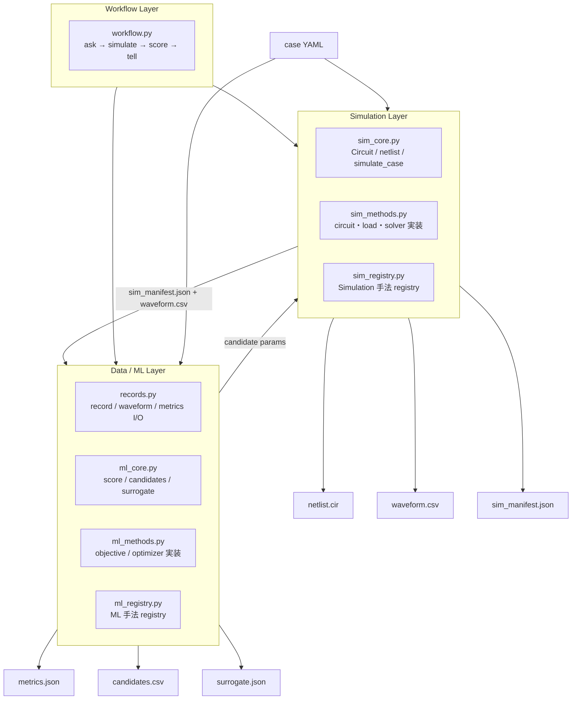

重要なのは、`Simulation Layer` と `Data / ML Layer` が直接 import し合わないことである。v6 のテストでは、`sim_core.py`, `sim_methods.py`, `sim_registry.py` が ML 系モジュールを import しないこと、`ml_core.py`, `ml_methods.py`, `ml_registry.py`, `records.py` が simulation 系モジュールを import しないことを静的に確認している。

### 2.2 ファイル構成

```text
circuit_design_platform_v6_final/
  pcd/
    common.py        # Case, YAML/JSON, design variable, SPICE 値ヘルパ
    sim_registry.py  # Simulation 手法登録
    sim_core.py      # Circuit, netlist 生成, simulate_case, batch simulation
    sim_methods.py   # built-in circuit/load/solver
    records.py       # saved record, waveform, metrics I/O
    ml_registry.py   # ML 手法登録
    ml_core.py       # score, propose, learning table, ridge surrogate
    ml_methods.py    # built-in objective/optimizer
    workflow.py      # optional closed-loop coupling
    cli.py           # CLI entrypoint
  examples/
  tests/
```

この構成は、階層を深くせず、第三者が読む順番を明確にするための設計である。

推奨読解順序は次である。

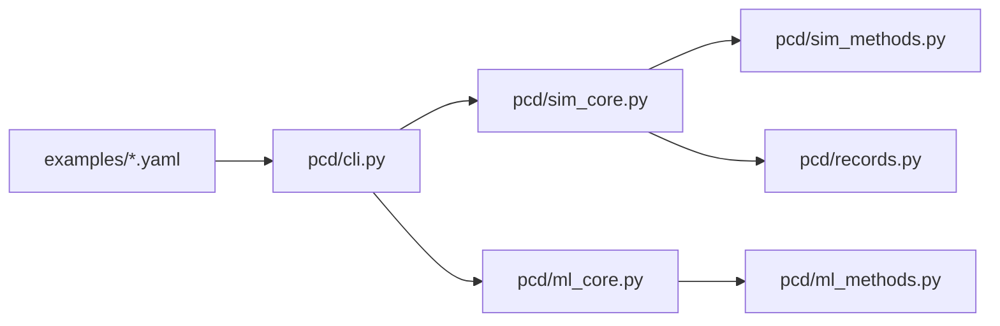

---

## 3. 主なワークフロー

### 3.1 Simulation only

回路計算だけを行い、目的関数は計算しない。

```bash
pcd sim-run examples/rf_plasma_fixed.yaml \
  --solver ngspice_cli \
  --run-root runs/sim_only
```

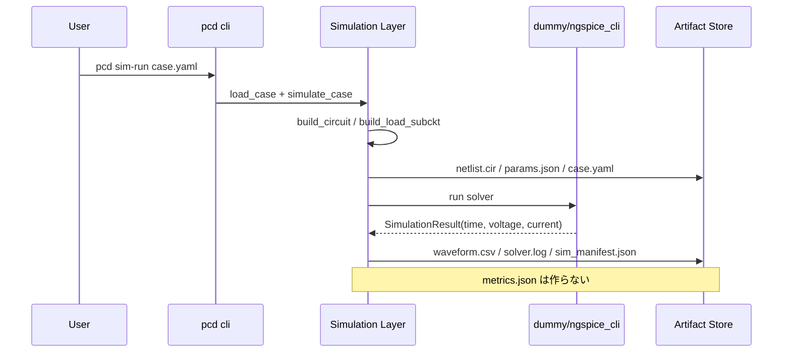

出力は次である。

| artifact | 役割 |
|---|---|
| `netlist.cir` | ngspice で実行される回路定義 |
| `waveform.csv` | `time_s`, `voltage_V`, `current_A` の保存波形 |
| `sim_manifest.json` | case_id, params, circuit, load, solver, artifact 名など |
| `solver.log` | ngspice または dummy solver のログ |
| `circuit_to_plasma.json` | `plasma_io.export: true` の場合のみ、外部プラズマ計算への入力メタデータ |

### 3.2 ML only

既存の simulation record または外部波形を後から採点する。

```bash
pcd ml-score examples/rf_plasma_fixed.yaml runs/sim_only
```

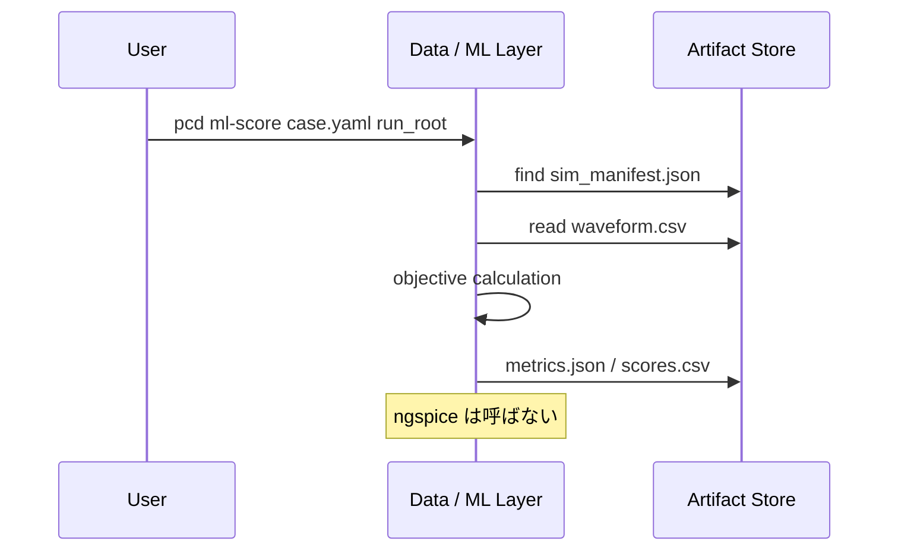

### 3.3 Batch study

候補生成、simulation batch、採点、surrogate 学習を分けて行う。

```bash
pcd ml-propose examples/topology_choice_pipeline.yaml \
  --n 100 \
  --out candidates.csv

pcd sim-batch examples/topology_choice_pipeline.yaml \
  candidates.csv \
  --solver ngspice_cli \
  --run-root runs/batch_001

pcd ml-score examples/topology_choice_pipeline.yaml runs/batch_001
pcd ml-fit-surrogate runs/batch_001 --out runs/batch_001/surrogate.json
```

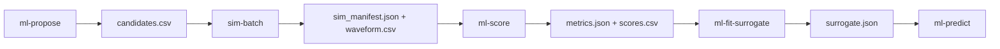

### 3.4 Closed-loop optimization

閉ループが必要な場合のみ `workflow.py` を使う。

```bash
pcd workflow-optimize examples/topology_choice_pipeline.yaml \
  --optimizer random \
  --solver ngspice_cli \
  --n-trials 100 \
  --run-root runs/closed_loop
```

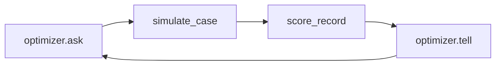

---

## 4. コード設計の詳細

### 4.1 `Case` と YAML 駆動

`common.py` の `Case` は、YAML/JSON case ファイルを軽量に包む dataclass である。あえて重い schema validation を入れていない。研究・探索段階では、仕様変更のたびに Pydantic schema や巨大な契約層を修正する負担が大きいためである。

```python
@dataclass(frozen=True)
class Case:
    path: Path
    data: dict[str, Any]
```

設計変数は、次の浅い場所から収集される。

```text
variables
source.variables
sources[].variables
circuit.variables
load.variables
```

この設計により、通常回路、RF 電極回路、プラズマ負荷付き回路を同じ YAML 形式で扱える。

### 4.2 design variable の扱い

設計変数は `bounds`, `scale`, `choices`, `default` を持つ。

```yaml
variables:
  topology_choice:
    choices: [l_match, pi_match, pi_match_harmonic]
    default: pi_match
  Vsrc_amp:
    bounds: [100, 900]
    scale: linear
    default: 500
```

連続値は線形または対数スケールで sample される。カテゴリ変数は `choices` から sample される。

この単純な形式の利点は、回路設計者にもデータサイエンティストにも読みやすいことである。

### 4.3 Circuit IR

`sim_core.py` の `Circuit` は、二端子部品のリストを持つ最小の中間表現である。

```python
@dataclass
class Component:
    ref: str | None
    n1: str | None
    n2: str | None
    value: Any
    raw: str | None = None

@dataclass
class Circuit:
    components: list[Component]
    params: dict[str, Any]
    output_node: str
```

これは過剰な回路グラフ DSL ではなく、ngspice netlist へ変換しやすい最小表現である。

### 4.4 built-in circuit builder

v6 の built-in circuit builder は次である。

| builder | 内容 | 主な用途 |
|---|---|---|
| `from_yaml` | YAML の `components` をそのまま回路化 | 汎用回路、試作 |
| `l_match` | series L + shunt C | 単純 RF 整合 |
| `pi_match` | shunt C + series L + shunt C | RF 整合、電極回路 |
| `pi_match_harmonic` | pi match + series LC shunt branch | 高調波 shaping |

例: `pi_match_harmonic`

```text
src ── L1 ── electrode
 |             |
 C1            C2
 |             |
 0             0
               |
             Lh-Ch series branch
               |
               0
```

### 4.5 load model の一般化

本コードでは、プラズマを特別扱いせず、`load` の一種として扱う。

| load | 内容 | 用途 |
|---|---|---|
| `none` | 追加負荷なし | 通常回路、単体確認 |
| `resistor` | 抵抗負荷 | ダミーロード |
| `parallel_rc` | 並列 RC | 容量性負荷 |
| `series_rlc` | 直列 RLC + leak | 一般等価負荷 |
| `electrode_stray` | 電極寄生容量 + leak | プラズマなし電極評価 |
| `from_yaml` | 任意 load を YAML 定義 | 拡張用 |
| `plasma_fixed_rlc` | 固定 bulk R/L + sheath C | 初期プラズマ近似 |
| `plasma_state_rlc` | plasma state から R/L 計算 | 縮約プラズマ連携 |
| `plasma_table_rlcq` | 時系列 Rp/Lp/Csh を PWL/Q 式で反映 | 外部プラズマ計算連携 |

この設計により、プラズマなしの一般回路から、プラズマチャンバー負荷付き回路まで、同じ runner と artifact 管理で扱える。

### 4.6 registry による手法追加

新しい circuit builder、load、solver、objective、optimizer は、小さな関数として登録する。

```python
from pcd.sim_registry import register

@register("load", "my_plasma_load")
def my_plasma_load(case, params):
    return """
.subckt load_model p n
R1 p n 50
.ends load_model
""".strip()
```

この方式の利点は以下である。

| 利点 | 説明 |
|---|---|
| 低い学習コスト | 1 関数を書けば手法を追加できる |
| 中心コードを壊しにくい | plugin で拡張できる |
| 大人数開発に向く | 手法ごとに担当者を分けられる |
| 過剰な契約を避ける | 形式は最小限の戻り値に限定 |

---

## 5. ngspice 計算部の数値計算設計

### 5.1 ngspice の採用理由

ngspice は、線形・非線形回路の一般的な SPICE 解析を行えるオープンソース回路シミュレータである。ngspice manual では、抵抗、容量、インダクタ、独立/依存電源、伝送線、半導体素子などを含む回路の nonlinear and linear analyses を扱う general-purpose circuit simulation program と説明されている [R1]。

本コードで特に重要なのは transient analysis である。ngspice manual では、transient analysis は DC 解を初期点として取得し、その後、時間依存要素を再導入して時間波形を逐次解く解析として説明されている [R1]。

本コードは、YAML から次のような ngspice netlist を生成する。

```spice
* Auto-generated simulation netlist
.param C1=2e-10
.param L1=8e-7

* Sources
Vsrc src 0 SIN(0 500 13560000 0 0 0)

* Circuit
C1 src 0 {C1}
L1 src electrode {L1}
C2 electrode 0 {C2}

* Optional load
.subckt load_model p n
Rbulk p nb {Rp}
Lbulk nb ns {Lp}
Csh ns n {Csh}
Rleak p n 1e12
.ends load_model
Xload electrode 0 load_model

.save v(electrode) i(Vsrc)
.control
tran 2e-10 7.3746e-7
wrdata waveform.csv time v(electrode) i(Vsrc)
quit
.endc
.end
```

### 5.2 時間変化素子への対応

ngspice manual では、behavioral resistor は `R = 'expression'` 形式を持ち、式には node voltage、branch current、parameter、special variable `time` などを含められる [R1]。同様に behavioral capacitor には `C = 'expression'` と `Q = 'expression'` の二形式がある [R1]。

本コードの `plasma_table_rlcq` は、外部プラズマシミュレーションから得た `time_s, Rp_ohm, Lp_H, Csh_F` を ngspice の PWL 式に変換する。

```spice
Rbulk p nb R = 'pwl(time, t0, Rp0, t1, Rp1, ...)'
Lbulk nb ns L = 'pwl(time, t0, Lp0, t1, Lp1, ...)'
Csh ns n Q = '(pwl(time, t0, C0, t1, C1, ...))*V(ns,n)'
```

シース容量を `C = C(t)` ではなく `Q = C(t)V` として出す理由は、時間変化容量では電流が

$$
i(t) = \frac{dQ}{dt}
$$

で定義されるためである。仮に

$$
Q(t) = C(t)V(t)
$$

と置くと、

$$
i(t) = \frac{d}{dt}\{C(t)V(t)\}
     = C(t)\frac{dV}{dt} + V(t)\frac{dC}{dt}
$$

となる。RF シースのように容量が時間変化する場合、この扱いは物理的に自然である。もちろん、実プラズマでは非線形な sheath charge-voltage 関係

$$
Q_{\mathrm{sh}} = Q_{\mathrm{sh}}(V_{\mathrm{sh}}, t, n_e, T_e, \ldots)
$$

が必要になる場合がある。その場合も、`Q = 'expression'` 形式や外部 model 化へ拡張しやすい。

### 5.3 プラズマ等価回路の簡易理論

bulk plasma を一様スラブとして近似し、電子の運動量緩和を衝突周波数 $\nu_m$ で表すと、導電率は

$$
\sigma(\omega) = \frac{n_e e^2}{m_e(\nu_m + j\omega)}
$$

で近似できる。長さ $\ell$、有効面積 $A$ の bulk impedance は

$$
Z_{\mathrm{bulk}} = \frac{\ell}{A\sigma}
= \frac{\ell m_e}{A n_e e^2}(\nu_m + j\omega)
$$

したがって、等価的に

$$
Z_{\mathrm{bulk}} = R_p + j\omega L_p
$$

と置けば、

$$
L_p = \frac{\ell m_e}{A n_e e^2}, \qquad
R_p = \nu_m L_p
$$

となる。本コードの `plasma_state_rlc` はこの関係を用いる。

シースは最初の近似として平行平板容量で表す。

$$
C_{\mathrm{sh}} \approx \frac{\epsilon_0 A}{s_{\mathrm{sh}}}
$$

ここで $s_{\mathrm{sh}}$ はシース厚である。より高精度化する場合は、非線形シース容量、自己バイアス、イオン応答、二次電子放出、壁反応を含む外部プラズマモデルから `plasma_table_rlcq` へ戻す。

### 5.4 solver 抽象化

v6 の solver は simulation registry に登録される。

| solver | 内容 |
|---|---|
| `dummy` | ngspice を呼ばず、ワークフロー確認用の合成波形を生成する |
| `ngspice_cli` | `ngspice -b -o solver.log netlist.cir` で batch 実行する |

`dummy` solver は物理計算ではない。しかし共同開発では非常に重要である。ngspice が入っていない環境でも、YAML 読み込み、netlist 生成、artifact 保存、ML scoring、candidate workflow を確認できるためである。

---

## 6. Data / ML 部の手法

### 6.1 ML layer の責務

ML layer は、保存済みの simulation record を読むだけである。

```text
sim_manifest.json
waveform.csv
    ↓
objective calculation
    ↓
metrics.json
scores.csv
    ↓
learning table
    ↓
surrogate.json
```

この設計により、ML layer は ngspice の有無や netlist 生成方法に依存しない。実測波形や外部プラズマ連成波形も `records.import_external_waveform()` で simulation record 互換に変換すれば同じ objective で採点できる。

### 6.2 波形追従目的関数

built-in objective `waveform_l2` は、目標波形 $V_{\mathrm{ref}}(t)$ と解析波形 $V(t)$ の正規化 RMSE を用いる。

$$
J_{\mathrm{wave}}
=
\frac{
\sqrt{\frac{1}{N}\sum_{i=1}^{N}\left(V(t_i)-V_{\mathrm{ref}}(t_i)\right)^2}
}{
\sqrt{\frac{1}{N}\sum_{i=1}^{N} V_{\mathrm{ref}}(t_i)^2}+\epsilon
}
$$

ここで、解析波形は目標波形の時刻点へ線形補間される。

### 6.3 高調波誤差

`waveform_l2_harmonics` は FFT を使い、指定高調波成分の誤差を加える。

$$
J_{\mathrm{harm}}
=
\frac{1}{|K|}
\sum_{k\in K}
\frac{
|\hat{V}(k f_0)-\hat{V}_{\mathrm{ref}}(k f_0)|
}{
|\hat{V}_{\mathrm{ref}}(k f_0)|+\epsilon
}
$$

最終 loss は

$$
J = J_{\mathrm{wave}} + w_h J_{\mathrm{harm}} + J_{\mathrm{penalty}}
$$

である。

半導体プラズマ処理では、電極波形の高調波成分は単なる波形歪みではなく、シース運動、自己バイアス、イオンエネルギー分布に関係する。電圧波形 tailoring によって ion flux-energy distribution のピーク位置やフラックスを制御できる可能性が示されている [R4]。

### 6.4 CCP benchmark 用 power proxy objective

作成済みの CCP benchmark pack には、plugin objective `ccp_waveform_power_proxy` が含まれる。

この objective は次を返す。

| metric | 意味 |
|---|---|
| `loss` | 総合スカラー目的関数 |
| `normalized_rmse` | 目標波形との正規化 RMSE |
| `harmonic_error` | 指定高調波成分の相対誤差 |
| `avg_power_proxy_W` | $\langle V(t)I(t)\rangle$ による平均電力 proxy |
| `power_error` | 目標電力からの相対誤差 |
| `dc_bias_proxy_V` | 波形平均値による DC bias proxy |
| `v_rms_V` | 電極電圧 RMS |
| `v_peak_abs_V` | 電圧ピーク絶対値 |
| `i_rms_A` | 電流 RMS |
| `constraint_penalty` | 電圧・電流上限制約のペナルティ |

総合 loss は概念的には次である。

$$
J =
J_{\mathrm{wave}}
+ w_h J_{\mathrm{harm}}
+ w_p \frac{|P_{\mathrm{proxy}}-P_{\mathrm{target}}|}{|P_{\mathrm{target}}|+\epsilon}
+ J_{\mathrm{constraint}}
$$

ただし、これは circuit screening 用 proxy であり、イオンフラックスやイオンエネルギー分布を直接予測するものではない。プロセスメトリクスは、外部 PIC/MCC、fluid、global model、実測から取得するのが望ましい。

### 6.5 optimizer

v6 の optimizer は `ask/tell` 型である。

```python
params = optimizer.ask()
metrics = evaluate(params)
optimizer.tell(params, metrics)
```

この形式は、simulation が ngspice 由来でも、実測由来でも、HPC batch 由来でも使える。

built-in optimizer は次である。

| optimizer | 特徴 |
|---|---|
| `random` | 依存関係なし。基準性能、ワークフロー確認、並列 batch に向く |
| `optuna` | optional dependency。TPE sampler、カテゴリ/連続/対数変数に対応 |

Optuna は define-by-run API により探索空間を Python 実行時に動的に定義でき、探索・pruning・分散運用を考慮した HPO フレームワークとして提案されている [R8]。本コードでは、Optuna を optional に留め、最小依存では random optimizer だけで動くようにしている。

### 6.6 ridge surrogate

v6 は軽量な ridge surrogate を持つ。これは本格的な surrogate optimization ではなく、保存済み trial から設計変数と loss の関係を粗く見るための最小モデルである。

カテゴリ変数は one-hot encoding され、数値変数と合わせて特徴量行列 $X$ になる。標準化後、次を解く。

$$
\hat{\beta}
=
\arg\min_{\beta}
\|X\beta-y\|_2^2 + \alpha\|\beta\|_2^2
$$

閉形式では、切片項を含む $X_1$ に対して

$$
\hat{\beta}
= (X_1^T X_1 + \alpha I)^{-1} X_1^T y
$$

である。

出力は `surrogate.json` で、特徴量名、平均、標準偏差、重み、training RMSE を保存する。これにより、後から `ml-predict` で候補の `predicted_loss` を付けられる。

将来、多目的・非線形・高コスト最適化へ進む場合は、pymoo や Gaussian Process、Random Forest、XGBoost、Neural surrogate を追加候補にできる。pymoo は Python の多目的最適化フレームワークとして、制約付き多目的問題、並列評価、可視化、多基準意思決定などを扱える [R9]。

---

## 7. 半導体プラズマチャンバー例題

### 7.1 GEC-like Argon CCP benchmark

本コードの評価に適した例題として、GEC-like Argon CCP を想定する。COMSOL の GEC CCP Argon 例では、NIST GEC CCP reactor は capacitively coupled plasmas を研究する標準化 platform とされ、Argon、100 mTorr、13.56 MHz、powered electrode 約 10 cm、gap 2.45 cm の条件が示されている [R2]。

| 項目 | 設定例 |
|---|---:|
| ガス | Ar |
| 圧力 | 100 mTorr ≈ 13.3 Pa |
| RF 周波数 | 13.56 MHz |
| powered electrode diameter | 0.10 m |
| electrode gap | 0.0245 m |
| electrode area | $\pi(0.05)^2 \approx 7.85\times10^{-3}\,\mathrm{m^2}$ |
| 設計対象 | RF 電源、整合回路、電極、プラズマ等価負荷 |

### 7.2 benchmark の 3 レベル

| Level | 目的 | v6 の評価点 |
|---|---|---|
| Level 1 | 固定・状態由来プラズマ負荷で RF 整合 | netlist 生成、plasma_state_rlc、ML scoring |
| Level 2 | 時変 plasma table を用いた waveform tailoring | `plasma_table_rlcq`, PWL, Q expression, 高調波評価 |
| Level 3 | topology/load 選択を含む最適化 | mixed continuous/categorical 変数、candidate batch、surrogate |

### 7.3 Level 1: 固定・状態由来プラズマ負荷

目的は、RF 整合回路と状態由来 RLC プラズマ負荷で、基本波の電極電圧目標を追従することである。

```yaml
circuit:
  builder: pi_match
  output_node: electrode

load:
  name: plasma_state_rlc
  ports: {p: electrode, n: 0}
  electron_density_m3: ne
  momentum_collision_Hz: nu_m
  bulk_length_m: 0.0245
  area_m2: 0.00785398163397
  Csh_F: Csh
```

評価項目は次である。

- `plasma_state_rlc` で $n_e$, $\nu_m$ から $R_p$, $L_p$ が生成されるか。
- `pi_match` の $C_1$, $L_1$, $C_2$ が `.param` として出力されるか。
- `sim-run` では `metrics.json` を作らず、`ml-score` で後から作れるか。

### 7.4 Level 2: 時間変化プラズマ負荷

目的は、外部プラズマシミュレーション出力を模擬した時系列テーブルを load として接続し、tailored waveform を追従することである。

```yaml
circuit:
  builder: pi_match_harmonic

load:
  name: plasma_table_rlcq
  table_file: plasma_table_gec_argon_synthetic.csv
```

プラズマテーブルは次の列を持つ。

```csv
time_s,Rp_ohm,Lp_H,Csh_F,electron_density_m3,momentum_collision_Hz,sheath_thickness_m
```

この Level では、次が評価できる。

- 外部プラズマデータを PWL 時系列として取り込めるか。
- シース容量が `Q = C(t)V` として出力されるか。
- 高調波を含む目標波形に対して、`harmonic_error` が計算されるか。
- `circuit_to_plasma.json` により、回路側からプラズマ側へ渡す情報が整理されるか。

### 7.5 Level 3: topology/load 選択を含むデータサイエンス評価

目的は、v6 が単なる ngspice wrapper ではなく、設計探索・データサイエンス基盤として機能することを確認することである。

```yaml
variables:
  topology_choice:
    choices: [l_match, pi_match, pi_match_harmonic]
  load_model:
    choices: [electrode_stray, plasma_fixed_rlc, plasma_state_rlc]

circuit:
  builder: $topology_choice

load:
  name: $load_model
```

ここでは、連続変数とカテゴリ変数が混在する。

| 種別 | 変数例 |
|---|---|
| 連続 | `Vsrc_amp`, `C1`, `L1`, `C2`, `Lh`, `Ch`, `Rp`, `Lp`, `Csh`, `ne`, `nu_m` |
| カテゴリ | `topology_choice`, `load_model` |

この Level では、`ml-propose → sim-batch → ml-score → ml-fit-surrogate` の分離ワークフローが有用である。

### 7.6 ベンチマーク問題設定と検証項目の読み方

このベンチマークは、プラズマ装置そのものの最終設計を保証する試験ではない。評価しているのは、CCP RF 回路の設計候補を生成し、ngspice の過渡解析で波形と物理制約を測り、実行可能な候補を見分けられるかである。したがって、単一の best loss だけでなく、feasible 率、制約違反率、中央値、p90/max の外れ値リスク、topology/load 別の安定性を同時に読む。

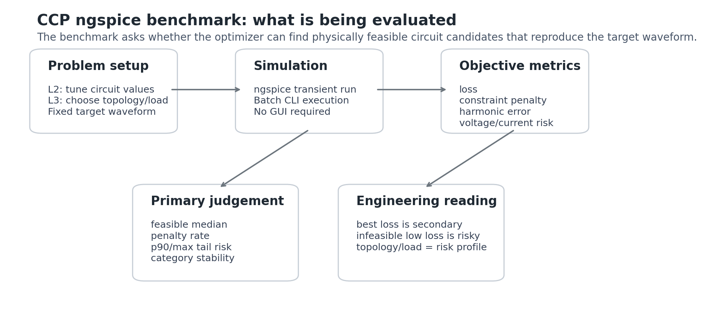

#### 回路図で見る benchmark level

各 level は、同じ RF 電源から electrode を駆動し、右側にプラズマ等価負荷を置く、という読み方で見る。Level が上がるほど、負荷モデルや topology/load の選択が評価対象に入る。

Level 1 は固定または状態由来の RLC 負荷を用いる基本形である。回路生成、netlist 生成、ngspice 実行、波形保存が正しくつながるかを見る入口になる。

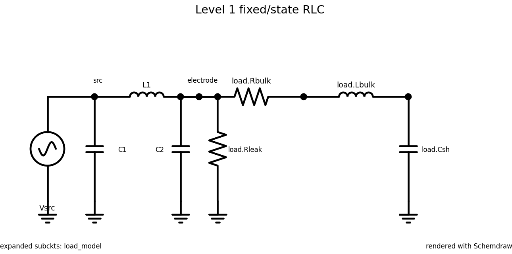

Level 2 は、plasma table 由来の時間変化負荷と harmonic branch を含む。ここでは、固定 RLC ではなく、時間変化する plasma load に対して波形をどこまで合わせられるかを見る。

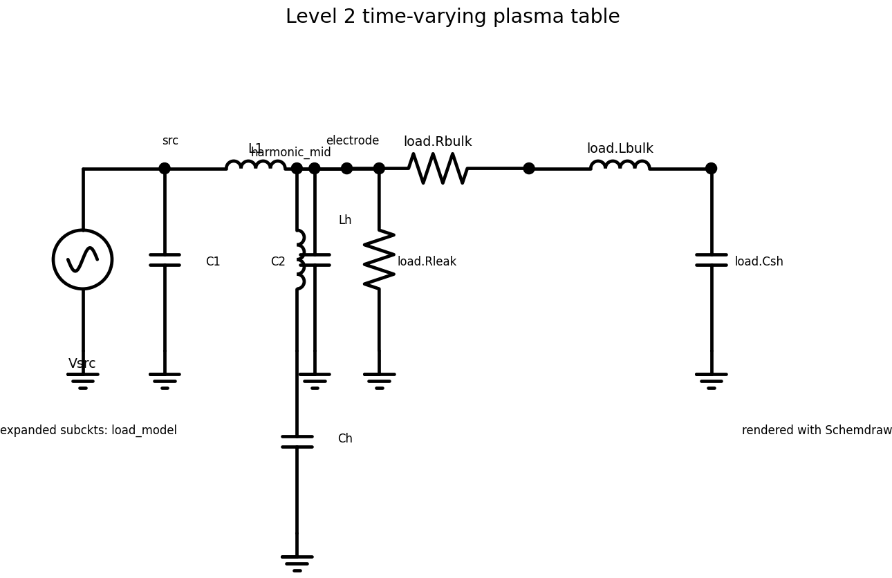

Level 3 は topology/load 選択を含む問題である。下図は default 表示の代表回路であり、実際の benchmark では `l_match`, `pi_match`, `pi_match_harmonic` と `electrode_stray`, `plasma_fixed_rlc`, `plasma_state_rlc` の組み合わせを切り替えて評価する。

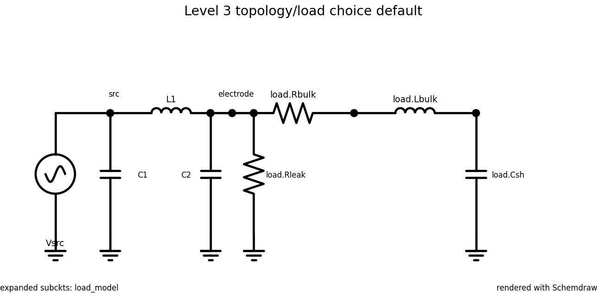

#### 問題設定

| 項目 | 内容 |
|---|---|
| 対象 | GEC-like Argon CCP を想定した RF 整合回路と等価プラズマ負荷 |
| Level 2 | 時間変化する plasma table load に対して、連続値パラメータで目標波形へ近づける |
| Level 3 | `l_match`, `pi_match`, `pi_match_harmonic` と `electrode_stray`, `plasma_fixed_rlc`, `plasma_state_rlc` の組み合わせを含む mixed search |
| simulator | `ngspice_cli`。Windows では既定で `ngspice_con.exe` を優先し、画面を出さずに batch 実行する |
| 入力データ | candidate parameters、topology/load choice、target waveform、plasma table |
| 出力データ | waveform、loss、constraint penalty、`v_peak_abs_V`、`i_rms_A`、harmonic A1/A2/A3、category summary |

検証項目は次の順で読む。

1. 実行安定性: `n_failed_trials=0` であるか。
2. 実行可能性: `constraint_penalty <= 0` の候補が十分にあるか。
3. 波形一致: feasible 候補の best/median loss が低いか。
4. 物理リスク: `v_peak_abs_V` と `i_rms_A` の外れ値が多くないか。
5. カテゴリ差: topology/load の違いが loss と penalty rate に現れているか。
6. 高調波再現性: A1 だけでなく A2/A3 も target に近いか。

次の図は、30 trials の standard benchmark をエンジニア向けの判定ゲートとして見たものである。各棒は独立した条件の通過数であり、左から右へ絞り込む累積 funnel ではない。たとえば `Loss < 2` を満たしていても、電圧または電流の制約を満たすとは限らない。

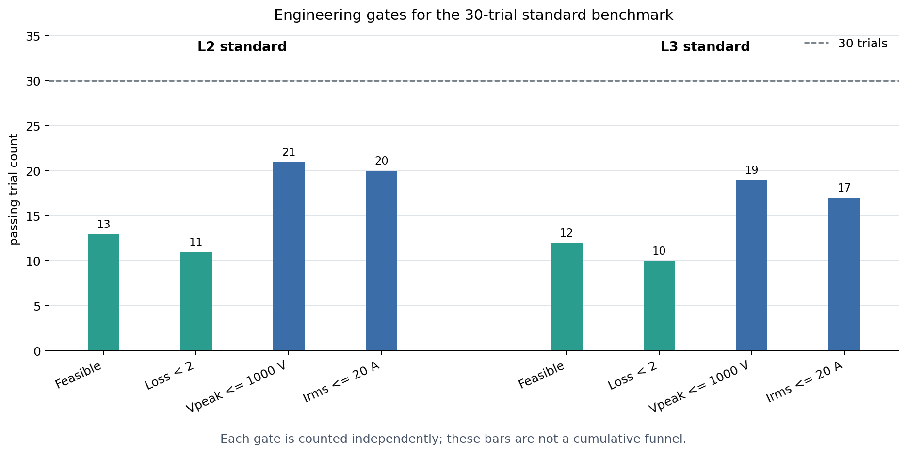

#### 実行可能性の結果

30 trials の standard 実行では、L2 は 13/30、L3 は 12/30 が feasible だった。L3 100 trials の extended 実行では 50/100 が feasible で、制約違反は偶発的ではなく問題設定の主要な評価軸になっている。

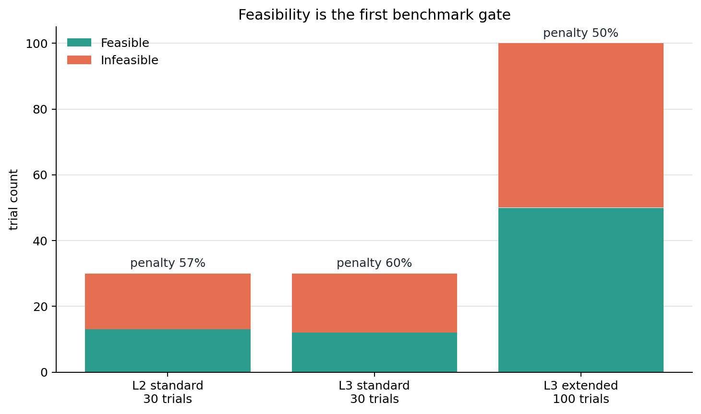

feasible と infeasible を混ぜた平均 loss は、外れ値 penalty に強く支配される。そのため、設計判断では全体平均よりも feasible median と infeasible tail risk を分けて見る。

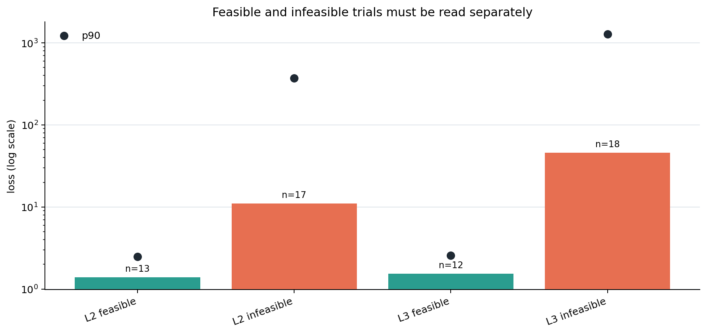

| case | trials | feasible | best loss | feasible median | infeasible median | p90 loss | max loss |
|---|---:|---:|---:|---:|---:|---:|---:|
| L2 standard | 30 | 13 | 0.578 | 1.390 | 11.050 | 121.461 | 753.367 |
| L3 standard | 30 | 12 | 0.503 | 1.529 | 46.001 | 704.383 | 6284.686 |
| L3 extended | 100 | 50 | 0.503 | 1.399 | 14.612 | 236.887 | 32321.608 |

この結果から、L2/L3 ともに低 loss 候補は存在する。ただし、L3 は設計空間が広がる分、制約違反と tail risk が大きく、best loss だけで「良い設計空間」とは言えない。

上位候補を電圧・電流の安全窓に置くと、feasible 候補と「loss は低いが制約違反の候補」の違いが分かりやすい。下図では 1000 V と 20 A を目安線として置いている。制約違反候補は、loss が悪く見えない場合でも実機設計候補としては慎重に扱う必要がある。

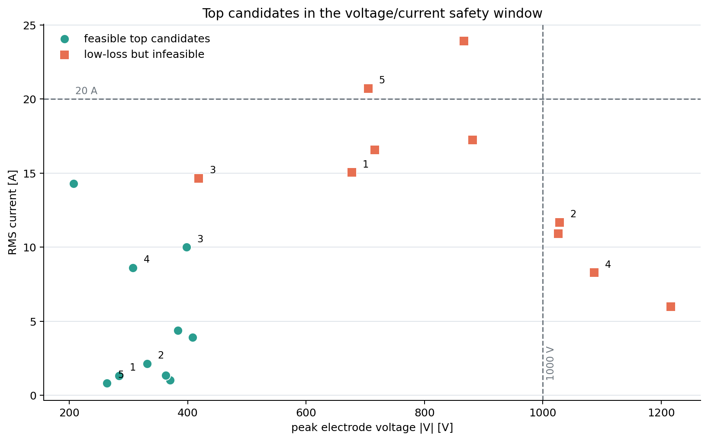

#### topology/load 別のリスク

L3 100 trials では topology/load の違いがスコアに現れた。`l_match` は median loss と penalty rate が比較的低い。一方で `pi_match` と `pi_match_harmonic` は penalty rate が高く、特に tail risk を持つ。load では `plasma_state_rlc` が median loss と max loss の面で比較的安定し、`electrode_stray` は最大外れ値が大きい。

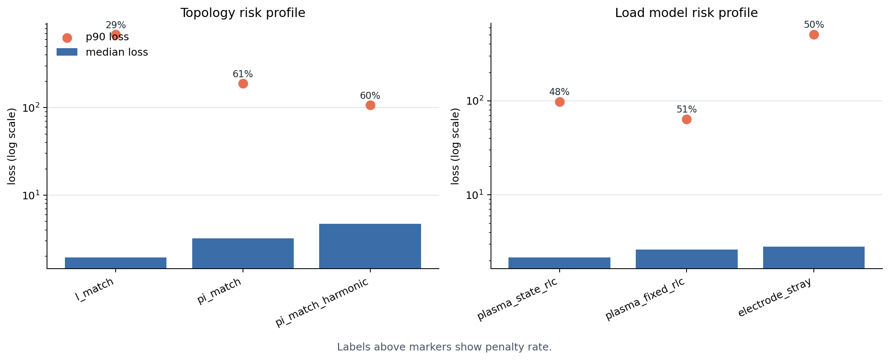

| group | count | median loss | p90 loss | max loss | penalty rate |
|---|---:|---:|---:|---:|---:|
| topology: `l_match` | 34 | 1.936 | 688.220 | 6284.686 | 29.4% |
| topology: `pi_match` | 31 | 3.222 | 189.323 | 8026.126 | 61.3% |
| topology: `pi_match_harmonic` | 35 | 4.721 | 106.531 | 32321.608 | 60.0% |
| load: `plasma_state_rlc` | 25 | 2.157 | 97.381 | 2188.804 | 48.0% |
| load: `plasma_fixed_rlc` | 39 | 2.620 | 63.605 | 8026.126 | 51.3% |
| load: `electrode_stray` | 36 | 2.820 | 508.993 | 32321.608 | 50.0% |

ここでの結論は「どの topology/load が絶対に最良か」ではなく、「組み合わせごとに制約違反と外れ値の出方が異なるため、benchmark はカテゴリ差を検出できている」という点である。

同じ情報を組み合わせ表として見ると、設計候補の初期選別に使いやすい。各セルは 1 行目が median loss、2 行目が penalty rate である。色が濃いほど median loss が悪い。`pi_match_harmonic + electrode_stray` は loss と penalty rate の両方で避けたい組み合わせとして見える一方、`l_match + plasma_fixed_rlc` はこの試行範囲では扱いやすい。

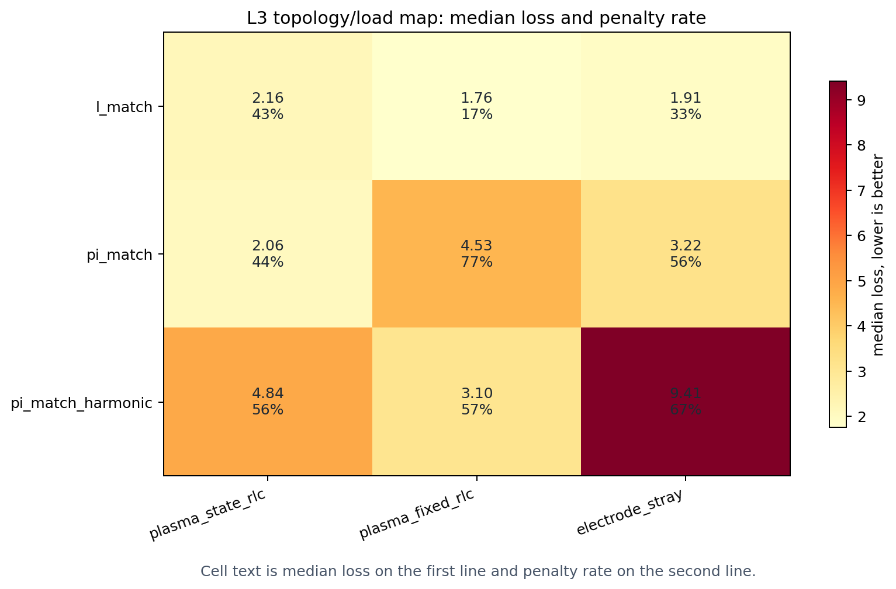

#### 高調波再現性

best L3 候補は A1 の振幅は target とよく合っているが、A2/A3 はほとんど再現できていない。したがって、今回の結果だけで harmonic tailoring に成功したとは言えない。

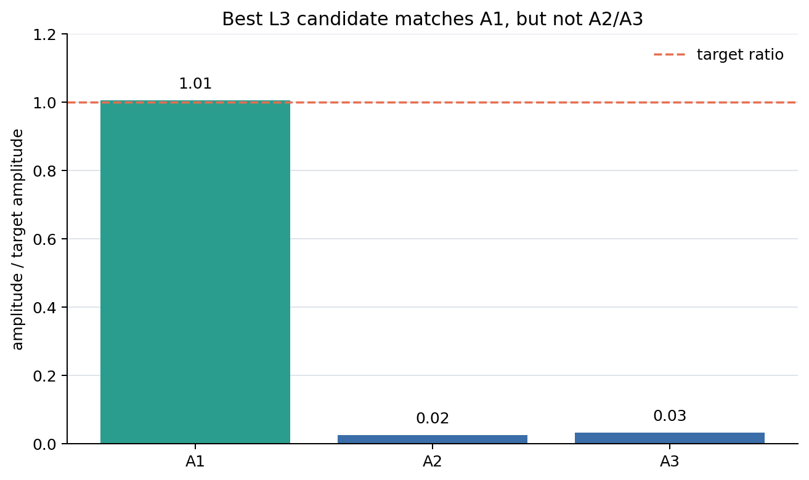

| 成分 | target ratio |
|---|---:|
| A1 | 1.006 |
| A2 | 0.024 |
| A3 | 0.031 |

#### loss を動かしている量

L3 extended の結果では、loss は constraint penalty、RMS current、waveform error、高調波 error、peak voltage と強く一緒に動いている。これは「最適化が波形だけを見ている」のではなく、制約違反と電気的リスクがスコアに大きく入っていることを示す。設計レビューでは、loss の数値を見る前に `constraint_penalty`, `i_rms_A`, `v_peak_abs_V` を確認するのが安全である。

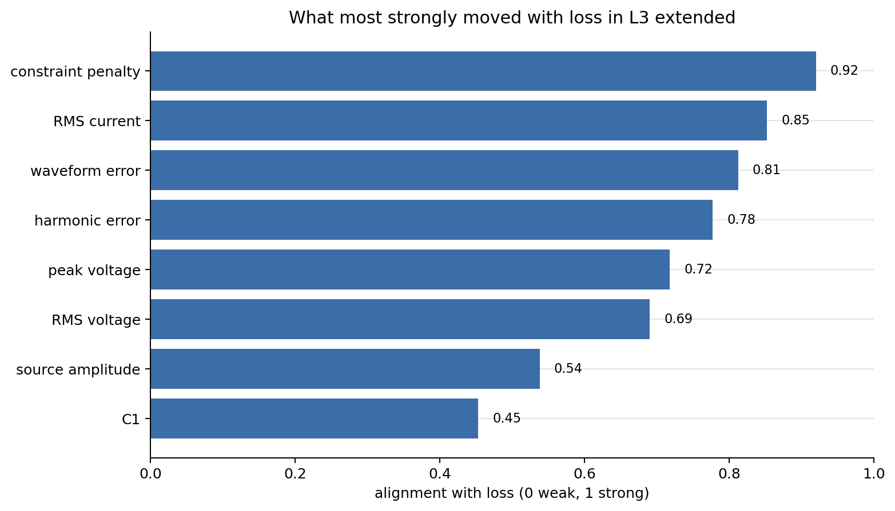

#### この問題設定に対する結論

このベンチマークは、次の用途には有用である。

- ngspice batch 実行、waveform metric、constraint penalty、category 集計が一連の評価として機能するかを検証する。
- feasible 候補と危険な低 loss 候補を分けて見つける。
- topology/load の違いが score とリスクに反映されるかを確認する。
- 高電圧、高電流、penalty tail を、最適化の副作用として可視化する。

一方で、今回の結果だけではプラズマ装置として最適設計できたとは言えない。理由は、feasible 率が L2/L3 でまだ十分高くなく、L3 では tail risk が大きく、best candidate も A2/A3 高調波を再現できていないためである。現時点の結論は、「本問題設定は benchmark として有用であり、回路候補の良否とリスク差を検出できる。ただし、装置設計の最終最適化としては未達」である。

図は `py ccp_benchmark_pack\plot_benchmark_explainer.py` で再生成できる。

---

## 8. 外部プラズマシミュレーションとの連携

### 8.1 v6 が担う境界

v6 は、PIC/MCC や fluid model の代替ではない。低圧 RF プラズマでは非局所・kinetic な効果が重要であり、PIC/MCC は低圧 RF プラズマの自己無撞着記述に重要な手法である [R5]。

そのため、v6 は次の境界を提供する。

```mermaid
flowchart LR
    A[回路 simulation\nwaveform.csv] --> B[circuit_to_plasma.json]
    B --> C[外部プラズマ model\nPIC/MCC・fluid・global]
    C --> D[plasma_table.csv\nRp(t), Lp(t), Csh(t)]
    D --> E[plasma_table_rlcq load]
    E --> A
```

### 8.2 回路からプラズマへ渡す情報

`plasma_io.export: true` の場合、`circuit_to_plasma.json` が保存される。

| 項目 | 内容 |
|---|---|
| `waveform_file` | `waveform.csv` |
| `waveform_columns` | `time_s`, `voltage_V`, `current_A` |
| `voltage_node` | 例: `electrode` |
| `current_source` | 例: `Vsrc` |
| `source` | RF 電源設定 |
| `circuit` | 選択された circuit builder |
| `load` | 選択された load model |
| `params` | 設計変数 |
| `geometry` | 電極径、面積、gap など |
| `process_condition` | gas, pressure, frequency など |
| `requested_outputs` | `Rp_ohm`, `Lp_H`, `Csh_F`, `ion_flux_m2_s` など |

### 8.3 プラズマから回路へ戻す情報

最小 I/O は次である。

```csv
time_s,Rp_ohm,Lp_H,Csh_F
```

将来的には次を追加する。

| 区分 | 量 |
|---|---|
| 等価負荷 | `Rp(t)`, `Lp(t)`, `Csh(t)`, `Qsh(V,t)` |
| 状態量 | `ne`, `Te`, `nu_m`, `plasma_potential` |
| プロセス指標 | ion flux, ion energy distribution, radical flux, uniformity |
| 数値品質 | convergence status, residual, uncertainty |

### 8.4 BOLSIG+ / LXCat / PIC-MCC の位置づけ

BOLSIG+ は、弱電離ガス中の電子 Boltzmann 方程式を解き、断面積データから電子輸送係数と衝突 rate coefficient を得るためのプログラムである [R6]。LXCat は、低温プラズマ modeling に必要な electron/ion scattering cross sections、swarm parameters、reaction rates、energy distribution functions などを収集・表示・ダウンロードする open-access website である [R7]。

これらは、v6 の `plasma_state_rlc` や `plasma_table_rlcq` の入力を作る補助として使える。

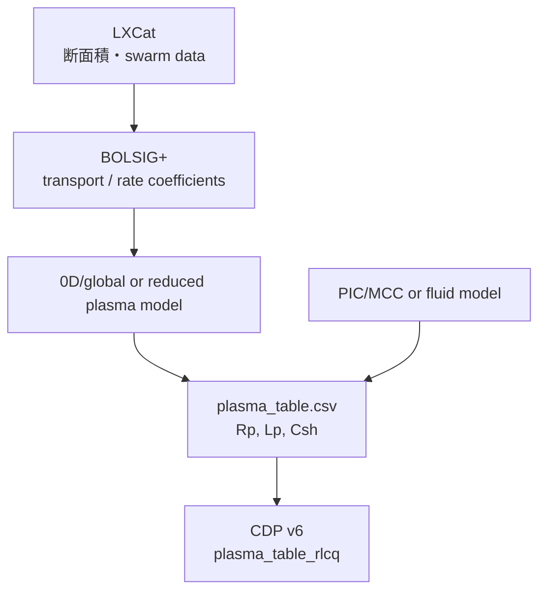

---

## 9. 本コードの工夫と独自性

ここでの「独自性」は、世界初のアルゴリズムという意味ではなく、**本解析目的に対して、実務・研究・共同開発で破綻しにくいよう組み合わせた設計上の工夫**を指す。

### 9.1 Simulation と ML の明確分離

最も重要な工夫は、次の境界である。

```text
Simulation output:
  sim_manifest.json + waveform.csv

ML input:
  sim_manifest.json + waveform.csv
```

この境界により、次が可能になる。

| 効果 | 説明 |
|---|---|
| 再現性 | `params.json`, `netlist.cir`, `sim_manifest.json` が trial ごとに残る |
| 分業 | 回路担当は simulation、DS 担当は scoring/surrogate に集中できる |
| HPC 適用 | `sim-batch` を HPC へ載せ、`ml-score` は後でローカル実行できる |
| 実測利用 | 外部波形を record 化して ML layer だけで採点できる |
| 保守性 | ngspice 実行部を変更しても objective/optimizer は壊れにくい |

### 9.2 optional load による汎用性

プラズマは `load` の一種である。これにより、次の比較が同じ仕組みでできる。

| 設定 | 意味 |
|---|---|
| `load: none` | 回路単体 |
| `load: electrode_stray` | 電極寄生容量のみ |
| `load: plasma_fixed_rlc` | 固定プラズマ等価負荷 |
| `load: plasma_state_rlc` | 状態量から計算したプラズマ負荷 |
| `load: plasma_table_rlcq` | 外部プラズマ時系列負荷 |

これは、半導体装置開発でよく必要になる「プラズマあり/なし」「ダミーロード/実プラズマ」「固定近似/時変近似」の比較に適している。

### 9.3 `Q = C(t)V` による時変シース容量表現

時間変化容量を扱う場合、単に容量値だけを変えると物理的な charge conservation の扱いが曖昧になりうる。本コードでは、外部プラズマ table 由来のシース容量を

$$
Q_{\mathrm{sh}}(t)=C_{\mathrm{sh}}(t)V_{\mathrm{sh}}(t)
$$

として出力する。

ngspice は behavioral capacitor に `Q = 'expression'` 形式を持つため [R1]、この設計は time-varying sheath を扱う最初の近似として自然である。

### 9.4 small plugin pattern

手法追加は `@register()` の小さな関数に限定している。

| 追加対象 | 返すもの |
|---|---|
| circuit builder | `Circuit` |
| load builder | `.subckt load_model p n ... .ends` 文字列 |
| objective | `loss` を含む metrics dict |
| optimizer | `ask()` / `tell()` を持つ optimizer |

これにより、第三者が追加手法の場所を把握しやすくなる。

### 9.5 artifact first な設計

1 trial につき以下が残る。

```text
trial_xxxx/
  case.yaml
  params.json
  netlist.cir
  waveform.csv
  solver.log
  sim_manifest.json
  metrics.json        # ML scoring 後
```

これはデータサイエンス観点で重要である。再実行、比較、可視化、surrogate、失敗分析の単位が明確になる。

---

## 10. 想定効果

本コードの効果は、現時点では「想定効果」または「評価可能な効果」であり、特定装置での定量実測効果を主張するものではない。

| 従来課題 | 本コードの工夫 | 想定効果 |
|---|---|---|
| netlist と条件が散逸する | case YAML と artifact 保存 | 設計条件と結果の再現性が上がる |
| simulation と最適化が密結合 | simulation / ML layer 分離 | 担当分離、保守、再利用が容易になる |
| プラズマなし・ありの比較が面倒 | optional load | ダミーロード、寄生容量、固定/時変プラズマの比較が容易になる |
| 外部プラズマ計算と接続しづらい | `circuit_to_plasma.json` と `plasma_table_rlcq` | 回路 ↔ プラズマの I/O が明確になる |
| 高調波や波形目標を手作業評価 | `waveform_l2_harmonics` | 波形 tailoring の定量評価がしやすい |
| 最適化 trial の管理が煩雑 | `ml-propose`, `sim-batch`, `ml-score` | batch study と後処理が分離できる |
| 全候補に高忠実度 simulation は重い | lightweight surrogate | 低コスト screening と候補順位付けが可能になる |
| 大人数開発でコードが肥大化 | small registry / shallow files | 手法追加とレビューがしやすい |

### 10.1 定量評価の例

本コードの有用性は、例えば以下の KPI で評価できる。

| KPI | 測り方 |
|---|---|
| 再現性 | 同じ `case.yaml + params.json` から同じ netlist が生成されるか |
| 分離性 | `sim-run` で `metrics.json` が生成されないか、`ml-score` で後生成できるか |
| 探索効率 | random/Optuna/surrogate の loss 推移を比較 |
| ロバスト性 | `load_model` や plasma scenario を変えたときの loss 分布 |
| 物理妥当性 | ngspice 波形、VI probe、PIC/MCC/fluid 結果との比較 |
| 保守性 | 新 load/objective を plugin 1 関数で追加できるか |

---

## 11. 推奨する分析・可視化

CCP benchmark を実行した後、まず見るべき表は `scores.csv` である。

| 列 | 解釈 |
|---|---|
| `loss` | 総合スコア |
| `normalized_rmse` | 目標波形とのズレ |
| `harmonic_error` | 高調波成分のズレ |
| `avg_power_proxy_W` | 平均電力 proxy |
| `dc_bias_proxy_V` | DC bias proxy |
| `v_peak_abs_V` | 電圧ピーク |
| `i_rms_A` | 電流 RMS |
| `param.topology_choice` | 選択トポロジ |
| `param.load_model` | 選択負荷モデル |

推奨可視化は次である。

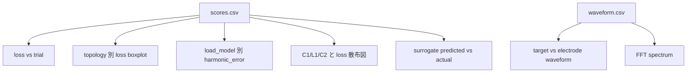

---

## 12. 限界と今後の改善

### 12.1 現時点の限界

| 項目 | 限界 |
|---|---|
| プラズマ物理 | `plasma_fixed_rlc` や `plasma_state_rlc` は縮約モデルであり、kinetic な詳細は解かない |
| 時変負荷 | `plasma_table_rlcq` は時系列 table の受け皿であり、外部プラズマ model が必要 |
| ngspice 実行 | 実 ngspice バージョン差、収束設定、PWL table 長による調整が必要 |
| surrogate | 現在は ridge のみで、非線形・不連続・多峰性には弱い |
| 多目的最適化 | 現在は scalar loss 中心で、Pareto front は未実装 |
| 並列実行 | 現在の batch はローカル逐次で、HPC queue は未実装 |
| 配置最適化 | 完全なグラフ生成・物理配置制約は未実装 |

### 12.2 改善ロードマップ

| Phase | 内容 |
|---|---|
| Phase 1 | ngspice 実機検証、solver log 分類、収束失敗処理の改善 |
| Phase 2 | 外部プラズマシミュレータ adapter 実装 |
| Phase 3 | plasma output から `Rp(t), Lp(t), Csh(t), Qsh(V,t)` を抽出する fit module |
| Phase 4 | multiprocessing / Slurm / PBS runner |
| Phase 5 | Gaussian Process, Random Forest, XGBoost, Neural surrogate の追加 |
| Phase 6 | pymoo 等による多目的最適化 |
| Phase 7 | grammar-based topology generator と配置制約 |
| Phase 8 | 実測 VI probe / OES / Langmuir probe データとの較正 |

---

## 13. 第三者向け導入手順

### 13.1 最小確認

```bash
python -m venv .venv
source .venv/bin/activate
pip install -e .

pcd list
pcd sim-run examples/generic_rc_filter.yaml --solver dummy --run-root runs/demo_sim
pcd ml-score examples/generic_rc_filter.yaml runs/demo_sim
```

### 13.2 プラズマ例題確認

CCP benchmark pack を `examples_ccp_gec/` としてコピー後、以下を実行する。

```bash
pcd sim-netlist examples_ccp_gec/ccp_gec_level2_timevarying_plasma.yaml \
  --out /tmp/ccp_level2.cir

pcd workflow-optimize examples_ccp_gec/ccp_gec_level3_topology_and_load_choice.yaml \
  --optimizer random \
  --solver dummy \
  --n-trials 20 \
  --run-root runs/ccp_level3_demo

pcd ml-score examples_ccp_gec/ccp_gec_level3_topology_and_load_choice.yaml \
  runs/ccp_level3_demo

pcd ml-fit-surrogate runs/ccp_level3_demo \
  --out runs/ccp_level3_demo/surrogate.json
```

ngspice を導入した環境では、`--solver dummy` を `--solver ngspice_cli` に変える。

---

## 14. まとめ

本コードは、半導体製造装置の RF プラズマチャンバーを含む回路設計において、次の課題を解くための軽量基盤である。

1. **プラズマ等価負荷を含む回路 netlist を自動生成する。**
2. **ngspice 計算部と ML/最適化部を明確に分離する。**
3. **プラズマなし、電極寄生、固定プラズマ、時変プラズマを同じ構造で扱う。**
4. **waveform artifact を中心に、後処理・採点・surrogate 学習を独立実行する。**
5. **大人数開発でも、過剰な契約や深い階層に頼らず、小さな手法関数で拡張できる。**

本コードの価値は、単一の高度な物理モデルを内蔵することではなく、**回路計算、プラズマ連成、データサイエンス、最適化を壊れにくい境界でつなぐこと**にある。これにより、初期検討では dummy や固定 RLC で高速に回し、有望条件を ngspice や外部プラズマシミュレータで検証し、その結果を ML layer に戻して学習・最適化する、という段階的で保守しやすい設計探索が可能になる。

---

## 参考文献・参考情報

[R1] Ngspice User's Manual, Version 46, March 31, 2026.  
https://ngspice.sourceforge.io/docs/ngspice-manual.pdf

[R2] COMSOL, *GEC CCP Reactor, Argon Chemistry*, COMSOL Multiphysics Plasma Module Application Library.  
https://doc.comsol.com/6.3/doc/com.comsol.help.models.plasma.argon_gec_ccp/argon_gec_ccp.html

[R3] Z. Chen et al., *Electrical Characteristics of the GEC Reference Cell with Impedance Matching: A Two-Dimensional PIC/MCC Modeling Study*, arXiv:2310.04957, 2023.  
https://arxiv.org/abs/2310.04957

[R4] E. Schüngel et al., *Customized ion flux-energy distribution functions in capacitively coupled plasmas by voltage waveform tailoring*, arXiv:1602.02624, 2016.  
https://arxiv.org/abs/1602.02624

[R5] Z. Donkó et al., *eduPIC: an introductory particle based code for radio-frequency plasma simulation*, arXiv:2103.09642, 2021.  
https://arxiv.org/abs/2103.09642

[R6] BOLSIG+, *Electron Boltzmann equation solver*, LAPLACE.  
https://www.bolsig.laplace.univ-tlse.fr/

[R7] LXCat, *Plasma Data Exchange Project / electron and ion scattering data for low-temperature plasma modeling*.  
https://nl.lxcat.net/home/

[R8] T. Akiba et al., *Optuna: A Next-generation Hyperparameter Optimization Framework*, arXiv:1907.10902, 2019.  
https://arxiv.org/abs/1907.10902

[R9] J. Blank and K. Deb, *pymoo: Multi-objective Optimization in Python*, arXiv:2002.04504, 2020.  
https://arxiv.org/abs/2002.04504

